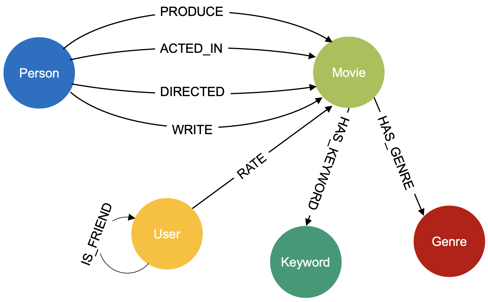

# TuGraph快速上手

Version: 3.3.0

2022/07/19

蚂蚁集团

---

## 目录
  - [1 简介](#1-%e7%ae%80%e4%bb%8b)
  - [2 安装](#2-%e5%ae%89%e8%a3%85)
    - [2.1 通过Docker Image安装](#21-%e9%80%9a%e8%bf%87docker-image%e5%ae%89%e8%a3%85)
    - [2.2 通过rpm/deb包安装](#22-%e9%80%9a%e8%bf%87rpmdeb%e5%8c%85%e5%ae%89%e8%a3%85)
  - [3 使用 TuGraph 服务](#3-%e4%bd%bf%e7%94%a8-TuGraph-%e6%9c%8d%e5%8a%a1)
    - [3.1 Movie场景](#31-movie%e5%9c%ba%e6%99%af)
      - [3.1.1 建立模型](#311-%e5%bb%ba%e7%ab%8b%e6%a8%a1%e5%9e%8b)
      - [3.1.2 导入数据](#312-%e5%af%bc%e5%85%a5%e6%95%b0%e6%8d%ae)
      - [3.1.4 可视化界面](#314-%e5%8f%af%e8%a7%86%e5%8c%96%e7%95%8c%e9%9d%a2)
      - [3.1.5 查询示例](#315-%e6%9f%a5%e8%af%a2%e7%a4%ba%e4%be%8b)
    - [3.2 IoT场景](#32-iot%e5%9c%ba%e6%99%af)
      - [3.2.1 建立模型](#321-%e5%bb%ba%e7%ab%8b%e6%a8%a1%e5%9e%8b)
      - [3.2.2 导入数据](#322-%e5%af%bc%e5%85%a5%e6%95%b0%e6%8d%ae)
      - [3.2.4 可视化界面](#324-%e5%8f%af%e8%a7%86%e5%8c%96%e7%95%8c%e9%9d%a2)
      - [3.2.5 查询示例](#325-%e6%9f%a5%e8%af%a2%e7%a4%ba%e4%be%8b)
  - [4 联系方式](#4-%e8%81%94%e7%b3%bb%e6%96%b9%e5%bc%8f)

---

## 1 简介

TuGraph 是蚂蚁集团自主研发的大规模图计算系统，提供图数据库引擎和图分析引擎。其主要特点是大数据量存储和计算，高吞吐率，以及灵活的 API，同时支持高效的在线事务处理（OLTP）和在线分析处理（OLAP）。 LightGraph、GeaGraph是TuGraph的曾用名。

主要功能特征包括：

- 支持属性图模型
- 原生图存储及处理
- 完全的ACID事务支持
- 支持OpenCypher图查询语言
- 支持原生的Core API和Traversal API
- 支持REST和RPC接口
- 支持CSV、JSON、MySQL等多数据源导入导出
- 支持可视化图交互
- 支持命令行交互
- 内置用户权限控制、操作审计
- 支持任务和日志的监控管理
- 原生适配PandaGraph图分析引擎

性能及可扩展性特征包括：

- 支持TB级大容量
- 吞吐率高达千万顶点每秒
- 面向读优化的存储引擎
- 支持高可用模式
- 支持离线备份恢复
- 在线热备份
- 高性能批量导入导出

## 2 安装

TuGraph可以通过Docker Image快速安装，或者通过rpm/deb包本地安装。  

### 2.1 通过Docker Image安装

对于拥有Docker的用户，我们推荐通过Docker Image来启动TuGraph。

加载TuGraph镜像的命令如下：

```bash
$ docker load -i lgraph_latest.tar.gz
```

启动Docker的命令如下：

```bash
# x.y.z 当前版本，例如3.3.0
$ docker run -d -v {host_data_dir}:/mnt -p 7090:7090 -it reg.docker.alibaba-inc.com/tugraph/tugraph:x.y.z
$ docker exec -it {container_id} bash
```

其中 `-v` 是目录映射，{host_data_dir}是用户希望保存数据的目录，比如`/home/user1/workspace。` `-p`的作用是端口映射，例子中将Docker的7090端口映射到本地的7090端口。{container_id}是Docker的 container id，可以通过 `docker ps` 获得。

一些可能碰到的问题：

- CentOS 6.5版本不支持高版本的Docker，需要安装Docker 1.7.0 版本。
- 如果要在非sudo模式下使用docker，需要先将用户加入到docker用户组 `sudo usermod -aG docker {USER}` ，并刷新用户组 `newgrp docker`。

### 2.2 通过rpm/deb包安装

我们提供CentOS的rpm包和Ubuntu的deb包，同时可以适配SUSE、银河麒麟等类UNIX操作系统，如有需要联系文末的技术支持。

## 3 使用 TuGraph 服务

本小节以Docker提供的环境为例，下面给出几个简单实例。

### 3.1 Movie场景

Movie场景的数据和脚本在 `~/tugraph_demo/movie`目录下

#### 3.1.1 建立模型



如上图所示，影视数据共包含5种实例，8种关系，共同描述电影和演员的基本关系，以及用户对电影的评分。

* movie 实例。表示某一部具体的影片，比如"阿甘正传"。
* person实例。表示个人，对影片来说可能是演员、导演，或编剧。
* genre实例。表示影片的类型，比如剧情片、恐怖片。
* keyword实例。表示与影片相关的一些关键字，比如"拯救世界”、”虚拟现实“、”地铁“。
* user实例。表示观影的用户。
* produce关系，连接person和movie。表示影片的出品人关系。
* acted_in关系，连接person和movie。表示演员出演了哪些影片。
* direct关系，连接person和movie。表示影片的导演是谁。
* write关系，连接person和movie。表示影片的编剧关系。
* has_genre关系，连接movie和genre。表示影片的类型分类。
* has_keyword关系，连接movie和keyword。表示影片的一些关键字，即更细分类的标签。
* rate关系，连接user和movie。表示用户对影片的打分。
* is_friend关系，连接user和user。表示用户和用户的好友关系。

#### 3.1.2 导入数据

```bash
$ cd ~/demo/movie
$ bash run_import.sh
```

$run_import.sh$ 脚本会根据 $import.config$ 配置文件，将图数据从csv数据文件导入。

#### 3.1.3 启动服务


```bash
$ lgraph_server --license /mnt/fma.lic --config ~/demo/movie/lgraph.json
```

fma.lic是授权文件，应放在{host_data_dir}文件夹中，映射到docker的/mnt下。lgraph.json是TuGraph的配置文件。

#### 3.1.4 查询入口

TuGraph提供基于浏览器的可视化查询和基于命令行的交互式查询。

如果使用基于浏览器的可视化查询，网页地址为 `{IP}:{Port}`，默认用户名为 `admin`，密码为 `73@TuGraph`。注意端口需要浏览器能直接访问，如果在Docker内需要做端口映射。然后我们可以在浏览器中输入`127.0.0.1:7090`进行访问。

如果使用基于命令行的交互式查询，需要使用lgraph_cypher工具，查询的示例在 ~/tugraph_demo/movie/query目录下。

#### 3.1.5 查询示例

我们将Movie数据导入图数据库后，可以非常方便地进行增删查改的操作，由于图数据的数据表达方式和传统的关系数据库不同，不能简单的用SQL进行查询，TuGraph采用OpenCypher作为主要的查询语言。OpenCypher是一个面向图数据的开放标准，是目前工业界认可度最高的图查询语言之一。

以下的操作的实例可以在浏览器或命令行操作。

#### 示例一

查询影片 'Forrest Gump' 的所有演员，返回影片和演员构成的子图。

```sql
MATCH (m:movie {title: 'Forrest Gump'})<-[:acted_in]-(a:person) RETURN a, m 
```

#### 示例二

查询影片 'Forrest Gump' 的所有演员，列出演员在影片中扮演的角色。

```sql
MATCH (m:movie {title: 'Forrest Gump'})<-[r:acted_in]-(a:person) RETURN a.name,r.role
```

#### 示例三

查询 Michael 所有评分低于 3 分的影片。

```sql
MATCH (u:user {login: 'Michael'})-[r:rate]->(m:movie) WHERE r.stars < 3 RETURN m.title, r.stars
```

#### 示例四

查询和 Michael 有相同讨厌的影片的用户，讨厌标准为评分小于三分。

```sql
MATCH (u:user {login: 'Michael'})-[r:rate]->(m:movie)<-[s:rate]-(v) WHERE r.stars < 3 AND s.stars < 3 RETURN u, m, v
```

#### 示例五

给Michael推荐影片，方法为先找出和Michael讨厌同样影片的用户，再筛选出这部分用户喜欢的影片。

```sql
MATCH (u:user {login: 'Michael'})-[r:rate]->(m:movie)<-[s:rate]-(v)-[r2:rate]->(m2:movie) WHERE r.stars < 3 AND s.stars < 3 AND r2.stars > 3 RETURN u, m, v, m2
```

#### 示例六

查询 Michael 的好友们喜欢的影片。

```sql
MATCH (u:user {login: 'Michael'})-[:is_friend]->(v:user)-[r:rate]->(m:movie) WHERE r.stars > 3 RETURN u, v, m
```

#### 示例七

通过查询给'Forrest Gump'打高分的人也喜欢哪些影片，给喜欢'Forrest Gump'的用户推荐类似的影片。

```sql
MATCH (m:movie {title:'Forrest Gump'})<-[r:rate]-(u:user)-[r2:rate]->(m2:movie) WHERE r.stars>3 AND r2.stars>3 RETURN m, u,m2
```
