# TuGraph可视化

Version: 3.3.0

2022/07/19

蚂蚁集团

---

### 1. 简述

TuGraph提供可视化控制台，方便用户对图数据库进行操作、管理和维护。

### 2. 登录

在浏览输入服务地址和端口登录控制台，输入用户名及密码即可登录。

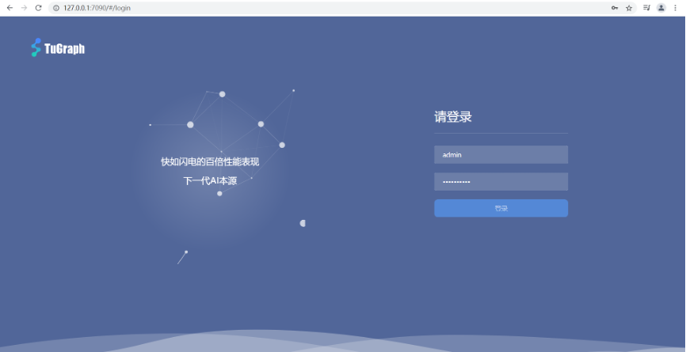

### 3. 开发控制台
开发控制台主要提供子图管理、Cypher可视化查询、图模型管理、数据导入、插件维护以及帮助文档。
#### 3.1 子图管理
#### 3.1.1 新建子图
点击新建按钮创建子图，需要录入子图名称、文件大小以及异步模式。

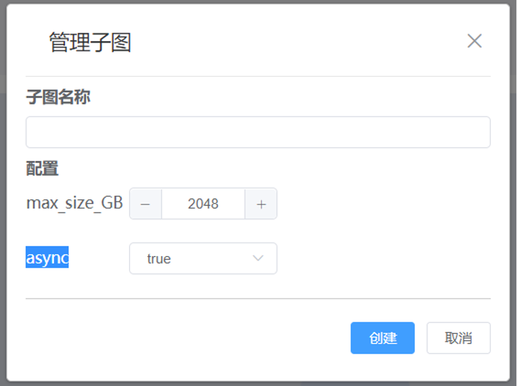

#### 3.1.2 选择子图
下拉选择需要切换子图的，同时也进行删除操作。

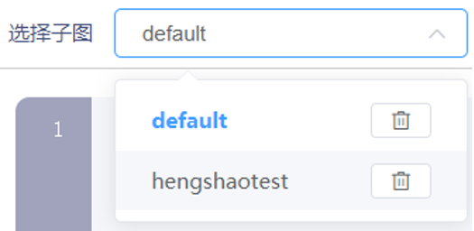

#### 3.2 Cypher可视化查询
#### 3.2.1 执行Cypher命令
输入Cypher命令，点击执行。可在可视化界面查看返回结果。

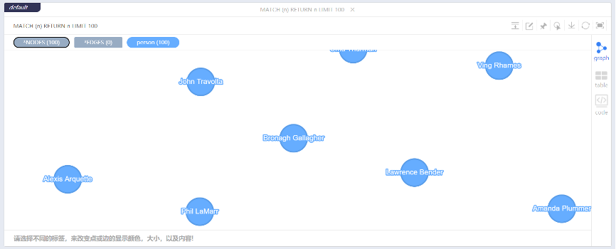

#### 3.2.2 可视化操作
可视化界面查看执行的结果。

可视化界面支持合并边、编辑顶点/边、锁定、导出、刷新、全屏等操作。用户可对画布上的顶点和边进行操作，扩展新的顶点。支持对画布上的顶点进行过滤，支持更改显示颜色、大小等。

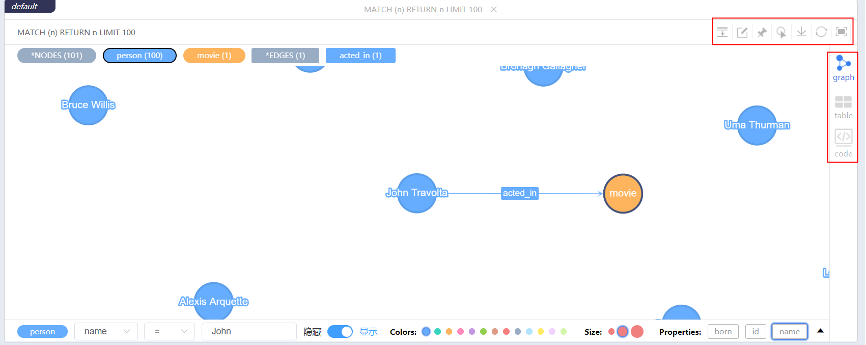

#### 3.3 图模型管理
产品提供图模型可视化管理，用户可查看、编辑、创建顶点和边。

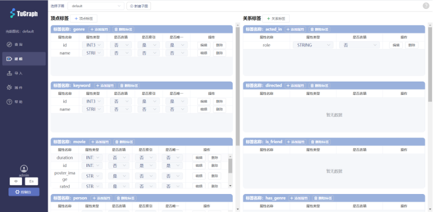

#### 3.3.1 新建顶点
点击添加顶点标签按钮新建顶点，用户需要录入顶点名称以及数据信息。

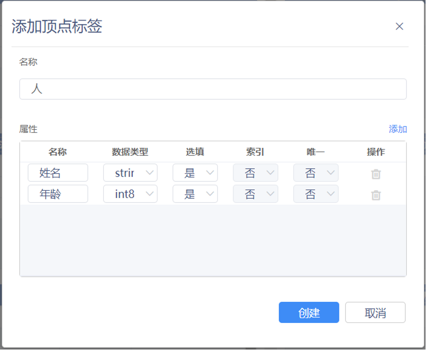

#### 3.3.2 新建关系
点击添加关系标签按钮新建关系，用户需要录入关系名称以及数据信息。

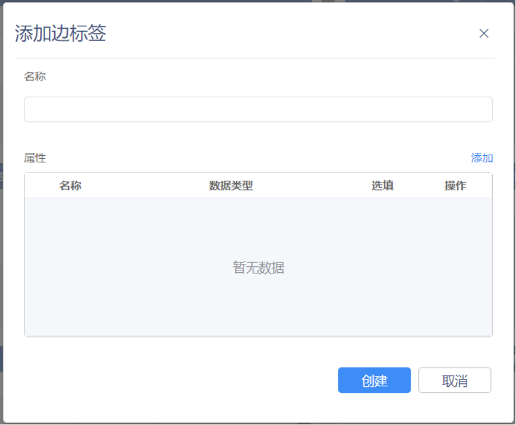

#### 3.4 数据导入
产品提供可视化导入界面，用户可以上传文件导入顶点或边数据。

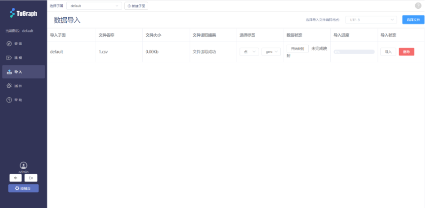

一次可以导入多个文件，支持导入文件和目标数据的关系映射。

#### 3.5 插件维护
产品提供可视化的插件维护界面，用户可以添加、维护插件。支持C++插件和Python插件。

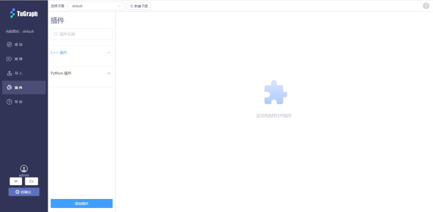

#### 3.6 帮助文档
产品提供在线的帮助文档，用户可以快速了解产品功能和特性，

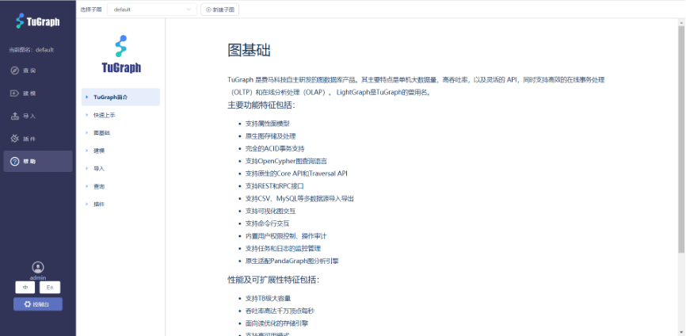

### 4. 管理控制台
#### 4.1 数据库信息
产品提供数据库信息的可视化展示，展示当前图数据库状态，主要包括基础信息、数据库配置信息以及子图信息。

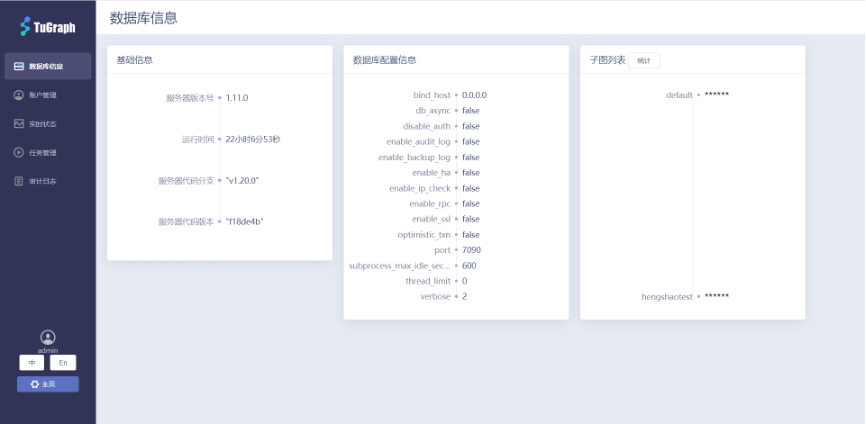

#### 4.2 账户管理
产品提供账户的创建、维护、授权等功能。

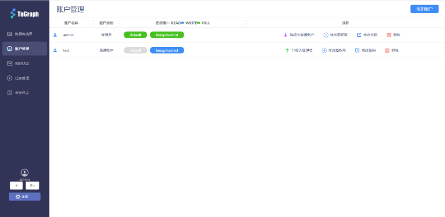

#### 4.2.1 添加账户
点击添加账户按钮创建新账户，用户需要录入账户名、密码、角色以及子图权限。

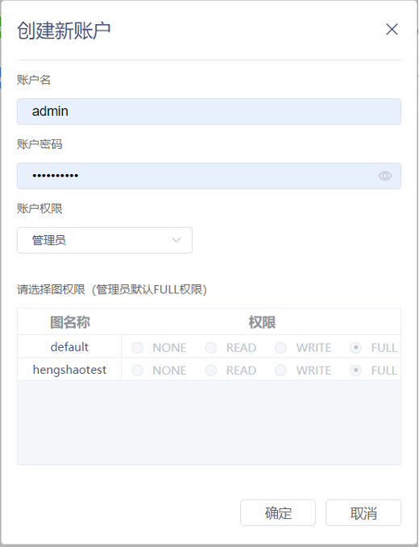

#### 4.3 实时状态
产品提供服务器实时状态的可视化展示，主要CPU使用情况、内存使用情况、硬盘使用情况和请求情况。

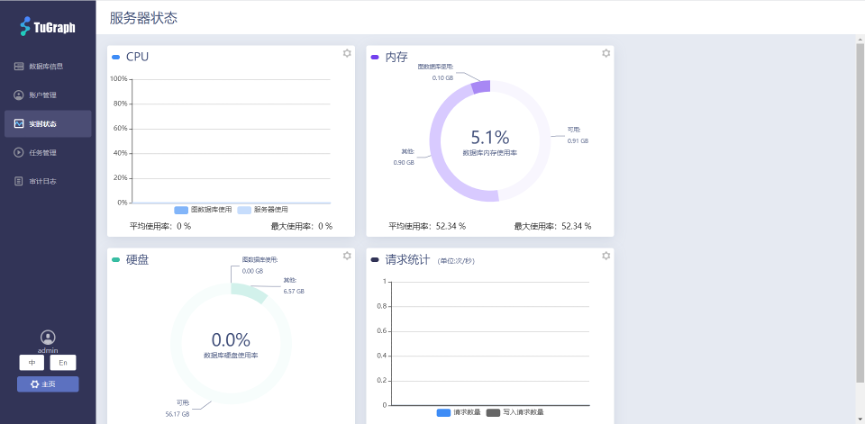

#### 4.3.1 告警设置
针对每项监测状态可以设置告警阈值，超过阈值可以触发告警，告警级别默认分为普通告警和严重告警。

#### 4.4 任务管理
产品提供任务管理的可视化展示，展示当前系统内正在执行的任务，可以手动终止运行时间超长的任务。

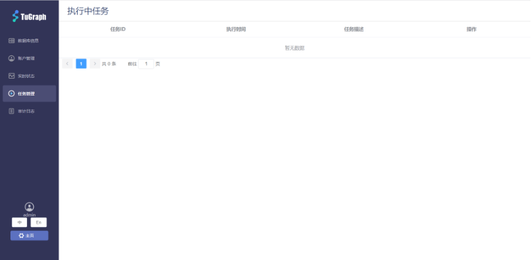

#### 4.5 审计日志
产品提供审计日志的可视化展示，开启审计日志功能后，可展示每个账号的操作记录，包括数据增删查改操作、权限操作等。

