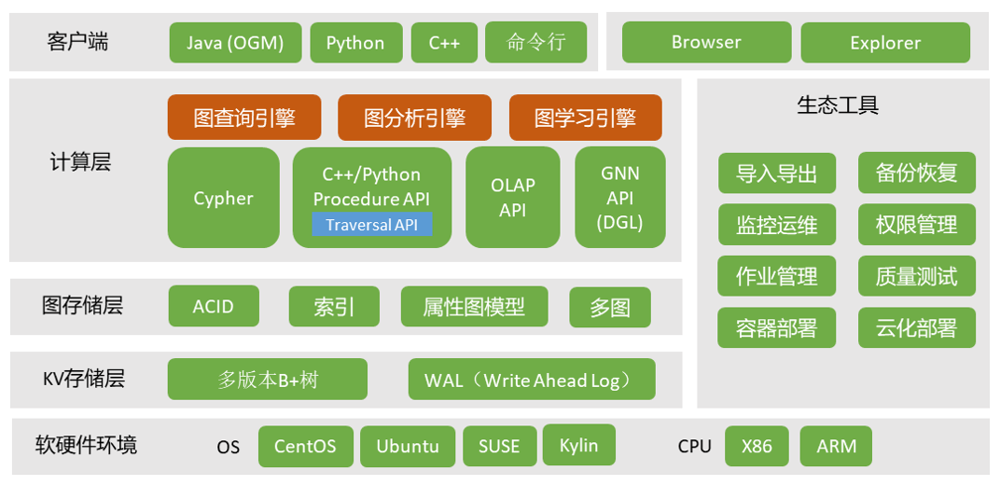

# TuGraph产品架构

> 此文档主要介绍 TuGraph 的产品架构。

## 1.简介

上图从功能模块的角度，以 TuGraph 为例，给出了企业级图数据库的整体架构，自下而上包括：

- 软硬件环境。涉及图数据库的开发和使用环境。TuGraph 主要基于底层的 C++语言开发，能够兼容市面上大部分操作系统和 CPU。
- 存储层，包括 KV 存储层和图存储层。存储层需要支持计算层所需的各个功能。
- 计算层。计算层应包括图事务引擎、图分析引擎和图神经网络引擎，也包含了服务端提供的多种编程接口，包括描述式查询语言 Cypher，存储过程等。
- 客户端。客户端 SDK 应支持 Java、Python、C++ 等多种语言，也支持命令行的交互方式。Browser 和 Explorer 通过网页端交互的方式，降低了图数据库的使用门槛。
- 在生态工具方面，覆盖了企业级图数据库的开发、运维、管理等链路，提升可用性。
