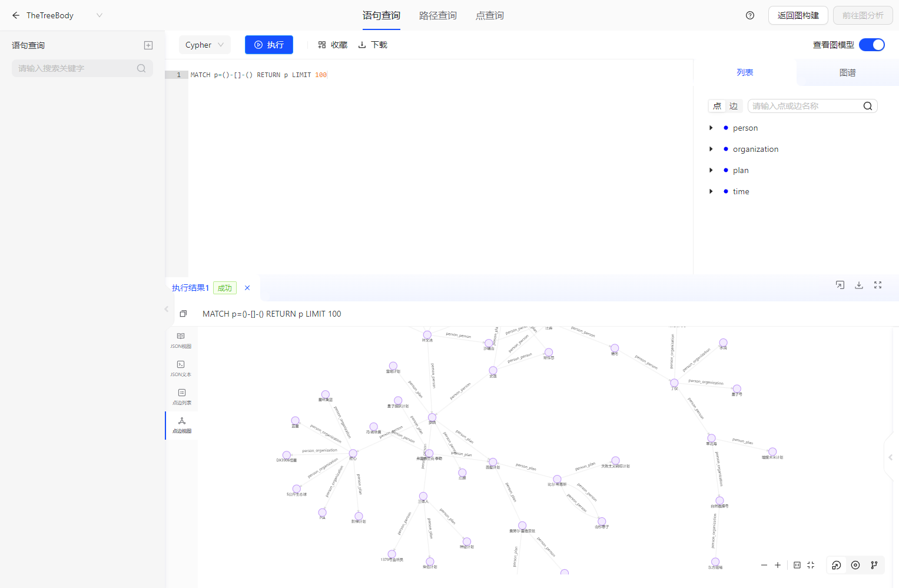

## 关于
这是一个tugraph的Demo，背景是刘慈欣老师的作品《三体》

关键词：tugraph demo、三体

## Demo场景设计
Demo背景基于三体1、三体2、三体3的故事背景进行设计

根据三体故事的设定，我们设计了4类点和6类边，点包括“人物”、“组织”、“计划”、“时间线”，边包括“人物-人物关系”、“人物-计划关系”、“人物-组织关系”、“组织-计划关系”、“组织-组织关系”。
根据剧情准备了对应Schema的数据
准备了一些query，提出一些关于剧情的问题

## 目录结构
rawdata: 原始剧情数据和schema定义文件
case.cypher: 查询相关的Cypher语句
control.sh: 控制TuGraph Server启动停止的脚本
lgraph_standalone.json: TuGraph Server启动的配置文件

## 使用说明
前置条件：TuGraph已安装

### 数据导入

- 根据数据存放目录对应修改import.json里面的DATA_PATH
- 参考control.sh中的load函数，加载数据
- 参考control.sh中的start函数，启动TuGraph服务
- 启动TuGraph服务后，访问${HOST_IP}:7071，打开web页面，确认数据是否导入成功

### Cypher查询

参考TuGraph文档，在TuGraph的Web页面前端输入Cypher进行查询

## 使用展示

### 数据导入的展示

### 查询展示

#### 人物关系查询
三体一剧情中，一开始全世界各地发生了大量科学家自杀事件，引起了警方重视，查案过程根据人物关系线索一步步排查，就如上面的图所示，随着线索越来越多，背后的真相逐步浮出水面。史强和汪淼发现大多数人都和叶文洁有着直接或者间接的联系，并派汪淼卧底，最终发现叶文洁的最终统帅身份。在图中也可以看出，叶文洁顶点周围有很多边关系（一度或二度邻居很多）

#### 邻域顶点分析
三体中的各种计划比较多，有的时候可能会被绕晕，这时候我们可以通过图的邻居顶点查询来查看该计划的相关人物和组织等。如"面壁计划"中,我们可以看到有四位人物与之相关，这四位也是被世人所寄予厚望的“面壁者”

