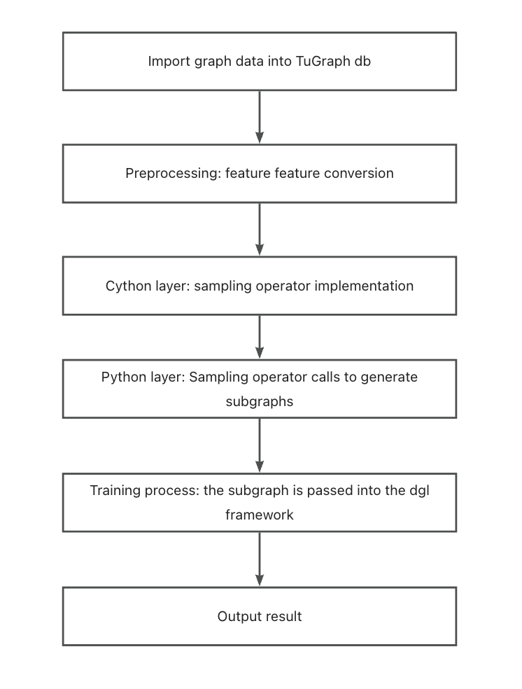

# Learning Tutorial

> This document is designed as a guide for TuGraph users. Before reading the detailed documentation, users should first read this document to have a general understanding of the graph learning process of TuGraph, which will make it easier to read the detailed documentation later. The guide program is based on a simple program instance of TuGraph, and we will focus on its usage.

## 1. TuGraph Graph Learning Module
The TuGraph graph learning module samples graph data in TuGraph, and the sampled nodes and edges are used as features for graph learning and training. The running process is shown in the following figure:



## 2. Data Import
Please refer to [Data Import](../../../5.developer-manual/3.server-tools/1.data-import.md) for data import.

Taking the cora dataset as an example for the import process:

Execute in the build/output directory:

```bash
./lgraph_import -c ./../../test/integration/data/algo/cora.conf --dir ./cora_db --overwrite true
```
Where cora.conf is the graph schema file representing the format of the graph data. cora_db is the imported graph data file name representing the storage location of the graph data.

## 3. Feature Conversion
Since the features in graph learning are generally represented as long float arrays, TuGraph does not support loading float array types, so they can be imported as string types and converted to char* for subsequent storage and access, and the implementation details can refer to the feature_float.cpp file.

The specific execution process is as follows:

Compile the imported plugin in the build directory:

`make feature_float_embed`

Execute in the build/output directory:

`./algo/feature_float_embed ./cora_db`

Then the conversion can be performed.

## 4. Sampling Operators and Compilation
TuGraph implements an operator for obtaining the full graph data and four sampling operators at the cython layer, as follows:

### 4.1.Sampling Operator Introduction
|Sampling Operator | Sampling Method |
| --- | --- |
|GetDB | Get the graph data from the database and convert it into the required data structure |
|Neighbor Sampling | Sample the neighboring nodes of the given node to obtain the sampling subgraph |
|Edge Sampling | Sample the edges in the graph according to the sampling rate to obtain the sampling subgraph |
|Random Walk Sampling | Conduct a random walk based on the given node to obtain the sampling subgraph |
|Negative Sampling | Generate a subgraph of non-existent edges|
### 4.2.Compilation
Execute in the tugraph-db/build folder:

`make -j2`

Or execute in the tugraph-db/learn/procedures folder:

`python3 setup.py build_ext -i`

Once the algorithm so is obtained, it can be used by importing it in Python.

5. Training
TuGraph calls the cython layer operator at the Python layer to implement graph learning and training.

The usage of the TuGraph graph learning module is as follows:

Execute in the tugraph-db/learn/example folder:

`python3 train_full_cora.py`

Then training can be performed.

If the final printed loss value is less than 0.9, the training is successful.