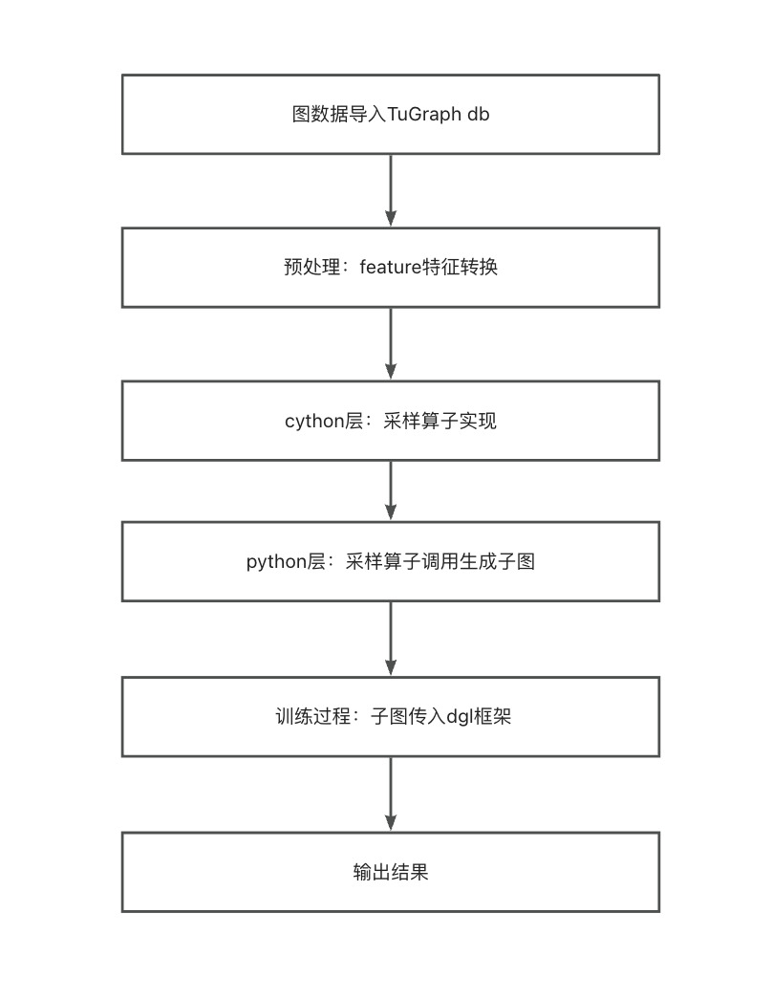

# Learn Tutorial

> 本文档是为 TuGraph 的用户设计的引导程序，用户在阅读详细的文档之前，应该首先阅读该文档，对 TuGraph 的图学习运行流程有一个大致的了解，之后再阅读详细文档会更加方便。引导程序是基于 Tugraph 的一个简单的程序实例，我们将重点介绍其使用方式。

## 1. TuGraph 图学习模块
TuGraph 图学习模块将TuGraph中的图数据采样，采样后的节点和边作为图学习的特征，进行学习训练。运行流程如下图所示：

## 2. 数据导入
数据导入请参考[数据导入](../../../5.developer-manual/3.server-tools/1.data-import.md)

导入过程以cora数据集为例：

在build/output目录下执行
```bash
./lgraph_import -c ./../../test/integration/data/algo/cora.conf --dir ./cora_db --overwrite true
```
其中cora.conf为图schema文件，代表图数据的格式。cora_db为导入后的图数据文件名称，代表图数据的存储位置。
## 3. feature特征转换
由于图学习中的feature特征一般表示为较长的float类型数组，TuGraph暂不支持float数组类型加载，因此可将其按照string类型导入后，转换成char*方便后续存取，具体实现可参考feature_float.cpp文件。
具体执行过程如下：

在build目录下编译导入plugin：
`make feature_float_embed`

在build/output目录下执行
`./algo/feature_float_embed ./cora_db`
即可进行转换。
## 4. 采样算子及编译
TuGraph在cython层实现了一种获取全图数据的算子及4种采样算子，具体如下：
### 4.1.采样算子介绍
| 采样算子 | 采样方式 |
| --- | --- |
| GetDB | 从数据库中获取图数据并转换成所需数据结构 |
| Neighbor Sampling | 根据给定的节点采样其邻居节点，得到采样子图 |
| Edge Sampling | 根据采样率采样图中的边，得到采样子图 |
| Random Walk Sampling | 根据给定的节点，进行随机游走，得到采样子图 |
| Negative Sampling | 生成不存在边的子图。 |

### 4.2.编译
在tugraph-db/build文件夹下执行
`make -j2`

或在tugraph-db/learn/procedures文件夹下执行
`python3 setup.py build_ext -i`

得到算子so后，在Python中import 即可使用。

## 5. 训练
TuGraph在python层调用cython层的算子，实现图学习的训练。
使用 TuGraph 图学习模块使用方式介绍如下:
在tugraph-db/learn/example文件夹下执行
`python3 train_full_cora.py`
即可进行训练。
最终打印loss数值小于0.9，即为训练成功。
