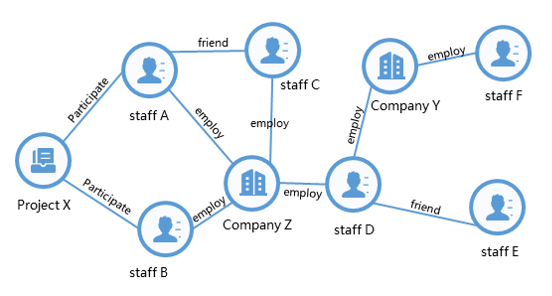

# What is Graph

The graph that we're going to introduce today, it's neither a picture, nor a diagram，it's a class of mathematics called graph theory. We can see on the screen that there are two graphs on the left and right, which represent things and their relationship. We abstract it out in a form, and we call such a form a graph.

The basic elements of a graph are a vertex, and an edge, a vertex is a representation of the thing, of the entity, and an edge is a representation of the relationship between them.

We see the graph on the left, the dots have companies, they have employees, and they have projects. What are their sides? The relationship between the company and the employees is an employment relationship, and there can be a friend relationship between the employees, and there can be a participation relationship between the project and the employees. That is, we can use graphs to abstract things and their relationships.

The diagram on the right is a schematic diagram of a financial transaction. Each of us has a bank account, and when our bank account makes a consumption or makes a transfer, this account is the point on the graph, and this edge can indicate that there is such a transfer relationship between us.

We can also see from this example that edges can attach information and points can attach information. The point can attach which bank this account is in and what the account is. The value of the transaction can be attached to the edge, and many times, if your transaction is large, it indicates that special attention is needed. This edge might not necessarily be the amount of a particular transfer, it might be the amount accumulated over a period of time and so on. Graphs can actually be very expressive.

On the other hand, for a graph like finance, it can be very large. There could be more than a billion points, a hundred billion or even a trillion edges. As you can imagine, it's actually quite challenging to actually work with these graphs.
