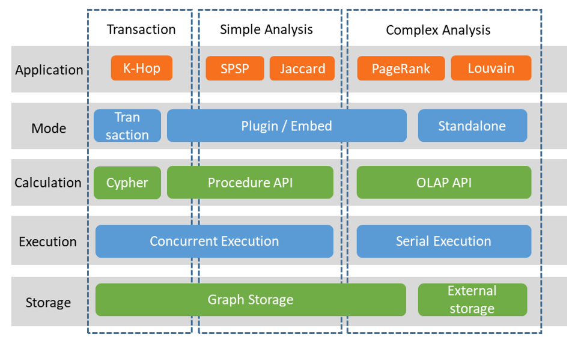

# HTAP

> This document mainly introduces the design philosophy of TuGraph's HTAP.

## 1.Introduction

There are different ways to implement HTAP in architecture: one is to use two different copies to handle OLTP and OLAP tasks separately, with the core being data consistency synchronization and additional resource overhead; the other is to use the same data storage at all times, but this implementation has memory bloat in its data structure and needs further work for industrialization. In TuGraph's design, simple OLAP and OLTP operations share the same data, while complex OLAP operations are exported and handled separately as snapshots.

## 2.Design

In TuGraph, OLTP is the graph transaction engine, corresponding to transaction operations in Figure; OLAP is the graph analysis engine, corresponding to simple graph analysis operations (such as SPSP) and complex graph analysis operations (such as PageRank), the former of which can be executed directly on the graph storage, while the latter requires exporting a snapshot for execution.

- Transaction operations, measured by the graph transaction engine, are local graph add, delete, query and modify operations, typically used for K-hop access.
- Simple analysis operations are the simpler part of the graph analysis engine, usually local graph analysis operations, such as the shortest path algorithm SPSP and Jaccard algorithm.
- Complex analysis operations are the more complex part of the graph analysis engine, usually involving multi-round data iteration operations across the entire graph, such as the PageRank algorithm for webpage ranking and the Louvain algorithm for community discovery.

As shown in Figure , external storage is added to the architecture diagram, making the data source for graph analysis not limited to the graph database and can be directly read from text files.

- Graph storage, which is the storage in the graph database, has carefully designed data structures that can perform real-time add, delete, query and modify operations.
- External storage, which can be an RDBMS or text file, is stored in a simple way as an edge table, only for one-time batch reading and batch result writing. In the calculation layer, it corresponds to the interface in the overall architecture diagram.
- Cypher, the declarative graph query language, can be executed concurrently.
- Procedure API, the procedural graph query language, is flexible and can support both transaction operations and graph analysis operations, but its efficiency is not sufficient to complete complex graph analysis operations, and it can be executed concurrently.
- OLAP API, for multi-round iteration of complex graph analysis. Applications need to first export the graph data in storage into a snapshot in memory, which is only used for fast access and does not need to consider the write support of ACID, so it can be arranged more compactly, and the read efficiency of CSR arrangement is much higher than that of graph storage data arrangement. OLAP API can only be executed serially, and each operation uses full CPU resources.

OLAP API snapshots can be created from external storage, where the edge table data is formatted as CSR, or from the graph storage. It should be noted that OLAP API requires that the IDs of the vertices be consecutive natural numbers, which may require additional ID mapping. This step can be mapped to a specified attribute when creating a snapshot or directly using the attribute value as the ID.

Corresponding to the calculation interface and storage, there are four operating modes.

- Transaction mode, each operation corresponds to a Cypher statement, which is a transaction by default.
- Plugin mode, call through plugins, after the calculation logic is loaded on the server, also known as stored procedures.
- Embed mode, which has the same interface as Plugin mode but the graph database service does not need to be started and can directly call the data in the database through the interface. This mode is usually used for debugging Procedure API and OLAP API code, and the debugging information and operation steps are more friendly than Plugin mode.
- Standalone mode, which maximally separates from the graph database, is more direct when only using the graph analysis engine for data analysis. Standalone mode will directly use the data of the external storage.

The use of the graph neural network engine is similar to the 'complex graph analysis operation', which calls part of the OLAP API and GNN API at the same time, which is not elaborated here.
