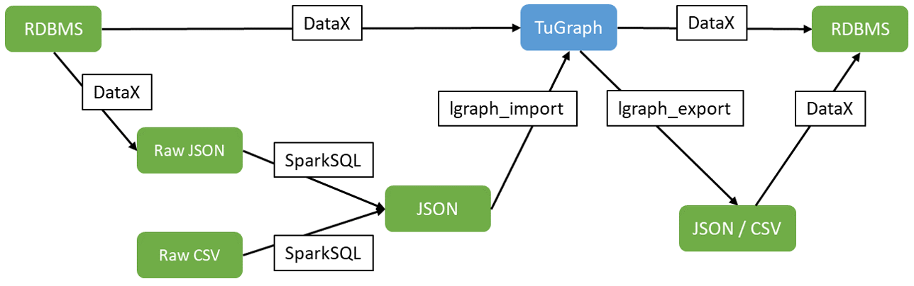

# Functionality

> This document mainly introduces the main functions and features of TuGraph.

## 1.Installation

## 1.1.Installation

Deployment methods TuGraph currently provides three deployment methods: cloud deployment, Docker deployment, and local package deployment. Users can choose the appropriate deployment method according to their actual situation.

## 1.2.Software and Hardware Environment

TuGraph core is developed in C++, and the default compiler used is GCC8.4, using c++14 standard. Some functions use other compilers, such as ApacheLucene-based full-text indexing, which uses JNI interface and requires a Java compiler. In addition, the Python Procedure API is provided in the stored procedure, which requires a Python environment. TuGraph does not require special hardware such as GPUs, and can naturally adapt to general hardware upgrades such as RDMA and HBM with high latency and low bandwidth.

TuGraph has been tested on CPUs based on X86 and ARM, including Intel, AMD, Kunpeng, Hygon, Feiteng, etc., and also runs on multiple operating systems, including mainstream versions of Ubuntu, CentOS, SUSE, Galaxy Kylin, Zhongbiao Kylin, and UOS, without special requirements for operating systems and CPUs.

The software and hardware environment also includes the environment of dependent libraries. Since the default KV storage in TuGraph's storage layer is LMDB, the file system needs to support POSIX interfaces. The compilation and parameter configuration in different environments will be slightly different. For example, in the packaging of point-edge data in graph storage, it should match the page table size of the operating system, which is 4KB by default, and it is recommended to set the system's page table size to 4KB.

## 2.Storage layer

In the graph data model, TUGraph supports the attribute graph model, which can be divided into subgraphs, tags (including vertex tags and edge tags), and attributes according to the hierarchy.

From the perspective of the storage layer, TuGraph uses an intuitive multi-layered tree model, without tags across subgraphs or attributes across tags, and only retains the core logic of the graph model. In terms of subgraph storage, TuGraph has performed data physical isolation for multiple graphs, and each graph corresponds to an instance of LMDB. The metadata description information of multiple graphs is saved in a special public LMDB instance called meta. The storage of vertex and edge tags and their attributes maps graph data adaptively to KV key-value pairs, maximizing read performance. At the same time, multi-threaded writing is implemented at the KV layer, solving the disadvantage of low write performance of LMDB. Primary key indexes and secondary indexes correspond to B+ tables in LMDB, supporting index value addition, deletion, query, and modification based on comparison.

The storage layer also retains some other non-core functional data, including permission data, pre-compiled plugin data, and monitoring data.

## 3.Calculation layer

The calculation layer is divided into three parts in terms of function, including the TP-class graph transaction engine, the AP-class graph analysis engine, and the graph neural network engine.

__The graph transaction engine__ is mainly used to process concurrent graph operations, including single-point queries, neighbor queries, and path traversal. The graph transaction engine focuses on ACID transactions of concurrent operations, ensuring that the operation logic will not interfere with each other. The main performance indicator is QPS, which is the number of completed queries per second.

__The graph analysis engine__ usually operates as a full-graph iteration. Some simple analysis tasks (such as SPSP) can be completed by the graph transaction engine, and complex analysis tasks are completed by the graph analysis engine, which usually takes several seconds to several hours for a single task. Therefore, a single graph analysis task should use all hardware resources in parallel, and the performance indicator is the total time for completing the task.

__The graph neural network engine__ usually operates as a full-graph iteration. In addition to graph topology-based operations, the graph neural network engine also needs to integrate a machine learning framework to handle vector operations, such as PyTorch, MXNet, and TenserFlow.

The logic of the three engines is different and independently configured for resource pools. The graph transaction engine sets up a thread pool based on RPC operations. For each operation received from the client, a thread is taken from the pool to process it, and the number of concurrent executions is equal to the capacity of the RPC thread pool, which is usually configured as the number of server cores. The graph analysis engine has an analysis thread pool, and each graph analysis task is executed concurrently, that is, all threads are used to execute a task to speed up the performance of the operation. The serial execution feature of TuGraph graph analysis operations will restrict the user experience to a certain extent. The demand for concurrent graph analysis can be processed by deploying high-availability, increasing machine resources, or connecting to an external task scheduler to transfer data to a container for real-time scheduling and calculation. Graph neural network operations will reuse the resources of the graph transaction

## 4.Core Features

### 4.1.Query Language

TuGraph provides Cypher graph query language that follows the OpenCypher standard.
- Supports Procedure embedding.
- Supports pluggable optimization frameworks with various optimization features.
- Supports extensible security check framework for Cypher.

### 4.2.Stored Procedures

When users need to express complex query/update logic that Cypher cannot describe, or when high performance is required, TuGraph's stored procedures (Procedure) is a more concise and efficient choice than calling multiple REST requests and completing the entire processing flow on the client-side.

### 4.3.Data Import/Export

Although TuGraph supports data insertion, batch import can greatly improve efficiency. The import function can be divided into importing into an empty database (offline import) and incremental import. The former refers to importing when the subgraph is empty, and the additional assumption can greatly improve the import performance. In TuGraph, the throughput rate of empty database import and incremental import differs by 10 times. Data consistency needs to be considered in data export, which is based on exporting data based on a snapshot.

TuGraph can perform data export on graph data already stored in TuGraph using the command-line tool `lgraph_export`. The export format supports CSV and JSON.

### 4.4.Backup and Restore

 TuGraph's backup function can be divided into active/scheduled, offline/online, and full/incremental backup. The goal is to complete the backup with the smallest storage and computing costs possible. The Restore function can restore to the latest state or a historical marked time point, ensuring that the database is in a consistent state.

### 4.5 Data Warmup

TuGraph is a disk-based graph database, and data is loaded into memory only when it is accessed. Therefore, system performance may deteriorate due to frequent IO operations in the first period after the server is opened. We can improve this problem by preheating the data in advance.

### 4.6 High Availability Mode

High availability means that by configuring a cluster, real-time multi-replica data hot backup can be achieved, and the cluster can still provide services when some replicas are not in use. TuGraph uses the multi-machine hot backup mechanism of the RAFT protocol, which can reduce RPO to near 0. Data synchronization is performed at the computation layer through RPC interfaces for write operations. The high availability cluster of TuGraph adopts a master-slave mode, where only the master node processes write requests, and both master and slave nodes can process read requests. The write request processing of the master node needs to be synchronized to more than half of the total nodes. The write request is considered complete when the majority of the nodes have written successfully.

## 5.Client Tools

Client Tools Client tools mainly include SDKs for various programming languages, OGM, and command-line tools.

The client SDK is mainly used for secondary development and can be linked to the server through RPC or REST protocols. RPC has better performance based on long links, and data needs to be uniformly serialized through protobuf. TuGraph uses brpc, which supports rpc clients in Java, Python, and C++. REST's protocol is more flexible and can be easily adapted to more diverse environments, and different programming languages can easily connect. TuGraph provides a Python REST client instance, and command-line interaction is also implemented using REST.

OGM (Object Graph Mapping) is a graph object mapping tool for TuGraph, which supports mapping JAVA objects (POJO) to TuGraph. Classes in JAVA are mapped to nodes in the graph, collections in classes are mapped to edges, and properties of classes are mapped to properties of graph objects. It also provides corresponding function to operate the graph database. Therefore, JAVA developers can easily use TuGraph database in a familiar ecosystem.

The command-line tool `lgraph_cypher` is a query client that can be used to submit OpenCypher requests to the TuGraph server. `lgraph_cypher` client has two execution modes: single-command mode and interactive mode.

## 6.Ecological Tools

Ecological tools are a crucial component of enterprise-level databases, and a rich array of ecological tools can greatly enhance the usability and stability of graph databases.

### 6.1.TuGraph DataX

TuGraph's core supports importing and exporting CSV and JSON data, offering both full database and incremental importing modes. In practice, there may be a need to import from multiple data sources such as MySQL, Kafka, and Hive, and TuGraph connects to these sources using DataX. Due to the differences between relational and graph models, data cleaning processes can be quickly processed using SparkSQL. TuGraph focuses only on the reliability and performance of simple CSV and JSON scenario imports.

### 6.2.Visual Interaction

TuGraph Browser is a visual interface for direct users of graph databases, covering most of TuGraph's capabilities, including data import, graph model building, data addition/deletion/query/modify, and monitoring and maintenance operations.

### 6.3.Monitoring

TuGraph uses the Prometheus + Grafana monitoring framework in a loosely coupled manner. Prometheus obtains monitoring information from TuGraph's monitoring interface, stores it in a local time-series database, and then displays it interactively on the web using Grafana.

The monitoring states provided by TuGraph include the state of the graph database and the state of the server. The former includes the database-side status such as read/write load and number of vertices/edges, while the latter includes the real-time status of the server's memory, CPU, and hard disk. If some monitoring state exceeds the expected threshold, proactive alerts are necessary, usually requiring integration with other operations and control systems such as group messaging and email alerts.
