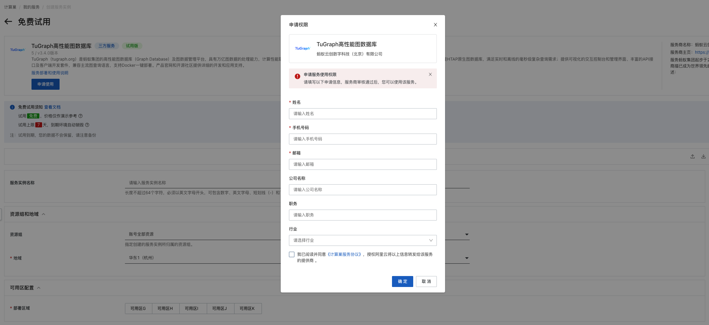
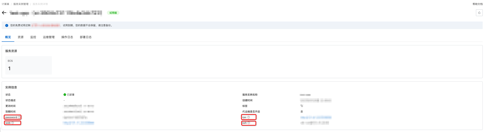
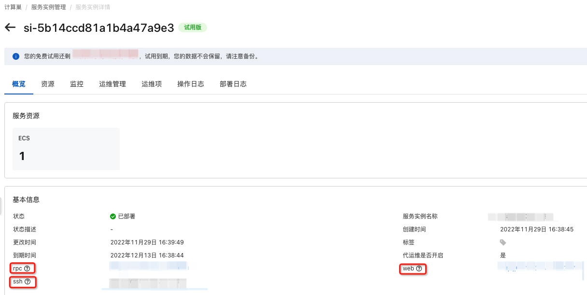
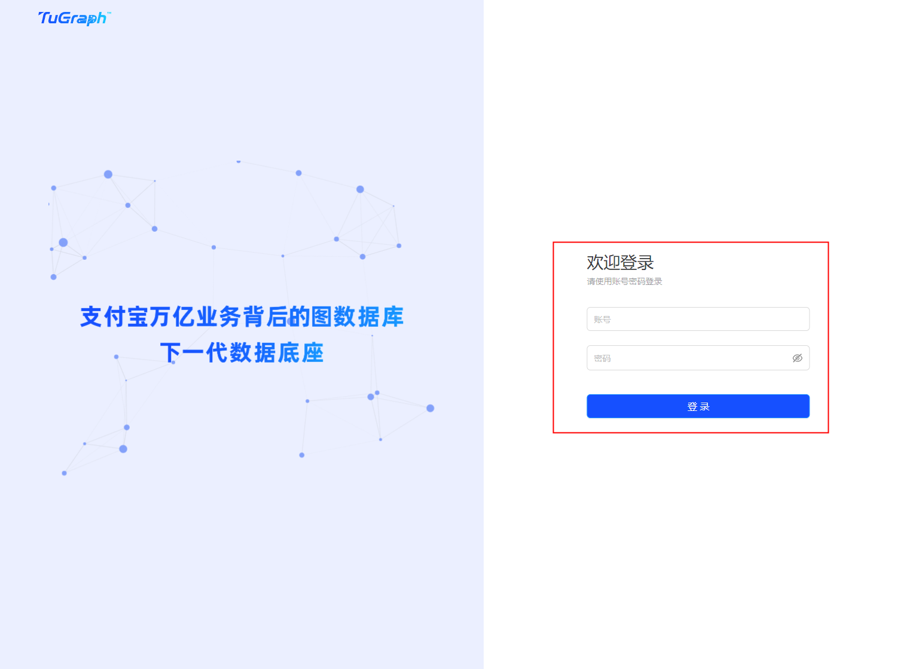
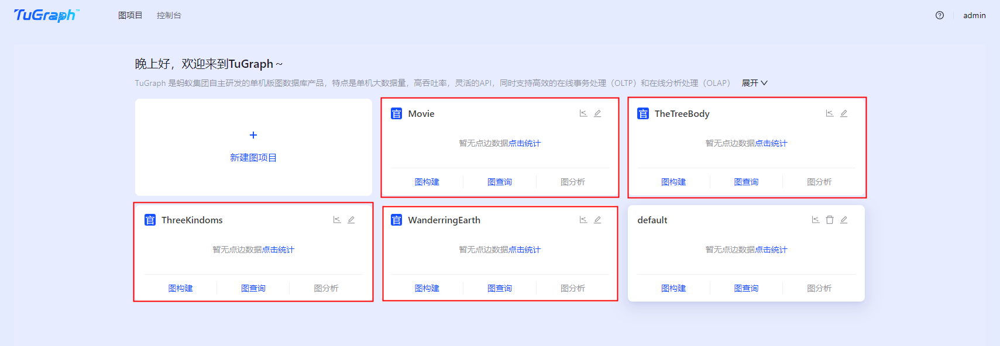

# Cloud Deployment

> This document mainly introduces the cloud deployment of TuGraph, and you can also refer to the[Alibaba Cloud ComputeNest deployment document.](https://aliyun-computenest.github.io/quickstart-tugraph/)。

## 1.Introduction

TuGraph (tugraph.antgroup.com) is a high-performance graph database of Alibaba Group. TuGraph provides community version services on ComputeNest, so you can quickly deploy TuGraph services on ComputeNest and achieve operation and maintenance monitoring, thereby building your own graph application. This document introduces how to open TuGraph community version services on ComputeNest, as well as deployment process and usage instructions.

## 2.Instance Description

TuGraph is deployed as a community open source version, and the source code can be found in the Github Repo. Currently, the available instance specifications are as follows:

| Instance Family | vCPU and Memory             | System Disk                | Public Bandwidth         |
|-----------------|-----------------------------|----------------------------|--------------------------|
| ecs.r7a.xlarge  | AMD Memory r7a, 4vCPU 32GiB | ESSD Cloud Disk 200GiB PL0 | Fixed bandwidth of 1Mbps |
| ecs.r6.xlarge   | Memory r6, 4vCPU 32GiB      | ESSD Cloud Disk 200GiB PL0 | Fixed bandwidth of 1Mbps |

Estimated costs can be seen in real time when creating instances (currently free). If you need more specifications or other services (such as cluster high availability requirements, enterprise-level support services, etc.), please contact us at tugraph@service.alipay.com.

## 3.Deployment Process

### 3.1.Preparation

Before starting to use, you need an Alibaba Cloud account to access and create resources such as ECS and VPC.

- If you use a personal account, you can directly create a service instance.
- If you create a service instance using a RAM user and use Alibaba Cloud ComputeNest for the first time:
    - Before creating a service instance, you need to add permissions for the corresponding resources to the account of the RAM user. For detailed operations on adding RAM permissions, please see Grant RAM user permissions. The required permissions are shown in the following table.
    - Authorization to create associated roles is also required. Refer to the following figure and select Agree to authorize and create associated roles.

| Permission Policy Name          | Remark                                                                       |
|---------------------------------|------------------------------------------------------------------------------|
| AliyunECSFullAccess             | Permissions for managing cloud server services (ECS)                         |
| AliyunVPCFullAccess             | Permissions for managing Virtual Private Cloud (VPC)                         |
| AliyunROSFullAccess             | Permissions for managing Resource Orchestration Service (ROS)                |
| AliyunComputeNestUserFullAccess | Permissions for managing ComputeNest services (ComputeNest) on the user side |
| AliyunCloudMonitorFullAccess    | Permissions for managing Alibaba Cloud Monitor (CloudMonitor)                |

### 3.2.Deployment Entrance

You can search in Alibaba Cloud ComputeNest, or quickly access it through the following deployment link.

[Deployment Link](https://computenest.console.aliyun.com/user/cn-hangzhou/serviceInstanceCreate?ServiceId=service-7b50ea3d20e643da95bf&&isTrial=true)

### 3.3.Apply for Trial Use

Before formal trial use, you need to apply for trial use, fill in the information as prompted, and create the TuGraph service after passing the review.

### 3.4.Create TuGraph Service

#### 3.4.1.Parameter List

During the process of creating a service instance, you need to configure the parameter list of the service instance information. The specific parameters are as follows.

| Parameter Group                              | Parameter Item  | Example                 | Description                                                                                                                            |
|----------------------------------------------|-----------------|-------------------------|----------------------------------------------------------------------------------------------------------------------------------------|
| Service Instance Name                        | N/A             | test                    | The name of the instance.                                                                                                              |
| Region                                       | N/A             | China East 1 (Hangzhou) | Select the region of the service instance. It is recommended to select nearby regions to obtain better network latency.                |
| Payment Type Configuration                   | Payment Type    | Pay-As-You-Go           | For free use, please select Pay-As-You-Go.                                                                                             |
| Availability Zone Configuration              | Deployment Area | Availability ZoneI      | Different available zones under the region, ensure that the instance is not empty.                                                     |
| Select Existing Basic Resource Configuration | VPC ID          | vpc-xxx                 | Select the ID of the Virtual Private Cloud according to the actual situation.                                                          |
| Select Existing Basic Resource Configuration | Switch ID       | vsw-xxx                 | Select the Switch ID according to the actual situation. If the Switch ID cannot be found, try switching the region and available zone. |
| ECS Instance Configuration                   | Instance Type   | ecs.r6.xlarge           | Currently supports ecs.r6.xlarge and ecs.r7a.xlarge specifications.                                                                    |
|ECS Instance Configuration|	Instance Password|	**|	Set the instance password. Length of 8-30 characters, must include three items (uppercase letters, lowercase letters, numbers, special characters in ()`~!@#$%^&*_-+={}[]:;'<>,.?/).
|

#### 3.4.2.Specific Steps

The creation of the service is carried out according to the following steps, refer to the figure below:

- Create an instance name, such as "test" in the figure below
- Select the region, such as "China East 1 (Hangzhou)" in the figure below

- Select the instance type, currently supports ecs.r6.xlarge and ecs.r7a.xlarge specifications. If there is no model available in the list, try selecting other deployment areas.
- Select the model
- Configure the password for the instance
- Select the deployment area, such as "Availability Zone I" in the figure below

- Click next to enter the order confirmation page
- Check the checkboxes for "Permission Confirmation" and "Service Terms"
- Click the green "Start Free Trial" button in the lower left corner to create a service instance

### 3.5.Start TuGraph Service

- View the service instance: After the service instance is created successfully, it takes about 2 minutes for deployment. After the deployment is complete, you can see the corresponding service instance on the page, as shown in the figure below.

- Click the service instance to access TuGraph. After entering the corresponding service instance, you can get 3 ways to
  use it on the page: web, rpc, ssh. You can also see the password of user admin on the page.

- Click the link of web to jump to the deployed TuGraph Web. It is recommended that novice users first use the demo to quickly get started with TuGraph.
    - First, on the TuGraph Web login page, enter the default username (admin) and the password on the page to log in, as shown in the figure below.
    - After the login is completed, click "New Instance" -> "Create Instance" in sequence, wait for the creation to be completed, and the steps in 3 will change to green in turn, and it will automatically switch to the subgraph MovieDemo1, as shown in the figure below.

## 4.Common FAQs

### No available resources in the selected deployment area

Sometimes, the selected deployment area (such as Availability Zone G) does not have available resources for the selected package, and an error will be reported as shown in the figure below.

__Solution__:Try selecting other regions, such as Availability Zone I

### Unaccessible to the web port

It takes some time for the server to get ready. Just wait for a few seconds.

### Username or password is not correct

Please make sure that you are using the password on the page instead of the default one.
