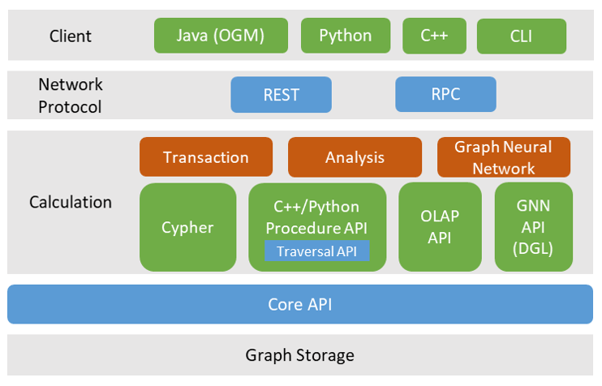

# Multi Level Interfaces

> This document mainly introduces the design concept of TuGraph's multi-level interfaces.

## 1.Introduction

The multi-level interface is a balance between usability and high performance that TuGraph has designed to meet a variety of use cases. For example, Cypher, a declarative graph query language, can abstract away the implementation details of a graph database and express queries based on the graph model. However, Cypher's high-level descriptions cannot be efficiently translated into low-level execution, so TuGraph provides a procedural language, Procedure API, to achieve optimal database performance.

Interfaces can be roughly divided into client interfaces and server interfaces. Most operations are performed on the server, and the client only does data encapsulation and parsing. The client and server are connected through a network, and TuGraph supports both flexible short-connection REST protocol and more efficient long-connection RPC protocol, which can be selected according to different business scenarios.

The server interfaces are all at the calculation layer and are logically separated from the graph data storage by a Core API layer.

### 2.Client Interface

The client interface refers to the interface executed on the client and is typically used for integration into software applications. TuGraph's client interface is relatively simple, including login/logout, data import/export, stored procedure loading and calling, and Cypher operations. Cypher integrates most of the functions, including data operations, graph model operations, operations and account management.

Since the parameters and return values of Cypher are strings, JAVA OGM is a structured wrapper for Cypher, meaning that query results can be encapsulated into a typed object for ease of use.

### 3.Server Interface

The server interface includes Cypher, Procedure API, OLAP API, and GNN PI, which provide services for graph transaction engines, graph analysis engines, and graph neural network engines. The characteristics of each interface are explained in detail below.

> __Cypher__ is an abstract description of query logic that is independent of execution logic and is more user-friendly for graph database applications, similar to the SQL language of relational databases. TuGraph's Cypher language mainly follows the OpenCypher query standard open-sourced by Neo4j and extends auxiliary functions such as operations and maintenance management. Descriptive graph query language will become the main data operation method for graph databases, but generating the optimal execution plan between description and execution still requires a long way to go in both academia and industry.

> __Procedure API__ is designed to bridge the gap between descriptive graph query language and optimal performance. TuGraph's Procedure API provides a simple wrapper on top of the Core API, which maximizes the storage's performance efficiency and is the upper limit of Cypher optimization performance. Python Procedure API is a cross-language wrapper on top of C++ Procedure API, but the copying of values during translation may result in some performance loss, and its advantage lies mainly in the ease of use of the Python language. The traversal API is a parallel-executing Procedure interface that is more similar to set operations in terms of description, such as expanding all outgoing neighbors of a point set to obtain a new point set.

> __OLAP API__ belongs to the category of "graph computing systems" and exports snapshots of graph data from storage that supports insert, update, delete, and query operations to support read-only complex graph analysis in a more compact data storage format. OLAP API encapsulates data structures that support high-concurrency execution, including Vector, Bitmap, and CSR-based graph snapshot data structures, and provides a set of concurrent fast point-edge operation frameworks. After the graph analysis task is completed, the data can be written back to the graph database through the interface.

> __GNN API__ mainly provides the interfaces needed for graph neural network applications and can be integrated with machine learning frameworks such as PyTorch. TuGraph's GNN PI mainly integrates DGL and completes the entire process from graph storage to graph neural network application in the Python language environment.

Except for Cypher's interpretive execution, all other server interfaces are compiled and executed, meaning that the corresponding code needs to be sent to the server and compiled (which may take some time) before execution on the server. Therefore, it is usually necessary to load the program first, then find it in the list of loaded applications, and execute it after passing in the input parameters.
