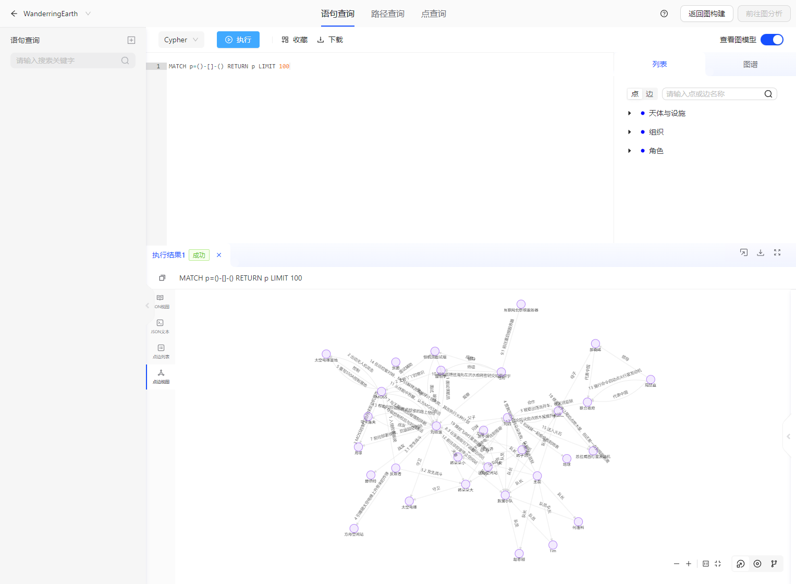
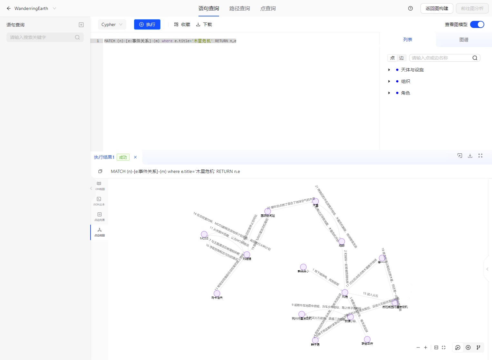
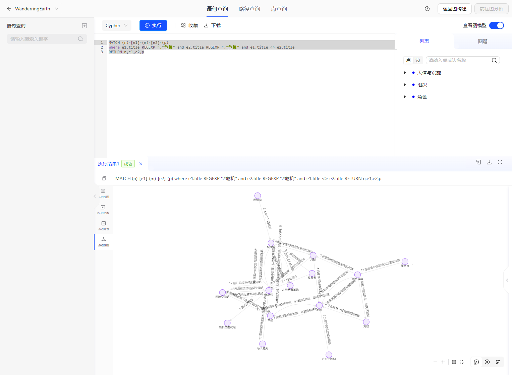

# DEMO:Wandering Earth

> This document mainly introduces the usage of the Wandering Earth demo.

## 1.Demo Scene Design

The demo is based on the story background of The Wandering Earth 1 and The Wandering Earth 2.

- Based on the plot, a graph structure is designed, including three types of points: organization, character, celestial body, and facility, and two types of edges: event and relationship.
- Prepared data corresponding to the schema based on the plot.
- Prepared some queries to ask questions about the plot.

## 2.Instructions for Use

Prerequisite: TuGraph is installed.

## 3.Data Import

- Data storage directory: https://github.com/TuGraph-family/tugraph-db-demo.
- Modify the DATA_PATH in import.json according to the corresponding data storage directory. For more details, please refer to [Data Importing](../../6.utility-tools/1.data-import.md).
- After starting the TuGraph service, access ${HOST_IP}:7070 to open the web page and confirm whether the data is imported successfully.

## 4.Cypher Query

Refer to the Cypher document and enter Cypher in the TuGraph web page frontend for queries.

## 5.Usage Display

### 5.1.Data Import Display

### 5.2.Query Display
Query all event processes related to the crisis on Jupiter.

Query all event processes related to all crises.

