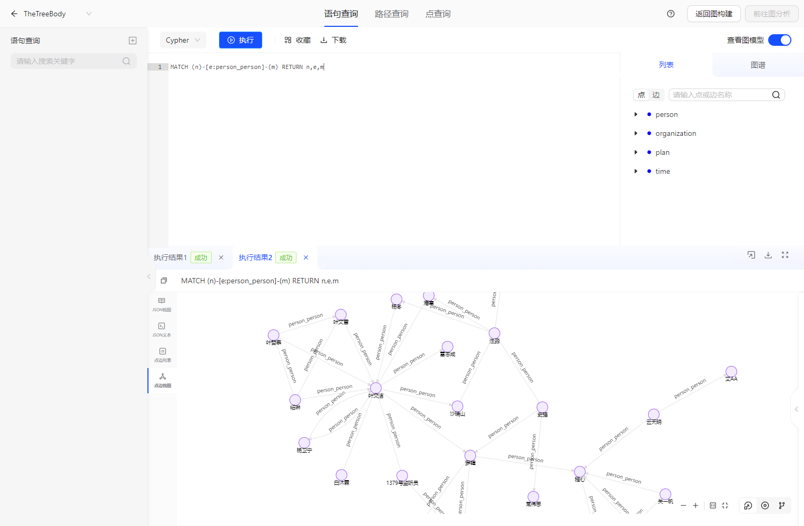
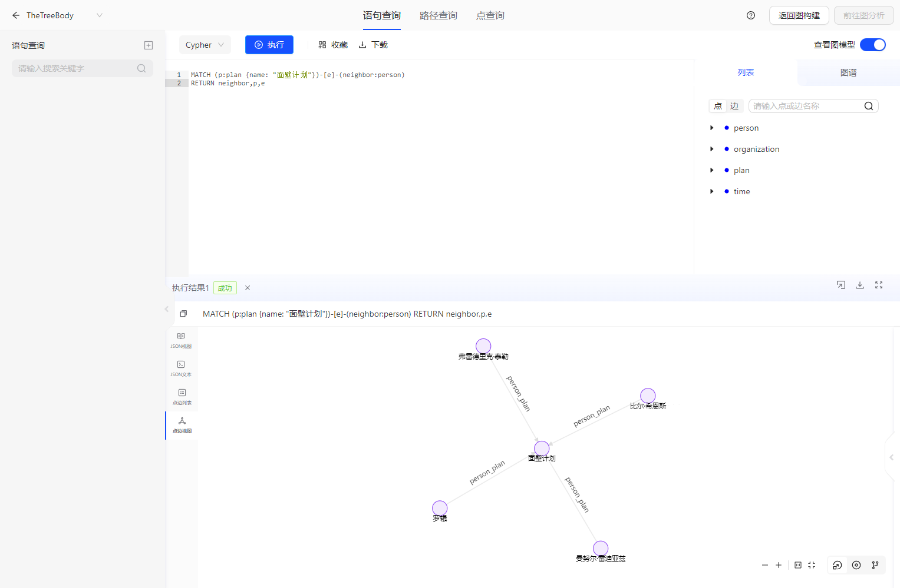
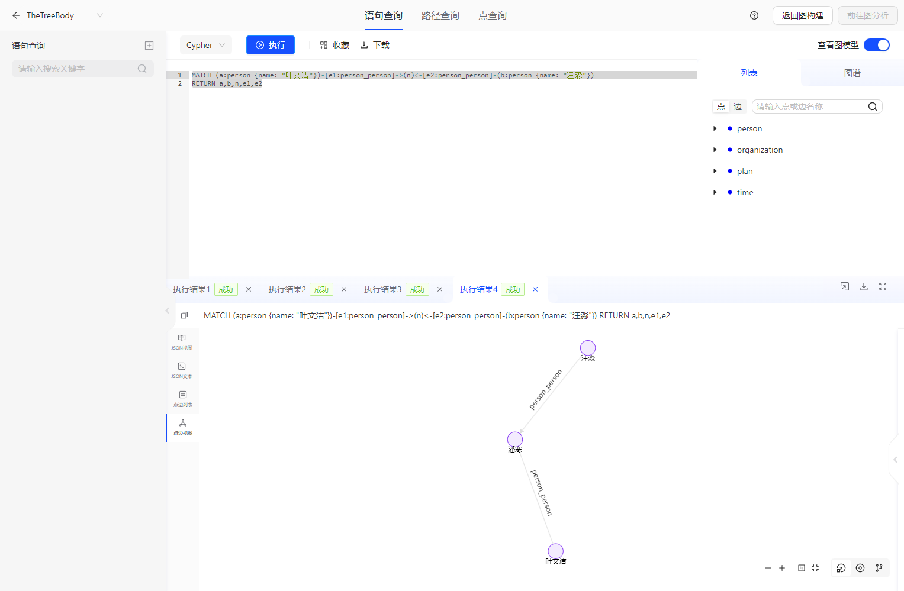

# The Three Body

> This document mainly introduces the usage of Three-Body demo.

## 1.Demo Scenario Design
The demo scenario is designed based on the story background of Three-Body 1, 2, and 3.

According to the setting of the Three-Body story, we have designed 4 types of nodes and 6 types of edges. The nodes include "character", "organization", "plan", and "timeline", while the edges include "character-character relationship", "character-plan relationship", "character-organization relationship", "organization-plan relationship", and "organization-organization relationship". According to the plot, corresponding schema data and some queries have been prepared to propose some questions about the plot.

## 2.Instructions for Use

Prerequisite: TuGraph is installed.

## 3.Data Import

- Manual import
    - Data storage directory: https://github.com/TuGraph-family/tugraph-db-demo.
    - Modify the DATA_PATH in import.json according to the corresponding data storage directory. For more details, please refer to [Data Importing](../../6.utility-tools/1.data-import.md).
    - After starting the TuGraph service, access ${HOST_IP}:7070 to open the web page and confirm whether the data is imported successfully.
- Automatic creation
    - Click `New Graph Project`, select Three-Body data, fill in the graph project configuration, and the system will automatically create the Three-Body scenario graph project.

## 4.Cypher Query

Refer to the TuGraph documentation and enter Cypher in the TuGraph web page frontend to execute a query.

## 5.Usage Demo

### 5.1.Data Import Demo


## 6.Query Demo

### 6.1.Character Relationship Query
In the plot of Three-Body 1, a large number of scientists committed suicide all over the world at the beginning, which aroused the attention of the police. During the investigation process, the truth behind it gradually surfaced step by step according to the clues of the character relationships, as shown in the above graph. Shi Qiang and Wang Miao discovered that most people had direct or indirect connections with Ye Wenjie, and sent Wang Miao undercover to finally discover Ye Wenjie's ultimate commander identity. As can be seen in the graph, there are many edge relationships (many one-degree or two-degree neighbors) around Ye Wenjie's vertex.

```cypher
MATCH (n)-[e:person_person]-(m) RETURN n,e,m
```



### 6.2.Neighbor Vertex Analysis
There are many plans in Three-Body, and sometimes we may be confused. At this time, we can use the graph's neighbor vertex query to view the relevant characters and organizations of the plan. For example, in the "Wallfacer Project", we can see that there are four characters related to it, and these four are also the "Wallfacers" who are highly expected by the world.

```cypher
MATCH (p:plan {name: "面壁计划"})-[e]-(neighbor:person)
RETURN neighbor,p,e
```



### 6.3.Query Common Neighbors of Node A and B
We often want to know who are the common related characters between two characters, so that we can quickly grasp the relationship between these two characters. In the case of large amounts of data, it is very convenient to use Cypher for graph relationship analysis!

```cypher
MATCH (a:person {name: "叶文洁"})-[e1:person_person]->(n)<-[e2:person_person]-(b:person {name: "汪淼"})
RETURN a,b,n,e1,e2
```



### 6.4.Set/Change Properties
As the plot progresses, we gradually learn about the various labels on "Ye Wenjie", so we can also update these labels to the "Ye Wenjie" node:

```cypher
MATCH (p:person {name: "叶文洁"})
SET p.introduce = "清华大学教授、ETO精神领袖、首位和三体人交流的人"
RETURN p
```

### 6.5.Add/Delete Nodes
Later, we learned about characters such as Luo Ji and Cheng Xin, and organizations such as PIA and the Star Ring Group, and wanted to add them as nodes to the graph:

```cypher
CREATE (a:person {introduce: "物理学教授", name: "bbb"})
RETURN a
```