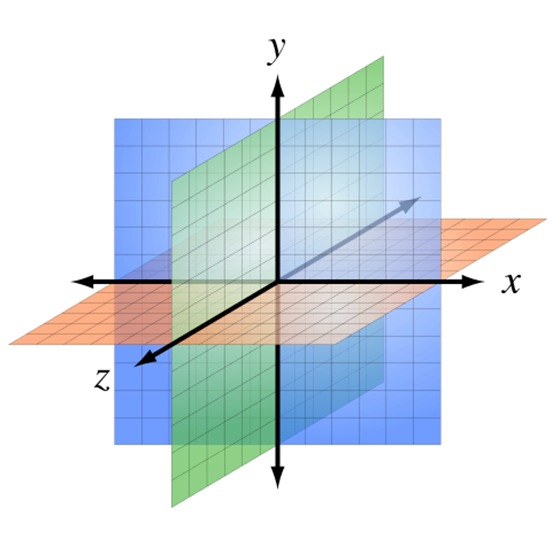
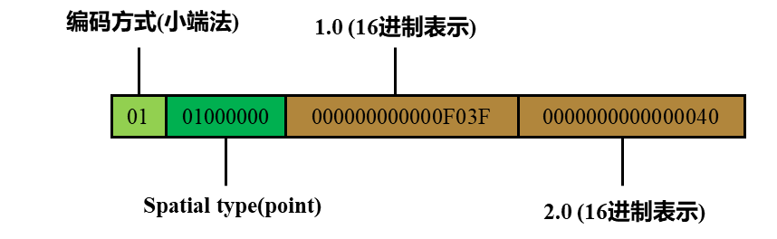
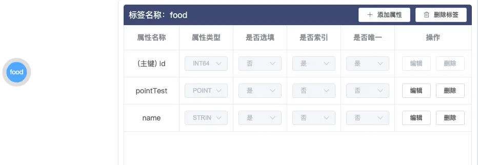
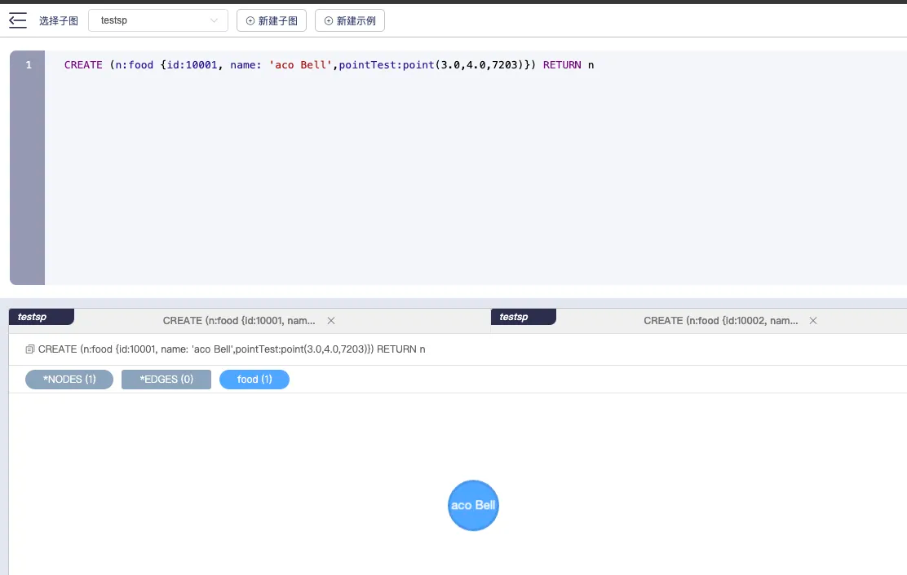
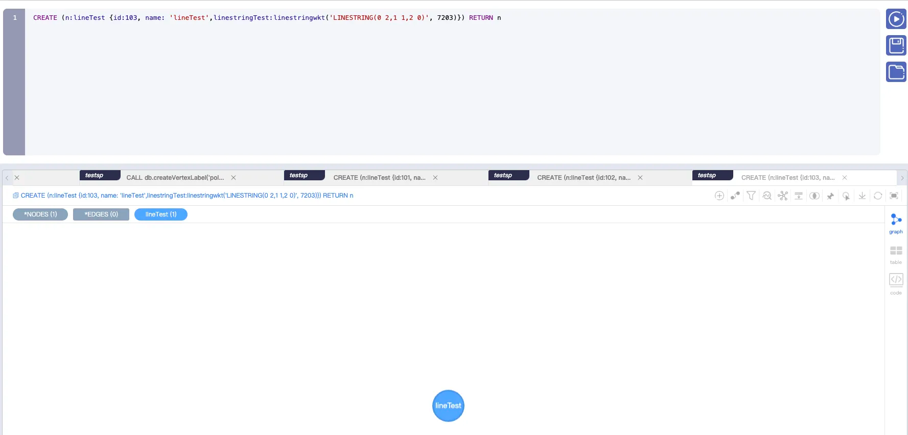

# 地理空间数据类型使用示例

## 1. 简介

TuGraph图数据库由蚂蚁集团与清华大学联合研发，构建了一套包含图存储、图计算、图学习、图研发平台的完善的图技术体系，拥有业界领先规模的图集群。近年来，地理空间功能在图数据库中的应用价值显著，它不仅增强了数据的表达能力，还促进了跨领域数据的融合分析，尤其在社交网络、地图探索、城市规划等关键领域展现了强大的实用价值。TuGraph也正在逐步支持地理空间功能。

## 2. 预备知识

EPSG([EPSG.io: Coordinate Systems Worldwide](https://epsg.io/)) 是一个标准化的地理空间参考系统标识符集合， 用于标识不同的地理空间参考系统，包括坐标系统、地理坐标系、投影坐标系等。我们常用EPSG编码表示数据的坐标系，这里我们介绍两种最常见的空间地理坐标系，也是大部分数据库支持的坐标系类型。

### 2.1 WGS84坐标系 EPSG: 4326

全球GPS定位系统: WGS84是全球定位系统(GPS)的基础，允许全球的GPS接收器确定精确位置。几乎所有现代GPS设备都是基于WGS84坐标系来提供位置信息。地图制作和地理信息系统(GIS): 在地图制作和GIS领域，WGS84被广泛用于定义地球上的位置。这包括各种类型的地图创建、空间数据分析和管理等。

### 2.2 Cartesian(笛卡尔)坐标系 EPSG: 7203

直角坐标系，是一种最基本、最广泛应用的坐标系统。它通过两条数轴定义一个平面，三条数轴定义一个空间，这些轴互相垂直，在数学、物理、工程、天文和许多其他领域中有着广泛的应用。

### 2.3 数据存储格式

OGC(Open Geospatial Consortium) 定义了空间数据的标准表示格式，分别为WKT与WKB格式，用于在不同系统和平台之间交换和存储空间数据，现已被广泛采用。其中WKT(well-kown text)格式, 是一种文本标记语言,易于人类阅读和编写，而WKB(Well-Known Binary)格式采用一系列字节来编码空间数据，更适合在计算机中存储;

**WKT:**

```
POINT(<x> <y>)
LINESTRING(<x1> <y1>, <x2><y2>, ...)
```

WKT格式的数据如上例所示，先指定空间数据类型，再在括号内指定具体的坐标，一个坐标对表示一个点，每个坐标对之间用逗号隔开。对于Polygon类型的数据，第一个坐标对需要与最后一个坐标对相同，形成闭合的面。

**WKB:**




针对EWKB格式的编码，说明如下:

- 第0 - 1位: 编码方式;
- 第2 - 5位: 空间数据类型;
    - 0100: point
    - 0200: linestring
    - 0300: polygon
- 第6 - 9位: 数据维度;
    - 0020: 二维
    - 0030: 三维
- 第10 - 17位: 坐标系的EPSG编码;
- 第18 - n位: double类型的坐标对的16进制表示。

### 2.4 常用函数

| Name                 | Description           | Signature                                                                 |
|----------------------|-----------------------|---------------------------------------------------------------------------|
| `dbms.graph.createGraph` | 创建子图           | `dbms.graph.createGraph(graph_name::STRING, description::STRING, max_size_GB::INTEGER) :: (::VOID)` |
| `db.createVertexLabel`  | 创建Vertex Label      | `db.createVertexLabel(label_name::STRING,field_specs::LIST) :: (::VOID)`      |
| `db.getLabelSchema`     | 列出label schema      | `db.getLabelSchema(label_type::STRING,label_name::STRING) :: (name::STRING,type::STRING,optional::BOOLEAN)` |
| `db.deleteLabel`        | 删除Vertex            | `db.deleteLabel(label_type::STRING,label_name::STRING) :: (::VOID)`         |

更完整详细的函数使用以及插入数据的语句，可以参考 [Cypher API](../8.query/1.cypher.md)

## 3. 数据类型

目前在TuGraph中，我们已经支持了Point, Linestring与Polygon三种类型:

- Point：点    point(2.0, 2.0, 7203)
- Linestring：折线 LINESTRING(0 2,1 1,2 0)
- Polygon：多边形  POLYGON((0 0,0 7,4 2,2 0,0 0))

其中坐标点都是double型，创建图模型和插入数据示例如下：

**创建标记美食位置的点模型**

```
CALL db.createVertexLabel('food', 'id', 'id', int64, false, 'name', string, true,'pointTest',point,true) 
```



**插入标记美食点的数据**

```
 CREATE (n:food {id:10001, name: 'aco Bell',pointTest:point(3.0,4.0,7203)}) RETURN n
```



**创建具有折线属性的点模型**

```
CALL db.createVertexLabel('lineTest', 'id', 'id', int64, false, 'name', string, true,'linestringTest',linestring,true)
```


**插入具有折线属性的点数据**

```
CREATE (n:lineTest {id:102, name: 'Tom',linestringTest:linestringwkt('LINESTRING(0 2,1 1,2 0)', 7203)}) RETURN n
```



**创建具有多边型属性的点模型**

```
CALL db.createVertexLabel('polygonTest', 'id', 'id', int64, false, 'name', string, true,'polygonTest',polygon,true)
```


**插入具有多边型属性的点数据**

```
CREATE (n:polygonTest {id:103, name: 'polygonTest',polygonTest:polygonwkt('POLYGON((0 0,0 7,4 2,2 0,0 0))', 7203)}) RETURN n
```

## 4. 函数介绍

| 函数名  | 描述 | 输入参数                         | 返回值类型 |
| --- | --- |------------------------------| --- |
| Distance() | 计算两个空间数据间的距离(要求坐标系相同) | Spatial data1, Spatial data2 | double |
| Disjoint()  |  判断两个空间数据是否相交（开发中） | Spatial data1, Spatial data2 | bool |
| WithinBBox() | 判断某个空间数据是否在给定的长方形区域内（开发中） | Spatial data, Point1         | bool |

## 5. 美食探索
### 5.1 基于地理位置的个性化推荐

在本章节中，我们将探索如何利用Tugraph图数据库的地理空间功能，构建一个生动有趣的美食探索应用，将“人”与“美食”通过地理位置紧密相连，实现个性化美食推荐。想象一下，无论身处何方，只需轻轻一点，周围诱人美食便尽收眼底，这正是我们即将构建的场景魅力所在。

### 5.2 数据模型设计
我们首先定义两种核心节点类型：

- Food（美食）节点：每一家餐厅或小吃店都可以作为一个Food节点，其属性包括但不限于名称、地址、评分、美食类别等。特别地，我们将在每个Food节点上附加地理坐标信息，用以精确记录其地理位置。

```
 CALL db.createVertexLabel('food', 'id', 'id', int64, false, 'name', string, true,'pointTest',point,true,'mark',double,true)
```

准备数据：

```
CREATE (n:food {id:10001, name: 'Starbucks',pointTest:point(1.0,1.0,7203),mark:4.8}) RETURN n
CREATE (n:food {id:10002, name: 'KFC',pointTest:point(2.0,1.0,7203),mark:4.5}) RETURN n
CREATE (n:food {id:10003, name: 'Pizza Hut',pointTest:point(2.0,5.0,7203),mark:4.5}) RETURN n
CREATE (n:food {id:10004, name: 'Taco Bell',pointTest:point(3.0,4.0,7203),mark:4.7}) RETURN n
CREATE (n:food {id:10005, name: 'Pizza Fusion',pointTest:point(5.0,3.0,7203),mark:4.9}) RETURN n
CREATE (n:food {id:10006, name: 'HaiDiLao Hot Pot',pointTest:point(2.0,2.0,7203),mark:4.8}) RETURN n
CREATE (n:food {id:10007, name: 'Lao Sze Chuan',pointTest:point(4.0,3.0,7203),mark:4.7}) RETURN n
```

- Person（人物）节点：代表应用的用户，属性包含用户名、当前位置等。用户的当前位置同样通过地理坐标表示，便于后续的地理空间查询。

```
 CALL db.createVertexLabel('person', 'id', 'id', int64, false, 'name', string, true,'pointTest',point,true)
```

准备数据：

```
 CREATE (n:person {id:1, name: 'Tom',pointTest:point(3.0,3.0,7203)}) RETURN n
```

### 5.3 构建美食探索查询

能够根据用户的当前位置，寻找距离2.5以内的美食,根据距离进行升序排列。返回距离和评分让用户得倒更好的体验。

**查询语句**

```
match (n:person{id:1}),(m:food) with n.pointTest as p1,m.pointTest as p2,m.name as food,m.mark as mark
CALL spatial.distance(p1,p2) YIELD distance 
WHERE distance<2.5
RETURN food,distance,mark ORDER by distance
```


此查询首先匹配特定的Person节点（以用户名“Tom”为例），然后找到所有Food节点，利用自定义的distance函数，计算Person节点当前位置与每个Food节点之间的直线距离，筛选出距离在2.5之内的美食。最后，按照美食的距离升序排列结果，附带评分参考，为用户提供最优质的推荐。

## 6. 展望

通过上述章节，我们不仅展示了TuGraph在地理空间数据处理的能力，也描绘了一个富有吸引力的美食探索场景，证明了图数据库在结合地理位置信息进行个性化服务方面具有巨大潜力。无论是寻找周末的休闲去处，还是探索旅行途中的特色美食，这样的应用都将极大地丰富人们的生活体验。

TuGraph将来会继续实现Disjoint() 、WithinBBox()，会丰富更多使用场景。当然，也欢迎大家一起参与，共同开发地理空间功能。
