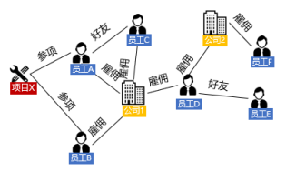

# 什么是图

> 本文面向初学者，介绍图（Graph）的基本概念。

我们今天介绍的图，是图论中使用点和边表示的图（Graph），而非图像的图（Image）。

图的基本元素是点和边，其中点表示事物或实体，边表示点之间的关联关系。

如上图左侧所示，点表示的有公司、员工、项目。边表示的是他们之间的关系，包括：公司和员工之间的雇佣关系，员工和员工之间的好友关系，项目和员工之间的参与关系。除此之外，点和边上可以附加属性，比如员工的工号，雇佣的时间，这样的图是属性图。也就是说，我们可以用图的方式来抽象地表示实体及其关联关系，图有非常丰富的表达能力。

除了上述的员工图谱，图还可以用于金融、工业、医疗等各个领域。在实际应用中，图的规模越来越大，比如金融交易图，点边规模可能到达百亿，与其同时，基于图的查询通常会复杂，最典型的是K跳查询，每增加一跳访问的数据都呈指数增长。