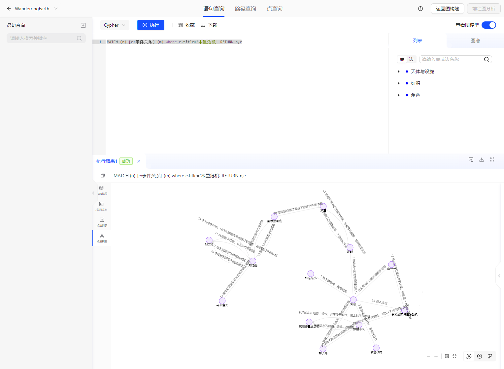

# 场景：流浪地球

> 此文档主要介绍 流浪地球 demo的使用方法。

## 1.Demo场景设计

Demo背景基于流浪地球1、流浪地球2的故事背景进行设计

- 基于剧情，设计了图结构，包含组织、角色、天体与设施3类点，事件、关系两类边
- 根据剧情准备了对应Schema的数据
- 准备了一些query，提出一些关于剧情的问题

## 2.使用说明

前置条件：TuGraph已安装

## 3.数据导入

- 手动导入
  - 数据存放目录：https://github.com/TuGraph-family/tugraph-db-demo
  - 根据数据存放目录对应修改import.json里面的DATA_PATH。具体可以参考[数据导入](../../6.utility-tools/1.data-import.md)
  - 启动TuGraph服务后，访问${HOST_IP}:7070，打开web页面，确认数据是否导入成功。
- 自动创建
    - 点击`新建图项目`，选择流浪地球数据，填写图项目配置，系统会自动完成流浪地球场景图项目创建。

## 4.Cypher查询

参考cypher文档，在TuGraph的Web页面前端输入Cypher进行查询

## 5.使用展示

### 5.1.数据导入的展示


### 5.2.查询展示
查询木星危机的所有事件经过

```
MATCH (n)-[e:事件关系]-(m) where e.title='木星危机' RETURN n,e
```



查询所以危机的相关事件经过

```cypher
MATCH (n)-[e1]-(m)-[e2]-(p)
where e1.title REGEXP ".*危机" and e2.title REGEXP ".*危机" and e1.title <> e2.title
RETURN n,e1,e2,p
```

