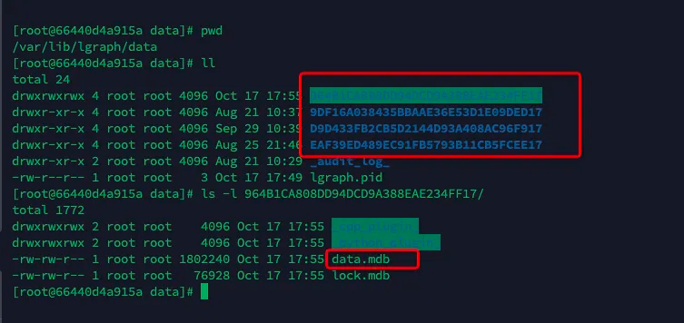
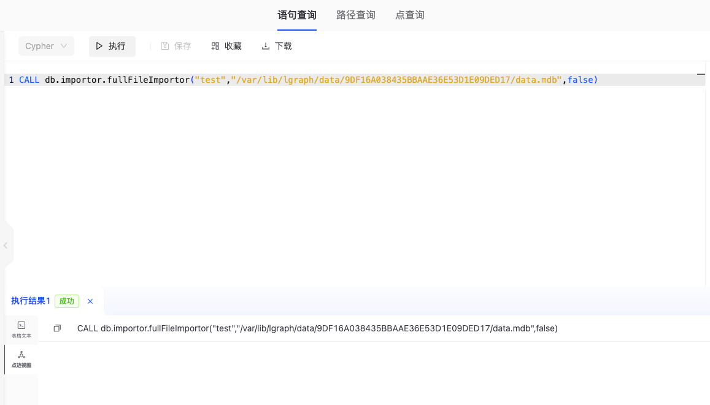
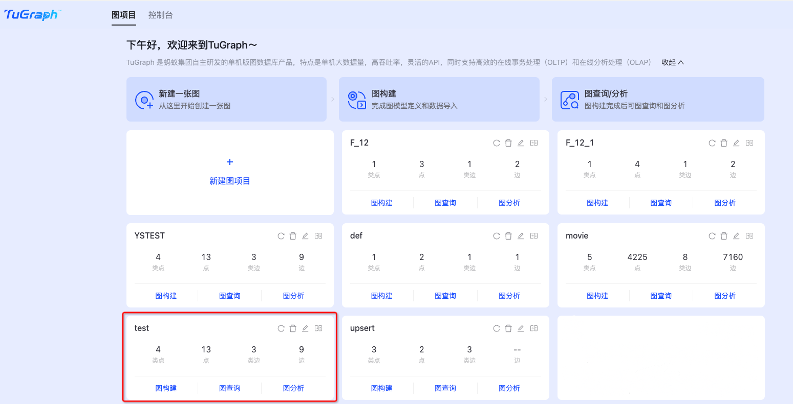

# 数据迁移

## 1. 简介
数据迁移是指将数据从一个系统、存储介质或应用程序迁移到另一个系统、存储介质或应用程序的过程。当TuGraph要升级或者系统硬件环境发生变化时，
需要对原TuGraph服务中的数据进行迁移。以系统硬件环境和软件版本为依据进行划分，本文将数据迁移分为四种方案：
1. 兼容迁移：当迁移前后系统环境一致且TuGraph软件兼容时，可以直接使用备份恢复的方式迁移数据；
2. 升级迁移：当迁移前后系统环境不一致或TuGraph软件不兼容时，需要使用先导出数据再重新导入的方式迁移数据；
3. 在线迁移：当对高可用集群进行数据迁移且集群网络环境良好时，可以使用增删节点的的方式将原集群平滑切换到新集群；
4. 图项目级数据迁移：包括在相同的TuGraph服务间进行子图数据迁移，以及在不同的TuGraph服务间进行子图数据迁移。

   请注意，TuGraph软件的不兼容性主要体现在跨大版本时的存储方式不兼容。接下来本文将详细介绍这四种方案。

## 2. 兼容迁移
兼容迁移指的是在系统环境不变，且TuGraph软件版本兼容时，原服务的数据和存储过程可以在新服务中使用，所以可以直接迁移。
用户可以先使用`lgraph_backup`工具备份数据，然后将数据传输到新机器中并重启服务。具体迁移步骤如下：

### 2.1. 备份数据
使用`lgraph_backup`工具备份数据
```bash
  lgraph_backup -s db -d db.bck
```
本步骤也可以直接使用`cp`命令，不过`cp`命令会拷贝一些多余的元数据，HA模式下也会拷贝raft的元数据导致迁移之后集群重启失败，
因此建议数据迁移时使用`lgraph_backup`工具替代`cp`命令。

### 2.2. 启动新服务
使用如下命令启动新服务，存储过程会自动加载到新服务中
```bash
  lgraph_server -c /usr/local/etc/lgraph.json --directory db.bck -d start
```

### 2.3. 停止原服务
使用如下命令停止原服务
```bash
  lgraph_server -c /usr/local/etc/lgraph.json --directory db.bck -d stop
```

## 3. 升级迁移
当用户要把原始服务迁移到一个差异化环境中（比如从centos7迁移到ubuntu18.04），或者TuGraph版本变化较大前后不兼容时（如3.4.0和3.6.0），
用户可以先使用`lgraph_export`工具将数据导出成文件，传输到新机器中，再使用`lgraph_import`工具重新导入并重启集群。
这样可以保证在新环境上能够使用，但是效率较低，存储过程也需要重新加载。具体的迁移步骤如下：

### 3.1. 导出数据
使用`lgraph_export`工具导出数据，并将数据传输到新机器上
```bash
  lgraph_export -d db -e db.export
```

### 3.2. 导入数据
使用`lgraph_import`工具导入数据，并手动加载存储过程（详见[client操作步骤](../7.client-tools/2.cpp-client.md)）
```bash
  lgraph_import -c db.export/import.config -d db
```

### 3.3. 启动新服务
使用如下命令启动新服务
```bash
   lgraph_server -c /usr/local/etc/lgraph.json --directory db.export -d start
```

### 3.4. 停止原服务
使用如下命令停止原服务
```bash
   lgraph_server -c /usr/local/etc/lgraph.json --directory db.export -d stop
```

## 4. 在线迁移
当对TuGraph高可用版本部署的服务器集群进行数据迁移时，如果网络带宽充足，可以直接使用增删节点的方式对服务进行在线迁移。具体迁移步骤如下所示：

### 4.1. 拷贝数据
使用如下命令拷贝leader节点上的数据，并且传输到新集群的机器节点上。由于leader节点上有最完整的raft日志，拷贝leader的数据可以最大程度地减少
日志追赶的时间。
```bash
  cp -r db db.cp
```
### 4.2. 启动新节点
使用如下命令将新节点加入集群，加入集群后，增量数据自动同步到新节点
```bash
  lgraph_server -c /usr/local/etc/lgraph_ha.json --directory db.cp --ha_conf 192.168.0.1:9090,192.168.0.2:9090,192.168.0.3:9090 -d start
```
### 4.3. 停止原节点
停止原节点服务，后续应用请求直接发给新集群
```bash
  lgraph_server -c /usr/local/etc/lgraph_ha.json --directory db.cp --ha_conf 192.168.0.1:9090,192.168.0.2:9090,192.168.0.3:9090 -d stop
```
## 5. 图项目级数据迁移
图项目级数据迁移包括在相同的TuGraph服务间进行子图数据迁移，以及在不同的TuGraph服务间进行子图数据迁移。 对于同一TuGraph服务内的子图数据迁移，可以将当前服务中的图项目迁移到一个新的项目中，新项目与被迁移的项目在模型和节点、边数据上完全一致。 对于不同TuGraph服务间的子图数据迁移，可以将其他TuGraph服务中的图项目迁移到当前的TuGraph服务中，迁移前后的模型和数据同样一致。

### 5.1. TuGraph 数据目录说明
如下图，数据默认在 `/var/lib/lgraph/data` 目录下。在该路径下，每个以长字符串命名的目录代表一个特定的图项目的数据存储位置。进入到具体的长字符串目录中，可以看到 data.mdb 文件，这些文件存储了该图项目的具体模型和数据。由于图项目的数据存储目录当前不支持以项目名称命名，可以通过项目的创建时间来区分不同的项目。



### 5.2. 子图间数据迁移

在任意图项目的图查询中执行如下语句进行迁移：

```
   CALL db.importor.fullFileImportor("${新的图项目名称}","data.mdb文件",false)
```

参数说明：
1. 第一个参数是新子图名称。
2. 第二个参数是服务器上待迁移图项目的文件绝对路径。有关路径位置，请参考“TuGraph 数据目录说明”。
3. 第三个是文件是否是远程文件，如果是服务器的本地文件就设置为false或者不设置。

注意：
如果第一个参数指定的新子图名称已经存在于已创建的图项目中，则原有的子图数据将会被迁移过来的数据覆盖。如果子图不存在，则会创建一个新的子图。建议避免使用重名，以防止覆盖导致的数据丢失。

示例：

```
CALL db.importor.fullFileImportor("test","/var/lib/lgraph/data/9DF16A038435BBAAE36E53D1E09DED17/data.mdb",false)
```

在任意图项目的图查询中执行迁移语句:



执行迁移语句后查看新子图




要实现跨 TuGraph 服务的数据迁移，可以先将目标数据目录复制到当前的 TuGraph 服务器上。通过执行上述迁移步骤，在服务正常运行的情况下进行数据和模型无缝迁移。