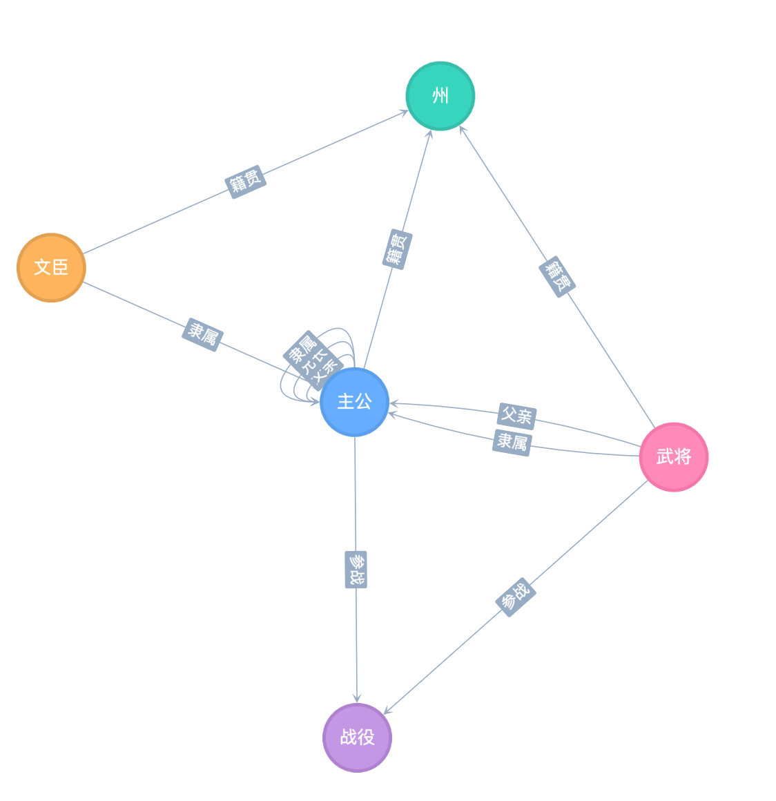
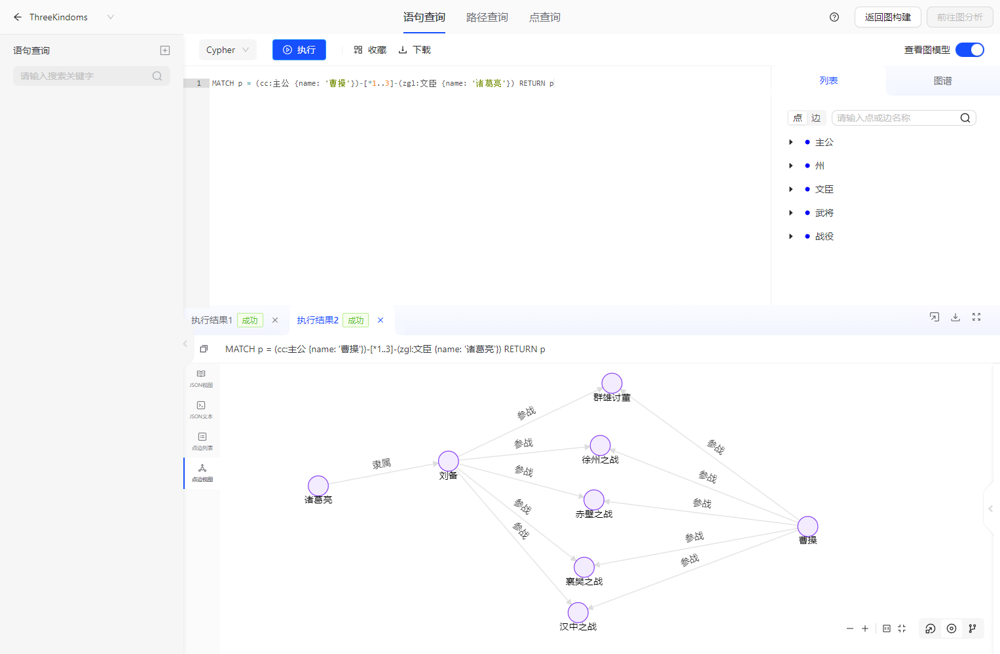
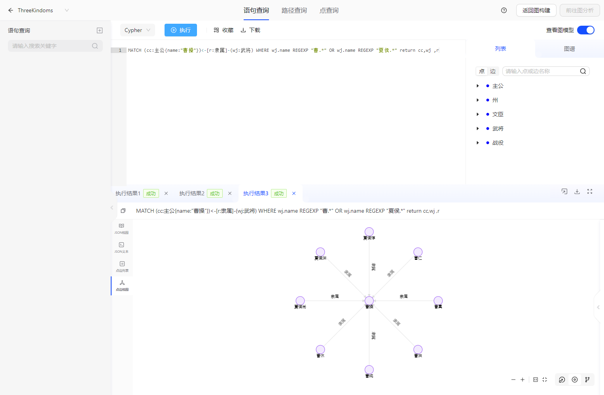
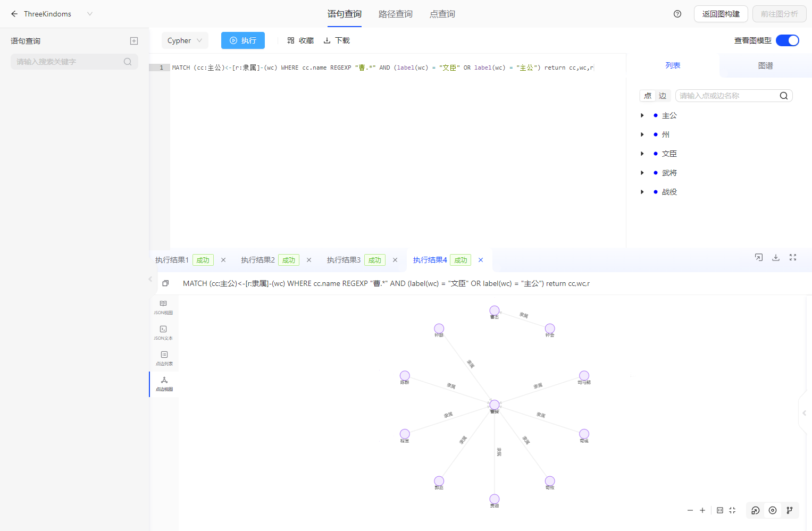
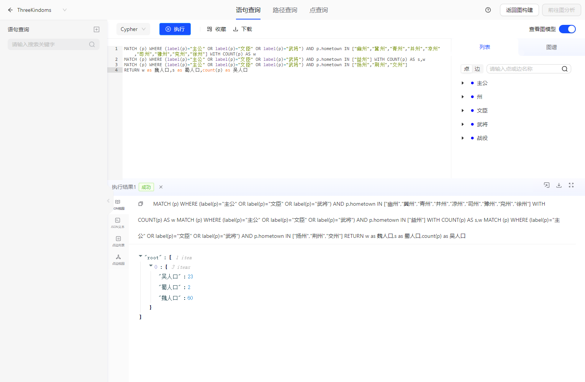

# 场景：三国

> 此文档主要介绍 三国 demo的使用方法。

## 1. 简介
由于史料的缺失，一些即使为人们熟知的历史事件也往往存在着很多未解之谜。以三国历史为例，诸葛亮为什么出山帮助当时势力弱小的刘备，同为天下英雄的曹操和刘备为什么成就差距巨大等等。以往学者往往采用二维关系分析历史，这样得出的结论往往比较片面。使用TuGraph将三国的历史人物和事件导入图模型中，使用图计算方式进行分析，能够帮助我们从有限的信息中获得更有价值的知识，是一种非常有意义的跨学科尝试。
## 2. 数据建模
我们设计了5类顶点和5类边，点包括“主公”，“州”，“文臣”，“武将”，“战役”，边包括“父亲”，“兄长”，“隶属”，“籍贯”，“参战”。其具体建模信息如下所示：


## 3. 数据导入
- 手动导入
  - 数据存放目录：https://github.com/TuGraph-family/tugraph-db-demo
  - 根据数据存放目录对应修改import.json里面的DATA_PATH。具体可以参考[数据导入](../../6.utility-tools/1.data-import.md)
  - 启动TuGraph服务后，访问${HOST_IP}:7070，打开web页面，确认数据是否导入成功。
- 自动创建
    - 点击`新建图项目`，选择三国数据，填写图项目配置，系统会自动完成三国场景图项目创建。

## 4. Cypher分析
### 4.1. 诸葛亮为什么选择刘备
通过如下cypher命令可以查看诸葛亮和曹操、刘备之间的关系
```
MATCH p = (cc:主公 {name: '曹操'})-[*1..3]-(zgl:文臣 {name: '诸葛亮'}) RETURN p
```
得到的查询结果如下图所示

从图中可以很直观的看出，曹操和诸葛亮之间的最短路径之一包含徐州之战，曹操曾经因父亲被杀对徐州进行过屠城，而诸葛亮是徐州琅琊郡人，任何人都断然不会选择一个屠杀过自己家乡的军阀作为主公。而相反，刘备曾经在徐州之战中阻止过曹操的暴行，这应当是诸葛亮对刘备好感的原因之一。

### 4.2. 曹操为什么成就比刘备高
通过如下cypher命令可以查看家族对曹操创业的助力
```
MATCH (cc:主公{name:"曹操"})<-[r:隶属]-(wj:武将) WHERE wj.name REGEXP "曹.*" OR wj.name REGEXP "夏侯.*" return cc,wj,r
```
得到的查询结果如下图所示

平定天下最重要的就是军事人才，曹操其父本姓夏侯，过继于曹氏，曹氏和夏侯氏在谯县都属于地方大族，在曹操创业初期提供了夏侯惇，夏侯渊，曹仁，曹洪在内大量的军事人才。而刘备其父早丧，没有家族助力，年过50才凑齐了自己的五虎上将，而这时已经过了天下大乱争夺地盘的最佳时机，曹操已经天下九州居其六了。

### 4.3. 三国中最强大的魏国为何最先灭亡
通过如下cypher命令可以查看曹操集团的重要文官组成
```
MATCH (cc:主公)<-[r:隶属]-(wc) WHERE cc.name REGEXP "曹.*" AND (label(wc) = "文臣" OR label(wc) = "主公") return cc,wc,r
```
得到的查询结果如下图所示

曹魏事实上于249年灭亡于高平陵之变，立国29年，少于蜀汉（43年）和东吴（51年）。三国中实力最强大的魏国最先灭亡的原因就在于曹魏的文官制度（九品中正制）使得权力很容易集中在世家大族手中。从图中可以看出，曹操曹丕父子两代的重要文臣几乎都是世家大族，颍川荀氏，颍川钟氏，颍川陈氏，武威贾氏等，甚至还出现了地区化趋势，集中于颍川，最终政权也为和颍川荀氏关系密切的河内司马氏所篡夺。

### 4.4. 三国各自的实力究竟如何
通过如下cypher命令可以查看三国各集团的人口实力
```
MATCH (p) WHERE (label(p)="主公" OR label(p)="文臣" OR label(p)="武将") AND p.hometown IN ["幽州","冀州","青州","并州","凉州","司州","豫州","兖州","徐州"] WITH COUNT(p) AS w
MATCH (p) WHERE (label(p)="主公" OR label(p)="文臣" OR label(p)="武将") AND p.hometown IN ["益州"] WITH COUNT(p) AS s,w
MATCH (p) WHERE (label(p)="主公" OR label(p)="文臣" OR label(p)="武将") AND p.hometown IN ["扬州","荆州","交州"]
RETURN w as 魏人口,s as 蜀人口,count(p) as 吴人口
```
得到的查询结果如下表所示

古代社会衡量一个国家实力的重要指标是人口数量，由于人口数据缺失，我们使用三国所有主公和文臣武将的籍贯数据估计每个州的人口数量。发现三国主要人物中，按籍贯有60个属于魏国，有23个属于吴国，仅有2个属于蜀国，证明魏国确实是三国中最强大的国家。

### 4.5. 曹操的军事能力如何评价
通过如下cypher命令可以查看曹操参与的主要战役
```
MATCH (cc:主公{name:"曹操"})-[e]-(zy:战役) RETURN cc,zy,e
```
得到的查询结果如下图所示

从图中可以看出，曹操在三国主要的15场战役中参加了8场，出场率比较高。但是曹操只获胜了徐州之战、兖州之战、官渡之战和襄樊之战，汉中之战、宛城之战、群雄讨董和赤壁之战都失败了，综合胜率50%，证明曹操并不算一个非常优秀的军事家。

## 5. 备注
更多的分析有待大家积极补充和尝试！