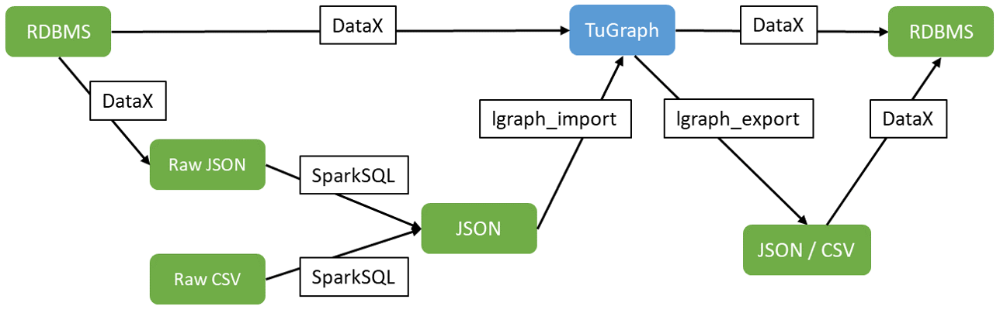

# TuGraph-DataX

> 此文档主要介绍 TuGraph DataX 的安装编译和使用示例

## 1.简介

TuGraph 在阿里开源的 DataX 基础上添加了 TuGraph 的写插件以及 TuGraph jsonline 数据格式的支持，其他数据源可以通过 DataX 往 TuGraph 里面写数据。
TuGraph DataX 介绍 [https://github.com/TuGraph-family/DataX](https://github.com/TuGraph-family/DataX)，支持的功能包括：

- 从 MySQL、SQL Server、Oracle、PostgreSQL、HDFS、Hive、HBase、OTS、ODPS、Kafka 等各种异构数据源导入 TuGraph
- 将 TuGraph 导入相应的目标源 （待开发）



DataX 原始项目介绍参考 [https://github.com/alibaba/DataX](https://github.com/alibaba/DataX)

## 2.编译安装

```bash
git clone https://github.com/TuGraph-family/DataX.git
yum install maven
mvn -U clean package assembly:assembly -Dmaven.test.skip=true
```

编译出来的 DataX 文件在 target 目录下

## 3. 导入TuGraph

### 3.1.文本数据通过DataX导入TuGraph

我们以 TuGraph 手册中导入工具 lgraph_import 章节举的数据为例子，有三个 csv 数据文件，如下：
`actors.csv`

```
nm015950,Stephen Chow
nm0628806,Man-Tat Ng
nm0156444,Cecilia Cheung
nm2514879,Yuqi Zhang
```

`movies.csv`

```
tt0188766,King of Comedy,1999,7.3
tt0286112,Shaolin Soccer,2001,7.3
tt4701660,The Mermaid,2016,6.3
```

`roles.csv`

```
nm015950,Tianchou Yin,tt0188766
nm015950,Steel Leg,tt0286112
nm0628806,,tt0188766
nm0628806,coach,tt0286112
nm0156444,PiaoPiao Liu,tt0188766
nm2514879,Ruolan Li,tt4701660
```

然后建三个 DataX 的 job 配置文件：
`job_actors.json`

```json
{
  "job": {
    "setting": {
      "speed": {
        "channel": 1
      }
    },
    "content": [
      {
        "reader": {
          "name": "txtfilereader",
          "parameter": {
            "path": ["actors.csv"],
            "encoding": "UTF-8",
            "column": [
              {
                "index": 0,
                "type": "string"
              },
              {
                "index": 1,
                "type": "string"
              }
            ],
            "fieldDelimiter": ","
          }
        },
        "writer": {
          "name": "tugraphwriter",
          "parameter": {
            "url": "bolt://127.0.0.1:27687",
            "username": "admin",
            "password": "73@TuGraph",
            "graphName": "default",
            "labelType": "VERTEX",
            "labelName": "actor",
            "batchNum": 1000,
            "properties": ["aid", "name"]
          }
        }
      }
    ]
  }
}
```

`job_movies.json`

```json
{
  "job": {
    "setting": {
      "speed": {
        "channel": 1
      }
    },
    "content": [
      {
        "reader": {
          "name": "txtfilereader",
          "parameter": {
            "path": ["movies.csv"],
            "encoding": "UTF-8",
            "column": [
              {
                "index": 0,
                "type": "string"
              },
              {
                "index": 1,
                "type": "string"
              },
              {
                "index": 2,
                "type": "string"
              },
              {
                "index": 3,
                "type": "string"
              }
            ],
            "fieldDelimiter": ","
          }
        },
        "writer": {
          "name": "tugraphwriter",
          "parameter": {
            "url": "bolt://127.0.0.1:27687",
            "username": "admin",
            "password": "73@TuGraph",
            "graphName": "default",
            "labelType": "VERTEX",
            "labelName": "movie",
            "batchNum": 1000,
            "properties": ["mid", "name", "year", "rate"]
          }
        }
      }
    ]
  }
}
```

`job_roles.json`

```json
{
  "job": {
    "setting": {
      "speed": {
        "channel": 1
      }
    },
    "content": [
      {
        "reader": {
          "name": "txtfilereader",
          "parameter": {
            "path": ["roles.csv"],
            "encoding": "UTF-8",
            "column": [
              {
                "index": 0,
                "type": "string"
              },
              {
                "index": 1,
                "type": "string"
              },
              {
                "index": 2,
                "type": "string"
              }
            ],
            "fieldDelimiter": ","
          }
        },
        "writer": {
          "name": "tugraphwriter",
          "parameter": {
            "url": "bolt://127.0.0.1:27687",
            "username": "admin",
            "password": "73@TuGraph",
            "graphName": "default",
            "labelType": "EDGE",
            "labelName": "play_in",
            "batchNum": 1000,
            "properties": ["SRC_ID", "role", "DST_ID"],
            "startLabel": {"type": "actor", "key": "SRC_ID"},
            "endLabel": {"type": "movie", "key": "DST_ID"}
          }
        }
      }
    ]
  }
}
```

`./lgraph_server -c lgraph_standalone.json -d 'run'` 启动 TuGraph 后依次执行如下三个命令：

```
python3 datax/bin/datax.py  job_actors.json
```

```
python3 datax/bin/datax.py  job_movies.json
```

```
python3 datax/bin/datax.py  job_roles.json
```

### 3.2.MySQL数据通过DataX导入TuGraph

我们在 `test` database 下建立如下电影 `movies` 表

```sql
CREATE TABLE `movies` (
  `mid`  varchar(200) NOT NULL,
  `name` varchar(100) NOT NULL,
  `year` int(11) NOT NULL,
  `rate` float(5,2) unsigned NOT NULL,
  PRIMARY KEY (`mid`)
);
```

往表中插入几条数据

```sql
insert into
test.movies (mid, name, year, rate)
values
('tt0188766', 'King of Comedy', 1999, 7.3),
('tt0286112', 'Shaolin Soccer', 2001, 7.3),
('tt4701660', 'The Mermaid',   2016,  6.3);
```

建立一个 DataX 的 job 配置文件

`job_mysql_to_tugraph.json`

**配置字段方式**

```json
{
  "job": {
    "setting": {
      "speed": {
        "channel": 1
      }
    },
    "content": [
      {
        "reader": {
          "name": "mysqlreader",
          "parameter": {
            "username": "root",
            "password": "root",
            "column": ["mid", "name", "year", "rate"],
            "splitPk": "mid",
            "connection": [
              {
                "table": ["movies"],
                "jdbcUrl": ["jdbc:mysql://127.0.0.1:3306/test?useSSL=false"]
              }
            ]
          }
        },
        "writer": {
          "name": "tugraphwriter",
          "parameter": {
            "url": "bolt://127.0.0.1:27687",
            "username": "admin",
            "password": "73@TuGraph",
            "graphName": "default",
            "labelType": "VERTEX",
            "labelName": "movie",
            "batchNum": 1000,
            "properties": ["mid", "name", "year", "rate"]
          }
        }
      }
    ]
  }
}
```

**写简单 sql 方式**

```json
{
  "job": {
    "setting": {
      "speed": {
        "channel": 1
      }
    },
    "content": [
      {
        "reader": {
          "name": "mysqlreader",
          "parameter": {
            "username": "root",
            "password": "root",
            "connection": [
              {
                "querySql": [
                  "select mid, name, year, rate from test.movies where year > 2000;"
                ],
                "jdbcUrl": ["jdbc:mysql://127.0.0.1:3306/test?useSSL=false"]
              }
            ]
          }
        },
        "writer": {
          "name": "tugraphwriter",
          "parameter": {
            "url": "bolt://127.0.0.1:27687",
            "username": "admin",
            "password": "73@TuGraph",
            "graphName": "default",
            "labelType": "VERTEX",
            "labelName": "movie",
            "batchNum": 1000,
            "properties": ["mid", "name", "year", "rate"]
          }
        }
      }
    ]
  }
}
```

`./lgraph_server -c lgraph_standalone.json -d 'run'` 启动 TuGraph 后执行如下命令：

```shell
python3 datax/bin/datax.py  job_mysql_to_tugraph.json
```

## 4.导出TuGraph

### 4.1.配置样例

TuGraph支持使用DataX导出数据，使用如下配置即可将数据导出到文本数据中

```json
{
    "job": {
        "setting": {
            "speed": {
                 "channel":1
            }
        },
        "content": [
            {
                "reader": {
                    "name": "tugraphreader",
                    "parameter": {
                        "username": "admin",
                        "password": "73@TuGraph",
                        "graphName": "Movie_8C5C",
                        "queryCypher": "match (n:person) return n.id,n.name,n.born;",
                        "url": "bolt://127.0.0.1:27687"
                    }
                },
                "writer": {
                    "name": "txtfilewriter",
                    "parameter": {
                        "path": "./result",
                        "fileName": "luohw",
                        "writeMode": "truncate"
                    }
                }
            }
        ]
    }
}
```

使用这个配置文件，可以把TuGraph Movie_8C5C子图中person节点的id,name和born属性全部导出出来，
导出到当前目录下的result目录中，文件名称为luohw+随机后缀。

### 4.2.参数说明

在使用DataX导出TuGraph数据时，需要将reader设置为tugraphreader并配置以下5个参数：

* **url**
    * 描述：TuGraph的bolt server地址 <br />
    * 必选：是 <br />
    * 默认值：无 <br />

* **username**
    * 描述：TuGraph的用户名 <br />
    * 必选：是 <br />
    * 默认值：无 <br />

* **password**
    * 描述：TuGraph的密码 <br />
    * 必选：是 <br />
    * 默认值：无 <br />

* **graphName**
    * 描述：所选取的需要同步的TuGraph子图 <br />
    * 必选：是 <br />
    * 默认值：无 <br />

* **queryCypher**
    * 描述：通过cypher语句读取TuGraph中的数据 <br />
    * 必选：否 <br />
    * 默认值：无 <br />
