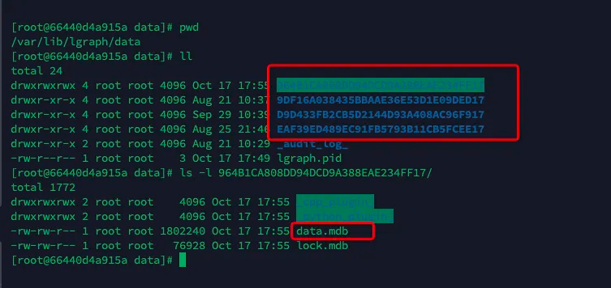
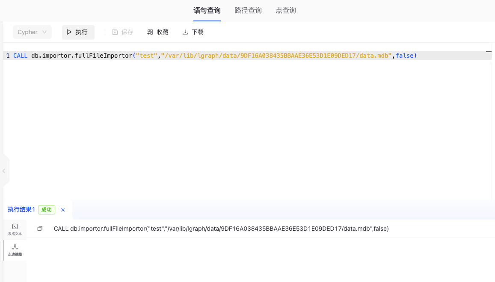
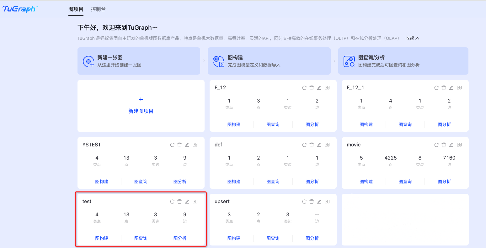

# Data Migration

## 1 Introduction
Data migration refers to the process of moving data from one system, storage medium, or application to another system, storage medium, or application. When TuGraph needs to be upgraded or the system hardware environment changes,
The data in the original TuGraph service needs to be migrated. Based on the system hardware environment and software version, this paper divides data migration into three schemes:
1. Compatible migration: When the system environment before and after the migration is consistent and the TuGraph software is compatible, you can directly use the backup and recovery method to migrate data;
2. Upgrade and migration: When the system environment before and after the migration is inconsistent or the TuGraph software is not compatible, it is necessary to migrate the data by first exporting the data and then re-importing;
3. Online migration: When data migration is performed on a high-availability cluster and the network environment of the cluster is good, the original cluster can be smoothly switched to the new cluster by adding or deleting nodes.
4. Graph project-level data migration : It includes the migration of subgraph data within the same TuGraph service as well as between different TuGraph services.

   Please note that the incompatibility of TuGraph software is mainly reflected in storage methods when transitioning across major versions. The following sections will provide a detailed introduction to these four solutions.

## 2. Compatible Migration
Compatible migration means that when the system environment remains unchanged and the TuGraph software version is compatible, the data and stored procedures of the original service can be used in the new service, so it can be directly migrated.
Users can first use the `lgraph_backup` tool to back up the data, then transfer the data to a new machine and restart the service. The specific migration steps are as follows:

### 2.1. Backup data
Backup data using `lgraph_backup` tool
```bash
   lgraph_backup -s db -d db.bck
```
You can also directly use the `cp` command in this step, but the `cp` command will copy some redundant metadata, and the raft metadata will also be copied in the HA mode, causing the cluster to fail to restart after migration.
Therefore, it is recommended to use the `lgraph_backup` tool instead of the `cp` command during data migration.

### 2.2. Start a new service
Use the following command to start the new service, and the stored procedure will be automatically loaded into the new service
```bash
   lgraph_server -c /usr/local/etc/lgraph.json --directory db.bck -d start
```

### 2.3. Stop the original service
Use the following command to stop the original service
```bash
   lgraph_server -c /usr/local/etc/lgraph.json --directory db.bck -d stop
```

## 3. Upgrade migration
When the user wants to migrate the original service to a differentiated environment (such as migrating from centos7 to ubuntu18.04), or when the version of TuGraph changes greatly and is incompatible (such as 3.4.0 and 3.6.0),
Users can first use the `lgraph_export` tool to export the data into a file, transfer it to a new machine, and then use the `lgraph_import` tool to re-import and restart the cluster.
This can ensure that it can be used in the new environment, but the efficiency is low, and the stored procedure needs to be reloaded. The specific migration steps are as follows:

### 3.1. Export data
Use the `lgraph_export` tool to export the data and transfer the data to the new machine
```bash
   lgraph_export -d db -e db.export
```

### 3.2. Import data
Use the `lgraph_import` tool to import data and manually load the stored procedure (see [client operation steps](../7.client-tools/2.cpp-client.md) for details)
```bash
   lgraph_import -c db.export/import.config -d db
```

### 3.3. Start a new service
Start the new service with the following command
```bash
    lgraph_server -c /usr/local/etc/lgraph.json --directory db.export -d start
```

### 3.4. Stop the original service
Use the following command to stop the original service
```bash
    lgraph_server -c /usr/local/etc/lgraph.json --directory db.export -d stop
```

## 4. Online Migration
When performing data migration on the server cluster deployed by the high-availability version of TuGraph, if the network bandwidth is sufficient, you can directly migrate the service online by adding or deleting nodes. The specific migration steps are as follows:

### 4.1. Copy data
Use the following commands to copy the data on the leader node and transfer it to the machine nodes of the new cluster. Since the leader node has the most complete raft log, copying the leader's data can minimize
The time for the log to catch up.
```bash
   cp -r db db.cp
```
### 4.2. Starting a new node
Use the following command to join the new node to the cluster. After joining the cluster, the incremental data will be automatically synchronized to the new node
```bash
   lgraph_server -c /usr/local/etc/lgraph_ha.json --directory db.cp --ha_conf 192.168.0.1:9090,192.168.0.2:9090,192.168.0.3:9090 -d start
```
### 4.3. Stop the original node
Stop the original node service, and send subsequent application requests directly to the new cluster
```bash
   lgraph_server -c /usr/local/etc/lgraph_ha.json --directory db.cp --ha_conf 192.168.0.1:9090,192.168.0.2:9090,192.168.0.3:9090 -d stop
```

## 5. Graph Project-Level Data Migration

Graph project-level data migration includes subgraph data migration within the same TuGraph service as well as subgraph data migration between different TuGraph services. For subgraph data migration within the same TuGraph service, you can migrate a graph project from the current service to a new project. The new project will be completely consistent with the migrated project in terms of models, nodes, and edges data. For subgraph data migration between different TuGraph services, you can migrate a graph project from another TuGraph service to the current TuGraph service. The models and data will remain consistent before and after the migration.

### 5.1. TuGraph Data Directory Description

As shown in the figure, data is by default located in the `/var/lib/lgraph/data` directory. Within this path, each directory named with a long string represents the data storage location of a specific graph project. By entering one of these directories, you can find the data.mdb file, which stores the specific models and data for that graph project.The data storage directory for graph projects currently does not support naming by project names, so different projects can be distinguished by their creation time.



### 5.2. Graph Project Data Migration

Execute the following statement in the graph query of any graph project to perform the migration:

```
   CALL db.importor.fullFileImportor("${newGraphName}","data.mdb",false)
```

Parameter Description:
1. The first parameter is the name of the new subgraph.
2. The second parameter is the absolute file path of the graph project to be migrated on the server. For path details, please refer to the "TuGraph Data Directory Description".
3. The third parameter specifies whether the file is a remote file. If it is a local file on the server, set this parameter to false or leave it unset.

Note:
If the name of the new subgraph specified in the first parameter already exists in an existing graph project, the original subgraph data will be overwritten by the migrated data. If the subgraph does not exist, a new subgraph will be created. It is advisable to avoid using duplicate names to prevent data loss due to overwriting.

Example:

```
CALL db.importor.fullFileImportor("test","/var/lib/lgraph/data/9DF16A038435BBAAE36E53D1E09DED17/data.mdb",false)
```

Execute the migration statement within the graph query of any graph project.



After executing the migration statement, check the new subgraph.



To achieve cross-TuGraph service data migration, you can first copy the target data directory to the current TuGraph server. By executing the aforementioned migration steps, you can perform seamless data and model migration while the service remains operational.