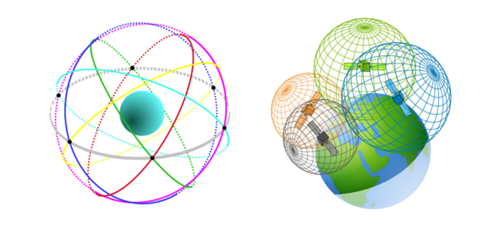
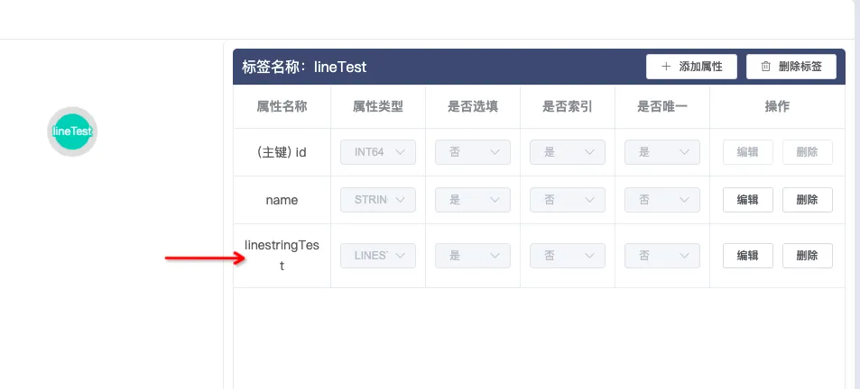
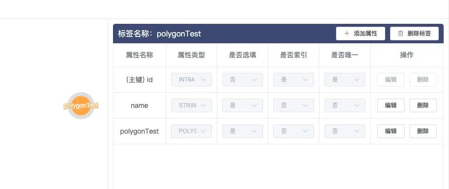
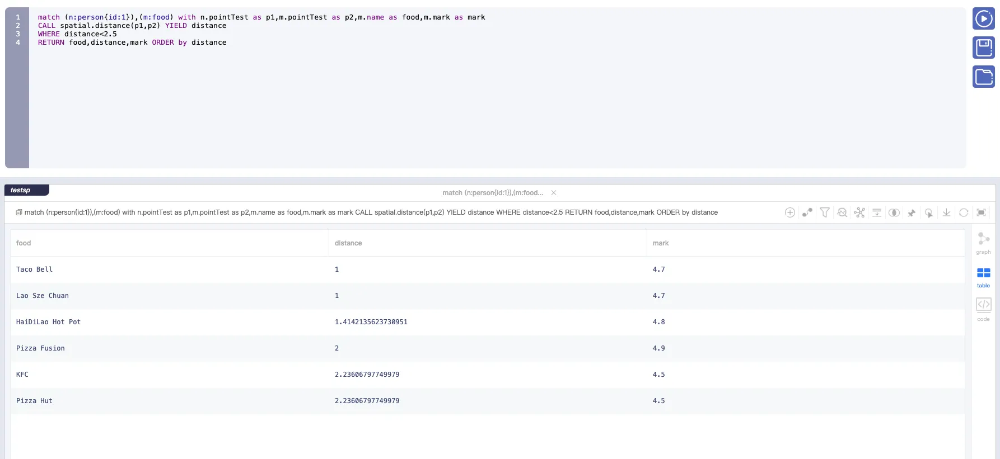

# Examples of geospatial data type usage

## 1. Introduction

TuGraph, a graph database jointly developed by Ant Group and Tsinghua University, has built a comprehensive graph technology system that includes graph storage, graph calculation, graph learning, and a graph development platform, owning a leading-scale graph cluster in the industry.  In recent years, geospatial capabilities have demonstrated significant application value in graph databases. They not only enhance the expressive power of data but also facilitate the fusion analysis of cross-domain data, especially displaying strong practical value in critical fields such as social networks, map exploration, and urban planning. TuGraph is also gradually supporting geospatial capabilities.

## 2. Background Knowledge

EPSG([EPSG.io: Coordinate Systems Worldwide](https://epsg.io/)) is a standardized collection of geospatial reference system identifiers, used to identify different geospatial reference systems, including coordinate systems, geographic coordinate systems, projected coordinate systems, etc. We commonly use EPSG codes to represent the coordinate systems of data, and here we introduce two of the most common geospatial coordinate systems, which are also the types supported by most databases.

### 2.1 WGS84 Coordinate System (EPSG:4326)

Global Positioning System: WGS84 is the foundation of the Global Positioning System (GPS), allowing GPS receivers around the world to determine precise positions. Almost all modern GPS devices provide location information based on the WGS84 coordinate system. Map Making and Geographic Information Systems (GIS): In the field of map making and GIS, WGS84 is widely used to define positions on Earth. This includes various types of map creation, spatial data analysis, and management, etc. 

### 2.2 Cartesian Coordinate System (EPSG:7203)

The Cartesian coordinate system, also known as the rectilinear or orthogonal coordinate system, is the most basic and widely applied coordinate system. It defines a plane with two axes and a space with three axes that are perpendicular to each other, extensively applied in mathematics, physics, engineering, astronomy, and many other fields. 

### 2.3 Data Storage Formats

OGC (Open Geospatial Consortium) has defined standard representation formats for spatial data, namely WKT and WKB formats, for exchanging and storing spatial data between different systems and platforms, which have now been widely adopted. WKT (Well-Known Text) format is a text markup language that is easy to read and write for humans, while WKB (Well-Known Binary) format uses a series of bytes to encode spatial data, which is more suitable for storage in computers.

**WKT:**

```
POINT(<x> <y>)
LINESTRING(<x1> <y1>, <x2><y2>, ...)
```

The WKT format data is as shown above, first specifying the spatial data type, then specifying the coordinates in parentheses, with a pair of coordinates representing a point, separated by commas between each coordinate pair. For Polygon type data, the first coordinate pair needs to be the same as the last coordinate pair to form a closed surface.

**WKB:**


The encoding for the EWKB format is explained as follows:

- Positions 0 - 1: Encoding method;
- Positions 2 - 5: Spatial data type;
    - 0100: point
    - 0200: linestring
    - 0300: polygon
- Positions 6 - 9: Data dimension;
    - 0020: two-dimensional
    - 0030: three-dimensional
- Positions 10 - 17: EPSG code of the coordinate system;
- Positions 18 - n: 16-bit hex representation of pairs of double-type coordinates.

### 2.4 Common functions

| Name                 | Description       | Signature                                                                 |
|----------------------|-------------------|---------------------------------------------------------------------------|
| `dbms.graph.createGraph` | create a subgraph           | `dbms.graph.createGraph(graph_name::STRING, description::STRING, max_size_GB::INTEGER) :: (::VOID)` |
| `db.createVertexLabel`  | create a vertex label  | `db.createVertexLabel(label_name::STRING,field_specs::LIST) :: (::VOID)`      |
| `db.getLabelSchema`     | get the schema of label  | `db.getLabelSchema(label_type::STRING,label_name::STRING) :: (name::STRING,type::STRING,optional::BOOLEAN)` |
| `db.deleteLabel`        | delete vertex label       | `db.deleteLabel(label_type::STRING,label_name::STRING) :: (::VOID)`         |

更完整详细的函数使用以及插入数据的语句，可以参考 [Cypher API](../8.query/1.cypher.md)


## 3. Data Types

Currently, in TuGraph, we support three types of spatial data: Point, Linestring, and Polygon.

- Point: POINT(2.0, 2.0, 7203)
- Linestring: LINESTRING(0 2,1 1,2 0)
- Polygon: POLYGON((0 0,0 7,4 2,2 0,0 0))

Coordinates are of double type. Examples for creating graph models and inserting data as follows:

**Create a vertex to mark food locations**

```
CALL db.createVertexLabel('food', 'id', 'id', int64, false, 'name', string, true,'pointTest',point,true) 
```


**Insert data to mark food points**

```
 CREATE (n:food {id:10001, name: 'aco Bell',pointTest:point(3.0,4.0,7203)}) RETURN n
```


**Create a vertex with polyline attributes**

```
CALL db.createVertexLabel('lineTest', 'id', 'id', int64, false, 'name', string, true,'linestringTest',linestring,true)
```



**Insert data for vertex with linestring attributes**

```
CREATE (n:lineTest {id:102, name: 'Tom',linestringTest:linestringwkt('LINESTRING(0 2,1 1,2 0)', 7203)}) RETURN n
```


**Create a vertex with polygon attributes**

```
CALL db.createVertexLabel('polygonTest', 'id', 'id', int64, false, 'name', string, true,'polygonTest',polygon,true)
```



**Inser data for vertex with polygon attributes**

```
CREATE (n:polygonTest {id:103, name: 'polygonTest',polygonTest:polygonwkt('POLYGON((0 0,0 7,4 2,2 0,0 0))', 7203)}) RETURN n
```

## 4. Function Introduction

| Function Name  | Description | Input Parameters                         | Return Type |
| --- | --- |------------------------------| --- |
| Distance() | Calculate the distance between two spatial data (requires the same coordinate system) | Spatial data1, Spatial data2 | double |
| Disjoint()  |  Determine whether two spatial data intersect (under development) | Spatial data1, Spatial data2 | bool |
| WithinBBox() | Determine whether a spatial data is within a given rectangular area (under development) | Spatial data, Point1         | bool |

## 5. Food Exploration 

### 5.1 Personalized Recommendations Based on Geographic Location

In this section, we will explore how to use the TuGraph graph database's geospatial capabilities to create a vivid and interesting food exploration application that connects "people" and "food" through geographical locations to achieve personalized food recommendations. Imagine, no matter where you are, with just a gentle tap, the tempting food around you is at a glance – this is precisely the charm of the scene we're about to build.

### 5.2 Data Model Design

We first define two core types of vertex:：

- Food vertex: Each restaurant or snack shop can serve as a Food node, with attributes that include but are not limited to the name, address, rating, food category, etc. Notably, we will attach geographic coordinate information to every Food node to record its precise location accurately.

```
 CALL db.createVertexLabel('food', 'id', 'id', int64, false, 'name', string, true,'pointTest',point,true,'mark',double,true)
```

Prepare data:

```
CREATE (n:food {id:10001, name: 'Starbucks',pointTest:point(1.0,1.0,7203),mark:4.8}) RETURN n
CREATE (n:food {id:10002, name: 'KFC',pointTest:point(2.0,1.0,7203),mark:4.5}) RETURN n
CREATE (n:food {id:10003, name: 'Pizza Hut',pointTest:point(2.0,5.0,7203),mark:4.5}) RETURN n
CREATE (n:food {id:10004, name: 'Taco Bell',pointTest:point(3.0,4.0,7203),mark:4.7}) RETURN n
CREATE (n:food {id:10005, name: 'Pizza Fusion',pointTest:point(5.0,3.0,7203),mark:4.9}) RETURN n
CREATE (n:food {id:10006, name: 'HaiDiLao Hot Pot',pointTest:point(2.0,2.0,7203),mark:4.8}) RETURN n
CREATE (n:food {id:10007, name: 'Lao Sze Chuan',pointTest:point(4.0,3.0,7203),mark:4.7}) RETURN n
```

- Person vertex: Represents the user of the application, with attributes including username, current location, etc. The user's current location is also represented by geographic coordinates, facilitating subsequent geospatial queries.

```
 CALL db.createVertexLabel('person', 'id', 'id', int64, false, 'name', string, true,'pointTest',point,true)
```

Prepare data:

```
 CREATE (n:person {id:1, name: 'Tom',pointTest:point(3.0,3.0,7203)}) RETURN n
```

### 5.3 Building the Food Exploration Query

The ability to find food within a distance of 2.5 based on the user's current location, and sort by distance in ascending order allows users to have a better experience by seeing the distance and rating.

**Query Statement**

```
match (n:person{id:1}),(m:food) with n.pointTest as p1,m.pointTest as p2,m.name as food,m.mark as mark
CALL spatial.distance(p1,p2) YIELD distance 
WHERE distance<2.5
RETURN food,distance,mark ORDER by distance
```



This query first matches a specific Person node (taking the user "Tom" as an example) and then finds all Food nodes. Using the custom distance function, the query calculates the straight-line distance between the current location of the Person node and each Food node, filtering out food within a distance of 2.5. Finally, the results are sorted by distance in ascending order, and the rating is provided as a reference to offer users the best possible recommendations.

## 6. Outlook

The aforementioned sections not only showcase TuGraph's capabilities in handling geospatial data but also depict an attractive food exploration scenario, proving the great potential of graph databases in providing personalized services that combine geographic location information. Whether it's finding a relaxing spot for the weekend or exploring unique cuisines during travel, such applications are set to greatly enrich people's life experiences. 
TuGraph will continue to implement Disjoint() and WithinBBox() functions, enriching more use cases. Of course, everyone is welcome to participate and collaborate in developing geospatial functionalities.
