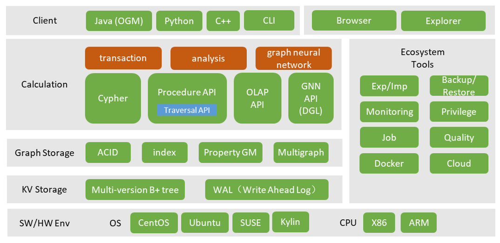

# Architecture

> This document mainly introduces the product architecture of TuGraph.

## 1.Introduction

The following diagram shows the overall architecture of an enterprise-level graph database from the perspective of functional modules, using TuGraph as an example, from bottom to top:

- Software and hardware environment. This involves the development and use environment of the graph database. TuGraph is mainly developed based on the underlying C++ language, and is compatible with most operating systems and CPUs on the market.
- Storage layer, including the KV storage layer and the graph storage layer. The storage layer needs to support various functions required by the calculation layer.
- Calculation layer. The calculation layer should include the graph transaction engine, graph analysis engine, and graph neural network engine. It also includes a variety of programming interfaces provided by the server, including descriptive query language Cypher, stored procedures, and so on.
- Client. The client SDK should support multiple languages such as Java, Python, and C++, and also support command-line interaction. The Browser and Explorer reduce the threshold for using the graph database through web-based interaction.
- In terms of ecological tools, it covers the development, operation, and management links of enterprise-level graph databases, improving usability.