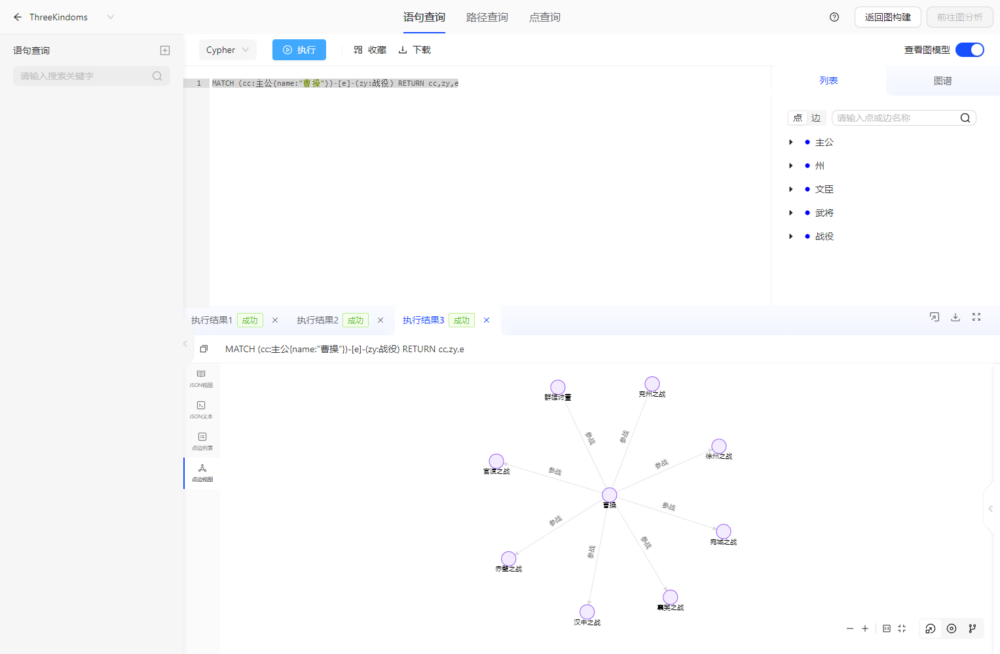

# Three Kingdoms

> This document mainly introduces the usage of the Three Kingdoms demo.

## 1. Introduction
Due to the lack of historical records, there are often many mysteries surrounding even well-known historical events. Taking the history of the Three Kingdoms as an example, why did Zhuge Liang come out of seclusion to help Liu Bei, and why there was a huge gap in achievements between Cao Cao and Liu Bei, both heroes of the time, are some of the unsolved mysteries. Historians in the past often used two-dimensional relationship analysis of history, and the conclusions drawn were often one-sided. Using TuGraph to import historical figures and events of the Three Kingdoms into a graph model, and analyzing them using graph calculation methods can help us obtain more valuable knowledge from limited information, which is a very meaningful interdisciplinary attempt.
## 2. Data Modeling
We designed 5 types of vertices and 5 types of edges. The vertices include "Lord", "Province", "Civilian", "Military Officer", and "Battle"; the edges include "Father", "Brother", "Belongs To", "Native Place", and "Participate In". The specific modeling information is shown below:

## 3. Data Import
- Manual import
    - Data storage directory: https://github.com/TuGraph-family/tugraph-db-demo.
    - Modify the DATA_PATH in import.json according to the corresponding data storage directory. For more details, please refer to [Data Importing](../../6.utility-tools/1.data-import.md).
    - After starting the TuGraph service, access ${HOST_IP}:7070 to open the web page and confirm whether the data is imported successfully.

- Automatic creation
    - Click `New Graph Project`, select the Three Kingdoms data, fill in the graph project configuration, and the system will automatically create the Three Kingdoms scene graph project.

## 4. Cypher Query
### 4.1. Why did Zhuge Liang Choose Liu Bei?
The following Cypher command can be used to view the relationship between Zhuge Liang, Cao Cao, and Liu Bei:
```
MATCH p = (cc:主公 {name: '曹操'})-[*1..3]-(zgl:文臣 {name: '诸葛亮'}) RETURN p
```
The query result is shown in the following figure:

From the graph, we can intuitively see that one of the shortest paths between Cao Cao and Zhuge Liang includes the battle of Xuzhou. Cao Cao once committed a massacre in Xuzhou because his father was killed, and nobody would choose a warlord who had previously massacred their hometown as their lord. In contrast, Liu Bei once prevented Cao Cao's violence during the battle of Xuzhou, which should be one of the reasons why Zhuge Liang had a good impression of Liu Bei.

### 4.2. Why Did Cao Cao Achieve More Than Liu Bei?
The following Cypher command can be used to view the family's support for Cao Cao's career:
```
MATCH (cc:主公{name:"曹操"})<-[r:隶属]-(wj:武将) WHERE wj.name REGEXP "曹.*" OR wj.name REGEXP "夏侯.*" return cc,wj,r
```
The query result is shown in the following figure:

The most important thing for pacifying the world is military talent. Cao Cao's father originally had the surname Xiahou, but was adopted into the Cao family. The Cao and Xiahou families were both local big clans in Qiao County, providing Cao Cao with a large number of military talents such as Xiahou Dun, Xiahou Yuan, Cao Ren, and Cao Hong in the early days of his career. In contrast, Liu Bei's father died early and he didn't have any family support. He only gathered his Five Tiger Generals when he was over 50 years old, by which time the best time to fight for land in the chaotic world had passed. Cao Cao had already controlled six of the nine provinces in the world.

### 4.3. Why Did the Most Powerful Wei Kingdom in the Three Kingdoms Perish First?
The following Cypher command can be used to view the important civilian officials of the Cao Cao group:
```
MATCH (cc:主公)<-[r:隶属]-(wc) WHERE cc.name REGEXP "曹.*" AND (label(wc) = "文臣" OR label(wc) = "主公") return cc,wc,r
```
The query result is shown in the following figure:

In fact, Cao Wei was overthrown in the Gao Ping Ling incident in 249 AD, after only 29 years of existence, which was shorter than Shu Han (43 years) and Dong Wu (51 years). The reason why the most powerful Wei Kingdom in the Three Kingdoms perished first was that the civilian official system of Cao Wei (the nine-rank system) made it easy for power to be concentrated in the hands of aristocratic families. From the graph, we can see that almost all the important civilian officials of Cao Cao and Cao Pi's generations were from aristocratic families, such as Xun Clan of Yingchuan, Zhong Clan of Yingchuan, Chen Clan of Yingchuan, Jia Clan of Wuxi, etc. There was even a trend of regionalization, centered on Yingchuan. Ultimately, the regime was usurped by the Sima family of Henei, which had close ties with the Xun Clan of Yingchuan.

### 4.4. What Were the Strengths of Each of the Three Kingdoms?
The following Cypher command can be used to view the population strength of each group in the Three Kingdoms:
```
MATCH (p) WHERE (label(p)="主公" OR label(p)="文臣" OR label(p)="武将") AND p.hometown IN ["幽州","冀州","青州","并州","凉州","司州","豫州","兖州","徐州"] WITH COUNT(p) AS w
MATCH (p) WHERE (label(p)="主公" OR label(p)="文臣" OR label(p)="武将") AND p.hometown IN ["益州"] WITH COUNT(p) AS s,w
MATCH (p) WHERE (label(p)="主公" OR label(p)="文臣" OR label(p)="武将") AND p.hometown IN ["扬州","荆州","交州"]
RETURN w as 魏人口,s as 蜀人口,count(p) as 吴人口
```
The query result is shown in the following table:

In ancient society, an important indicator of a country's strength was its population. Since population data is missing, we estimate the population of each province using the birthplace data of all lords, civilians, and military officers in the Three Kingdoms. It is found that among the main characters of the Three Kingdoms, 60 belong to Wei, 23 belong to Wu, and only 2 belong to Shu, which proves that Wei was indeed the most powerful country in the Three Kingdoms.

### 4.5. How Should Cao Cao's Military Ability Be Evaluated?
The following Cypher command can be used to view the main battles that Cao Cao participated in:
```
MATCH (cc:主公{name:"曹操"})-[e]-(zy:战役) RETURN cc,zy,e
```
The query result is shown in the following figure:

From the graph, we can see that Cao Cao participated in 8 out of the 15 major battles in the Three Kingdoms, with a high participation rate. However, Cao Cao only won the battles of Xuzhou, Yanzhou, Guandu, and Xiangyang, while losing the battles of Hanzhong, Wancheng, the Campaign against Dong Zhuo and the Battle of Red Cliffs. His overall win rate was 50%, which proves that Cao Cao was not a very outstanding military strategist.

## 5. Remarks
More analysis is needed and encouraged to be added by everyone!