# TuGraph Browser

> This document focuses on the use of TuGraph Browser.

## 1.Introduction

TuGraph Browser (hereinafter referred to as Browser) is a powerful product visualization development tool that presents graph data in an intuitive visual way, allowing users to easily manage, maintain, and view the database running status. This tool not only supports graph data management and visualization but also supports system account management, providing users with a comprehensive operation and management experience, enabling users to manage and utilize graph databases more efficiently.

## 2.User Guide

### 2.1.Accessing

After the user completes the installation of the graph database, they can access the Browser through a browser. Users only need to enter the IP:Port of the server where TuGraph is located in the browser address bar. The default port used is 7001.

- For example:127.0.0.1:7001
- Recommend using Chrome

#### 2.1.1. Startup configuration

Before starting Browser, you need to start TuGraph-Server in advance and configure the connection between Browser and TuGraph-Server. The configuration file is the env.json file in the Browser directory. The specific configuration is as follows
```shell
# vim /usr/local/share/lgraph/tugraph-db-browser/env.json
{
   "tugraph_db_host": "http://127.0.0.1:9090"
}
```
Tugraph_db_host needs to be modified to the address of the actual TuGraph-Server RPC service

#### 2.1.2.Startup method
There are two ways to start Browser. One is to directly switch to the directory where Browser is located in the docker image and execute the startup command.
```shell
cd /usr/local/share/lgraph/tugraph-db-browser
pnpm run dev
```
The other is to use the rpm/deb installation package in the local environment. In this case, it needs to be built first and then started. Therefore, the Node environment needs to be installed locally in advance. For details, see the source code directory.
ci/images/tugraph-runtime-*-Dockerfile. When installing TuGraph locally,
Browser will be installed to the specified local directory, switch to the directory, and execute the following command to build and start
```shell
cd /usr/local/share/lgraph/tugraph-db-browser
pnpm run bootstrap
pnpm run dev
```

### 2.2.Logging in

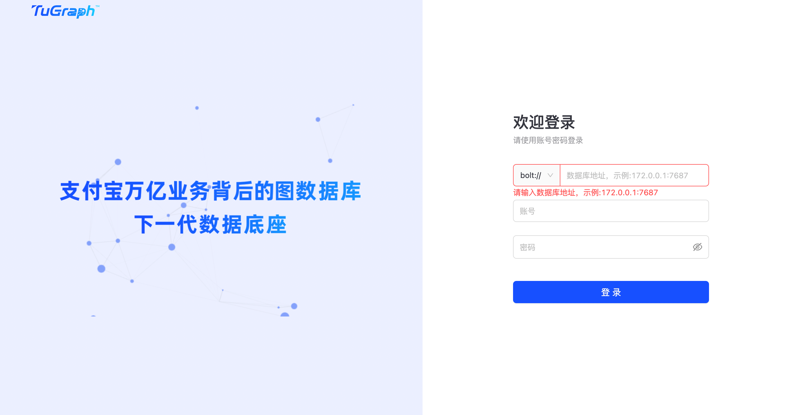

- After successfully accessing the Browser, the login page appears first (as shown above), where users need to fill in their account and password to log in.
- Default account: admin
- Default password: 73@TuGraph
- After the user's first login, they will be redirected to the password modification page. Once the password is successfully modified, they can only use the new password to log in.

### 2.3.Quick Start

For first-time users of TuGraph, you can quickly build a graph project with the built-in demo data and get started with graph data projects quickly.

#### 2.3.1.Creating a Graph Project

In the `Graph Project` homepage tab, click `Create New Graph Project` to create a new graph project.

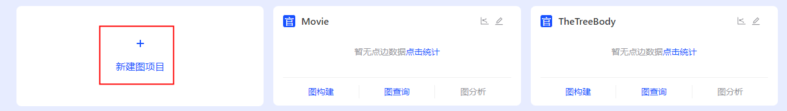

Select a built-in demo data, and click the `Next` button.


In the Fill in Configurations interface, enter the graph project information. Since the demo data is relatively small in size, set the Maximum Storage Space to 1 GB. After entering the graph project information, click the Create button, and the system will automatically create the graph model of the demo data and import the graph data.

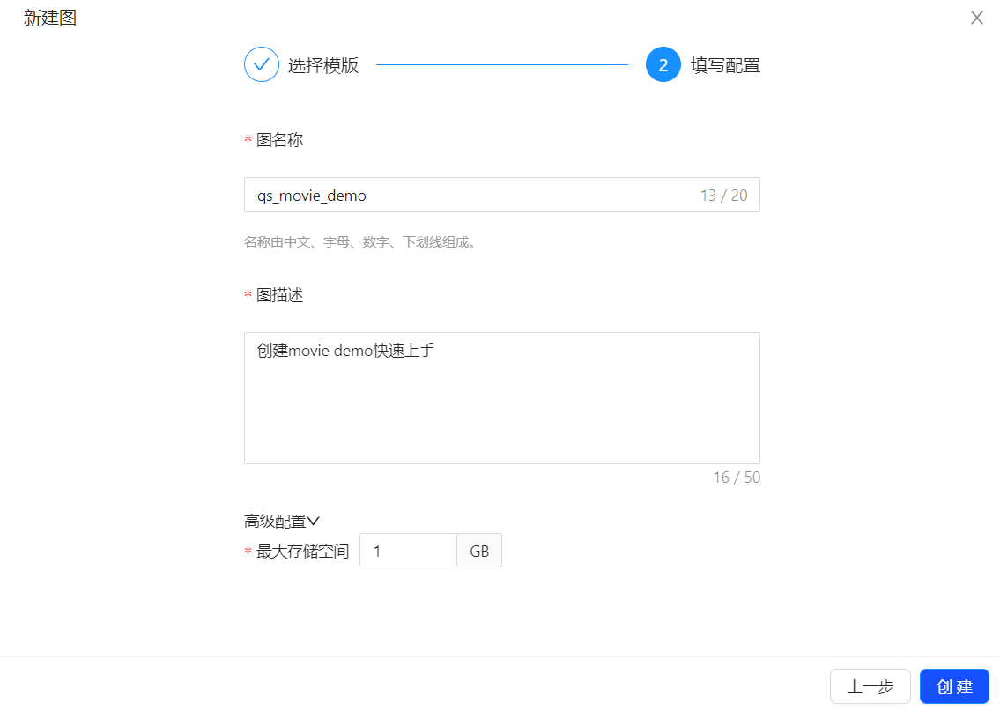

#### 2.3.2.Starting a Graph Project

After creating a graph project with demo data, you can find the corresponding graph project in the `Graph Project` tab, and then click `Graph Query` to query graph data.


Execute the default query statement to browse the graph data in the demo.

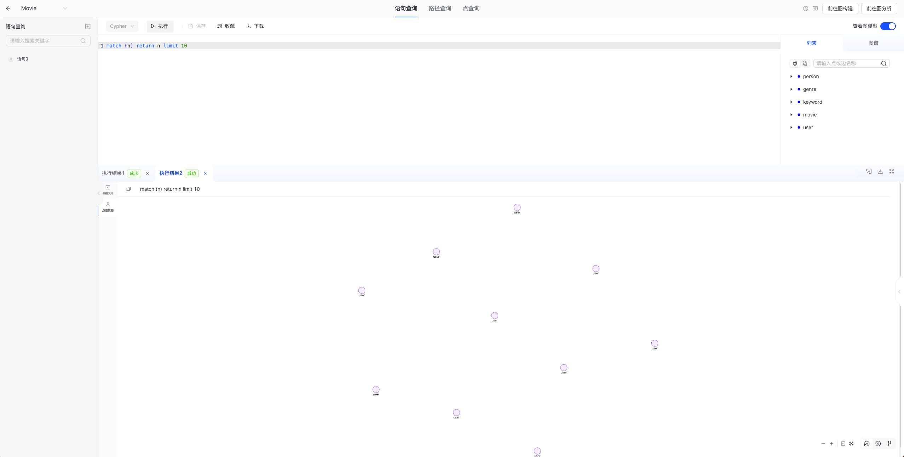

For more quick start documents, please visit the[Quick Start Documents](../3.quick-start/1.preparation.md)

### 2.4.Graph Project

`Graph Project` provides visualized graph project management and graph data development functions, providing users with a series of convenient graph data visualization operations, including graph project creation, modification, deletion, and other management operations, as well as graph data queries, vertex-edge statistics, and other operations. In addition, it also supports graph model management, making it more convenient for users to manage and maintain graph data.

#### 2.4.1.Graph Project Management

On the `Graph Project` page, you can see the graph projects in the current graph database.


##### 2.4.1.1.Creating a Graph Project

On the `Graph Project` page, click the `Create New Graph Project` button to create a new graph project.


Creating a new graph project requires completing the creation of the graph project through two pages: `Select Template` and `Fill in Configurations`.

- __Select Template__: The product provides two types of templates: empty templates and demo templates.
    - Empty templates: A brand new graph project where users need to create their own graph model and import graph data, generally used for formal project development.
    - Demo templates: Built-in demo data in the product. After the graph project is created successfully, the system will automatically create a demo graph model and import demo graph data, usually used for trial and learning.


- __Fill in Configurations__: Users need to fill in basic information about the graph project and click the `Create` button to create the graph project.
    - Graph Name: The name of the new graph project, which is also the unique primary key of the graph project. Supports Chinese characters, letters, numbers, and underscores, but does not support spaces or other special characters.
    - Graph Description: The description of the new graph project can be used to describe the background and objectives of the project in detail.
    - Advanced Configuration - Maximum Storage Space: Set the maximum storage space that the graph project can occupy. It does not actually occupy physical storage space in advance. After the actual data volume reaches the maximum storage space threshold, no more data can be written.

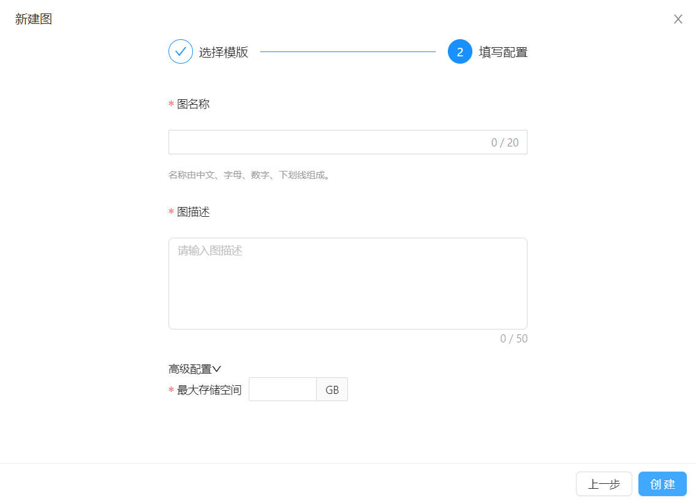

After creation, the graph project can be viewed in the graph project tab on the `Graph Project` page.

##### 2.4.1.2.Editing a Graph Project

On the `Graph Project` page, click the `Edit button` (pencil icon) in the graph project tab to edit the basic information of the corresponding graph project.

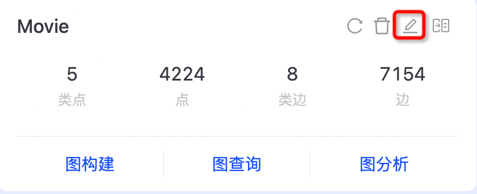

graphmanagement-editgraph-button

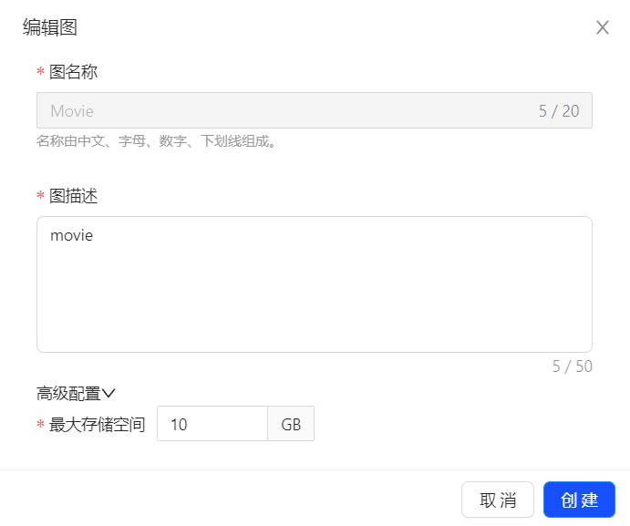

##### 2.4.1.3.Deleting a Graph Project

On the `Graph Project` page, click the `Delete` button (trash can icon) in the graph project tab to delete the corresponding graph project.


_Note: Graph projects cannot be restored after deletion._

##### 2.4.1.4.Vertex-Edge Statistics

On the `Graph Project` page, click the `Vertex-Edge Statistics` button (line graph icon or refresh icon) in the graph project tab to count the number of vertexs and edges in the corresponding graph project.


The statistical results will be displayed on the graph project tab. Graph projects that have not been vertex-edge statistics will display `No vertex-edge data`, and graph projects that have already been vertex-edge statistics need to click the `Refresh` button to count again.

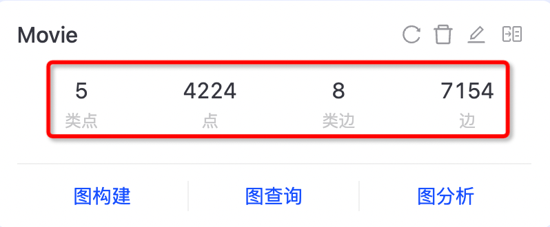

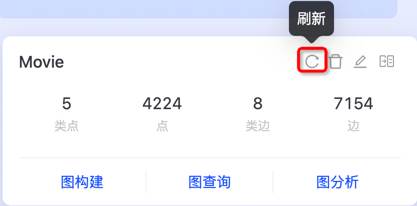

#### 2.4.2.Graph Building

The `Graph Building` function in Browser is mainly used for graph project model definition and data import. On the `Graph Project` page, click the `Graph Building` button in the graph project tab.

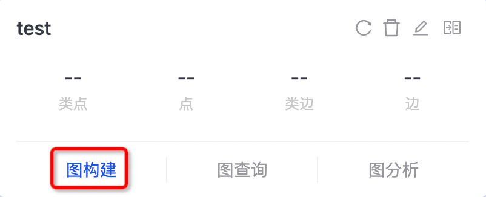

##### 2.4.2.1.Model Definition

Browser provides a visualization way to create and maintain graph models.

- Graph models can also be created and maintained through the `Cypher` tool and the `lgraph_import` tool. For details, please refer to the [Cypher API Document](../8.query/1.cypher.md) and [Data Import Document](../6.utility-tools/1.data-import.md).

###### a.Browse Graph Models

On the `Model Definition` page, you can view detailed graph model settings, support list and canvas view of the graph model, support list display of vertex type properties and indexes, edge type properties and start/end vertex types.


- Supports list view of vertex types and edge types.
    - Supports the display of the number of vertexs or edges in the corresponding vertex type or edge type in the vertex type or edge type tab.
    - Supports keyword search for vertex type or edge type names. Enter the keyword in the `search box` to display the corresponding vertexs or edges.

        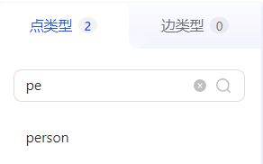
    - Supports copying vertex type or edge type names. Click the `Copy` button to copy the name of the vertex or edge to the clipboard.

        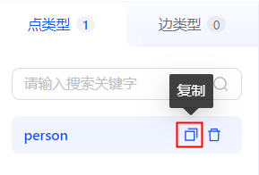
    - Supports deleting vertex types or edge types. Click the `Delete` button to delete the corresponding vertex or edge.

        
- Supports canvas view of vertex types and edge types.
- Clicking the corresponding vertex type or edge type in the list or canvas can display the model details.
        

###### b.Add Vertex

Click the `Add Vertex` button on the `Model Definition` page to add a vertex type in the right sliding window.


The user needs to enter the Vertex type name, properties, and indexes, and click the `Complete` button to complete the creation of the Vertex type.
- Vertex Type Name: The name of the Vertex, which is also the unique identifier of the Vertex.
- Properties: The attributes of the Vertex, and one attribute needs to be used as the primary key.
    - Data Type: The data type of the attribute field, supports types such as INT, STRING, DOUBLE, DATE, DATETIME, BLOB, BOOL.
    - Optional: Whether the attribute can be null.
    - Delete: Attributes can be deleted arbitrarily when creating Vertexs.
- Indexes: The indexing attributes of the Vertex, you need to create attributes first and then set the attribute as an index.
    - Attribute: The attribute that needs to be indexed.
    - Unique:Set the attribute field as a unique value.
    - Primary Key: Whether the corresponding attribute is a primary key. The Unique option must be `Yes` after selecting `Yes`.
    - Delete: Indexes can be deleted arbitrarily during Vertex creation.


- Edit Vertex: You can add Vertex properties, modify the data type of existing properties, and add or delete indexes. You need to click the `Save` button for each newly added or modified attribute to take effect.
_Note: Once the primary key field attribute is created, it cannot be modified._


###### c.Add Edges

Click the `Add Edge` button on the `Model Definition` page to add an edge type in the right sliding window.


The user needs to enter the edge type name, properties, select the start vertex type and end vertex type, and click the `Complete` button to complete the creation of the edge type.
- Edge Type Name: The name of the edge, which is also the unique identifier of the edge.
- Properties: The attributes of the edge, which may not exist on the edge.
    - Data Type: The data type of the attribute field, supports types such as INT, STRING, DOUBLE, DATE, DATETIME, BLOB, BOOL.
    - Optional: Whether the attribute can be null.
    - Delete: Attributes can be deleted arbitrarily when creating edges.
- Selecting start vertex type and end vertex type: Set the start vertex type and end vertex type of the edge, and support multiple start vertex types and end vertex types.
    - Start vertex: Select the vertex type of the start vertex.
    - End vertex: Select the vertex type of the end vertex.
    - At least one vertex type needs to be created in advance to set the start vertex type and end vertex of the edge.
    - If not selected, it means that the start vertex and end vertex can be any vertex type, and the corresponding edge is not displayed on the canvas, and you need to view the edge type in the left list.

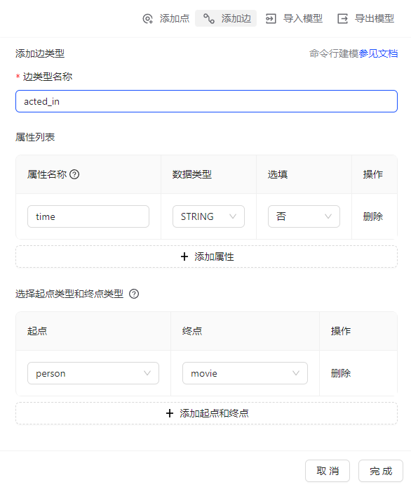

- Edit Edge: You can add edge properties and modify the data type of existing properties. You need to click the `Save` button for each newly added or modified attribute to take effect.


###### d.Import Model

Click the `Import Model` button on the `Model Definition` page to upload a model file and quickly create a model.


Click the `Upload File` button on the `Import Model` page to upload the model file. After the upload is successful, click `OK` to import the graph model.

- Overwrite the current canvas model: If this option is selected, the existing graph model will be cleared before importing the graph model in the model file; if not selected, the vertex types and edge types in the model file will be imported, but the existing vertex types and edge types will not be modified.

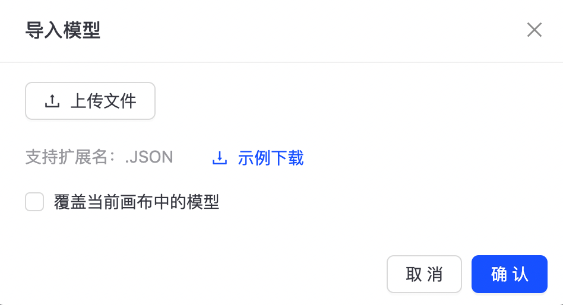

###### e.Export Model

Click the `Export Model` button on the `Model Definition` page to export the graph model in the current graph project to a JSON file.


The model file is in JSON format and is not recommended to be manually modified.


##### 2.4.2.2.Data Import

After completing the `Model Definition`, click the `Next` button to enter the data import page.

###### a.Data Preparation

Data needs to be prepared in advance before importing data. The current browser supports the uploading of CSV files, and the data file suffix needs to be ensured to be CSV.
- The header is not mandatory.
- Text qualifiers are supported, and the text qualifier is double quotes. Data Import - CSV

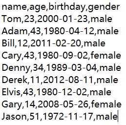

###### b.Upload Files

Upload the required data files on the `Data Import` page and import the data into the graph project.

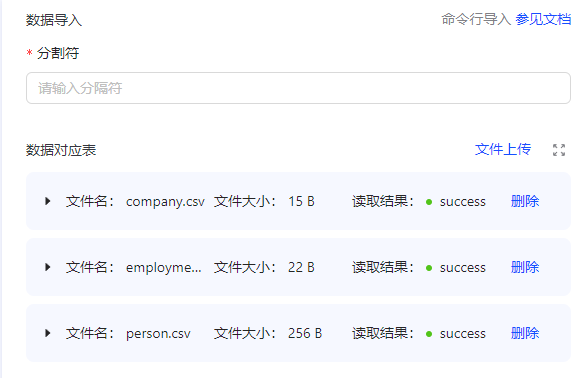

- Separator: The column separator of the data file.
- File upload: Supports uploading multiple files.
    - Supports selecting multiple upload files in the pop-up window.
    - Supports dragging and dropping files to upload on the page.
    - Supports uploading vertex files and edge files at the same time.

###### c.Data Mapping

After the file is successfully uploaded, you need to set the `Data Corresponding Table` on the `Data Import` page to establish a mapping relationship between the data columns in the data file and the target vertexs/edges and corresponding attributes.

- Data Corresponding Table: Displays uploaded data problems.
    - File Name: The name of the uploaded data file.
    - File Size: The size of the uploaded data file.
    - Read Result: The result of uploading the data file, success means uploaded successfully.
    - Delete: Delete on the page, the local file will not be deleted.
- Data File Mapping: Each uploaded data file needs to configure a mapping relationship.
    - Label: Select the corresponding vertex or edge type for the file, and you can only select one type of vertex or one type of edge.
    - Starting from the Nth row: Start reading data from the Nth row. The system defaults to start reading data from the 0th row. To skip the header, you can enter 1.
    - Attribute Mapping: Select the attribute field corresponding to the data column from the drop-down list.
    - Data Preview: The system will pre-read the first 5 rows of the data file.

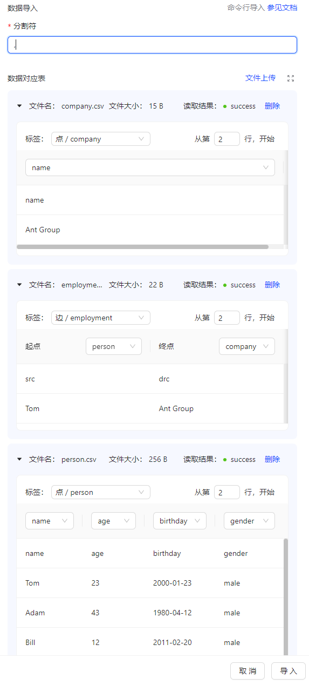

After the file is successfully uploaded, you can click the `Continue Import` button to continue importing other data or click the `Go to Graph Query` button to query the imported data on the `Graph Query` page.

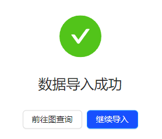

#### 2.4.3.Graph Query

Click the `Graph Query` button in the `graph project tab` on the `Graph Project` page to query and access graph data in the graph project. The product provides multiple modes for querying graph data, such as Statement Query, Path Query, and Vertex Query, and supports switching between graph projects and query result display.


##### 2.4.3.1.Switch Graph Project

The `Graph Query` function can only access one graph project data. Users can select and switch to other graph data in the `Switch Graph Project drop-down list`.


##### 2.4.3.2.Statement Query

The Browser provides a visual way to develop and debug graph query statements. Users can enter graph query statements, execute and return results, and support collecting statements and viewing graph models.

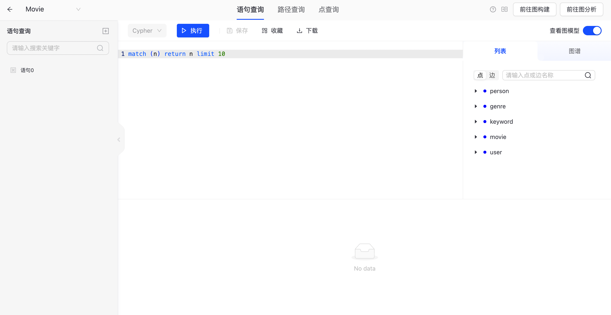

###### a.Statement Query Window

Users enter graph query statements in the `Statement Query Window`, click the `Execute` button to run the corresponding statement, and display the result in the `Execution Result tab`.

- Switch Query Language: Provides switching between different graph query language modes.
    - _Currently only supports Cypher syntax._


- Statement Query Window: Provides syntax prompts for the current query language.


- Execute: Click the `Execute` button to send the entered query statement to the background for execution.


- Bookmark: Click the `Bookmark` button to save the content of the current statement query window as a template for future use.

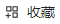

- Download: Click the `Download` button to save the content of the current statement query window as a text file and download it to the local computer for future use.

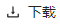

For detailed Cypher usage guidelines, please refer to the document: [Cypher API](../8.query/1.cypher.md)

###### b.Bookmark List

Displays the collected query statements in a list, and clicking on a bookmark in the list allows using the statement. Supports keyword search, name modification, and deletion.

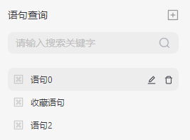

###### c.View Graph Model

The Browser provides a graph model query for the current graph project, which allows users to query vertex types and edge types conveniently. It supports both list display and canvas graph display, and can be hidden.

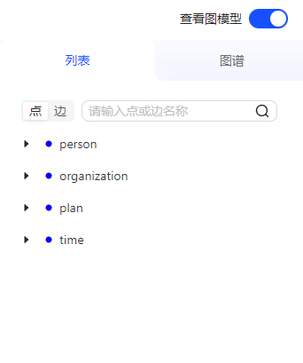
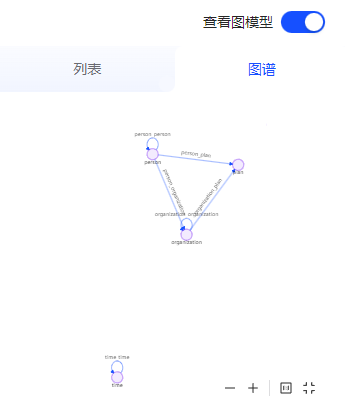

##### 2.4.3.3.Path Query

The Browser provides `Path Query templates`. Users can search whether corresponding paths exist in the graph data of the graph project by selecting paths.


- Path: Select the path to search in the path selection drop-down list.
    - Select a Path: Based on the definition of the graph model, the system will automatically match the corresponding first-degree relationship path. Clicking the path drop-down box again will automatically match the next-degree relationship path based on the endvertex vertex type of the path.
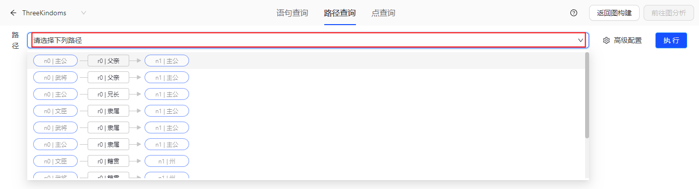
    - Execute: Click the `Execute` button to return the matched paths in the graph project.
    - Advanced Configuration: Set the number of paths to scan. The default is 100 paths.


_Note: The edges in the graph model need to set the starting vertex and endvertex. If no edge in the graph project has set the starting vertex and endvertex, the drop-down list will have no results._

##### 2.4.3.4.Vertex Query

The Browser provides `Vertex Query templates`. Users can query vertex data in the graph project by selecting vertex attributes.

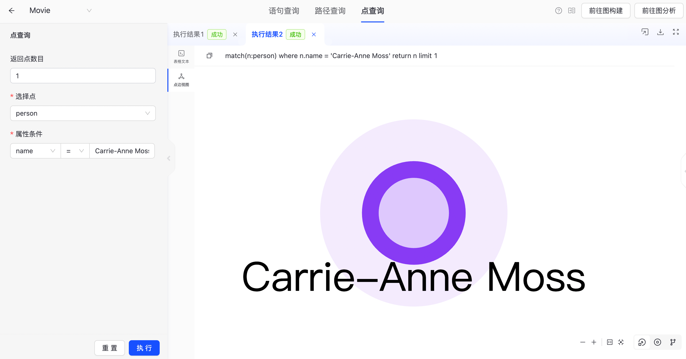

- Select Vertex: Select the vertex type to be queried.
    - Attribute: The system will automatically match the schema of the vertex type, set the corresponding query conditions, and click the execute button to return the results.
- Return vertex Limit: Set the upper limit of the returned vertex data.

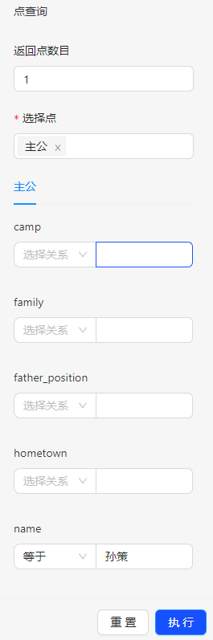

##### 2.4.3.5.Execution Result Tab

The Browser provides multiple ways to display graph query results, such as JSON view, JSON text, vertex-edge list, and vertex-edge view. It supports result download, data insertion, and full-screen display.

###### a.JSON View

The Browser provides JSON view to display query results.

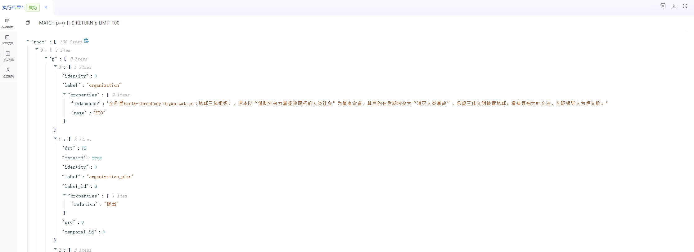

###### b.JSON Text

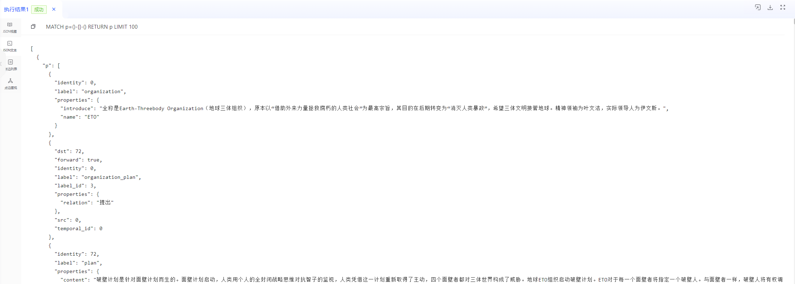

###### c.Vertex-Edge List

The Browser provides vertex and edge list to display query results.


###### d.Vertex-Edge View

The Browser provides canvas view to display query results.


###### e.Data Insertion

The Browser provides a visual way to insert vertex or edge data in the corresponding graph project. Click the `Insert Data` button, select the Vertex Type or Edge Type on the Insert Data tab, enter the attribute values, and click `OK` to complete the data insertion.

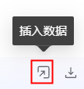

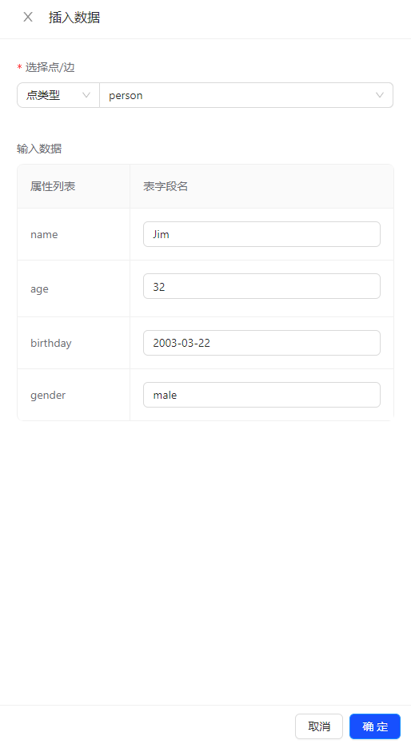

###### f.Download Execution Result

The Browser provides a function to export graph query results as text files. Click the `Download Execution Result` button, and the system will automatically save the result as a text file and download it to the local computer.

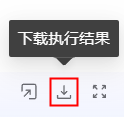
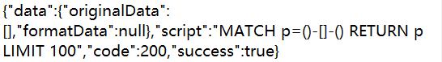

###### g.Full-Screen Display

The Browser provides full-screen display for graph query results. Click the `Full-Screen` Display button to display the results in full screen, and click the `Exit Full Screen` button to exit full-screen display.


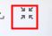

#### 2.4.4.Graph Analysis

Click the `Graph Analysis` button in the `Graph Project` tab in the `Graph Project` interface to display and analyze graph data on the canvas. The product provides `Query by Statement` and `Query by Configuration` to query and load data from the graph project to the canvas. It supports filtering, layout adjustment, and canvas operations on the canvas data.

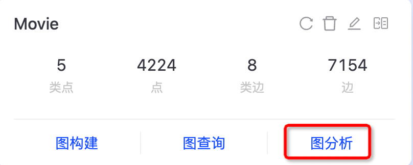

As shown in the figure below, the graph analysis function mainly includes: 1. Operation bar: the main operation functions of graph analysis, including view switching, query filtering, layout style, and canvas operations; 2. Left sidebar: query, filter, and appearance operation area; 3. Canvas area: the area for displaying graph data, displaying vertex and edge data, supporting vertex expansion query, collapsing vertexs, fixing vertexs, deleting vertexs, and providing canvas graph data statistics; 4. Right sidebar: when a vertex or edge data is selected, the corresponding attribute information will be displayed; 5. Switch graph project: switch to different graph projects for analysis.


##### 2.4.4.1.Query by Statement

In the `Query by Statement` function, users can enter query statements to query graph data and load the data to the canvas area for display.
- Syntax Description: TuGraph's query language and syntax documentation.
- Clear Canvas Data: If this button is not selected, the results of each query will be appended to the canvas area; if this button is selected, the canvas will be cleared before each query.

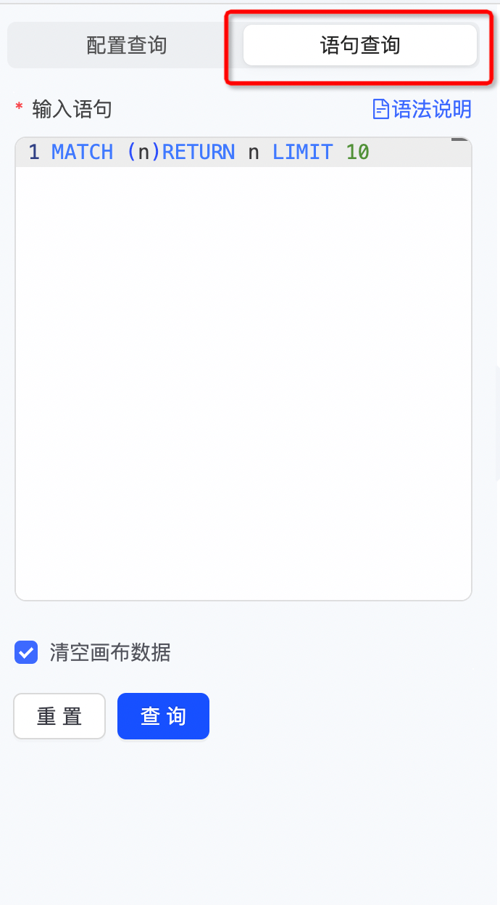

##### 2.4.4.2.Query by Configuration

In the `Query by Configuration` function, users can select vertex types and enter attribute conditions to query graph data and load the data to the canvas area for display.
- Clear Canvas Data: If this button is not selected, the results of each query will be appended to the canvas area; if this button is selected, the canvas will be cleared before each query.


##### 2.4.4.3.Canvas Analysis

In the `Canvas Analysis` function, users can perform operations and analysis on the vertex or edge data on the canvas, including: expanding queries by selecting vertexs, collapsing/expanding vertexs, fixing vertexs, clearing the canvas, lassoing, vertex/edge retrieval, and canvas legend. The most basic operation on the canvas is dragging vertex data. By selecting a vertex with the left mouse button and moving the mouse, the position of the vertex data can be changed.

###### a.Expand Query

Right-click on a vertex data in the `Canvas` area, a pop-up operation window will appear, move the mouse to `Expand Query`, and a secondary window will pop up. Click on the corresponding expansion degree to perform the query.
- First-degree Query: Bidirectional expansion of first-degree relationships.
- Second-degree Query: Bidirectional expansion of second-degree relationships.
- Third-degree Query: Bidirectional expansion of third-degree relationships.
- Custom Query: Expand based on selected conditions.
    - Edge Direction: Set the direction of the expansion relationship, Bidirectional: includes outgoing edges and incoming edges, Outgoing: edges pointing outward from the selected starting vertex, Incoming: edges pointing to the selected starting vertex.
    - Degree of Diffusion: The degree of expansion.
    - Custom Return vertex Count: Configure the number of vertexs returned to the front end, default is 100, to prevent exceptions on the front end caused by super vertexs.
    - Add Filter Group: Set the relationship type and attribute conditions of the expansion, multiple relationship types can be set.

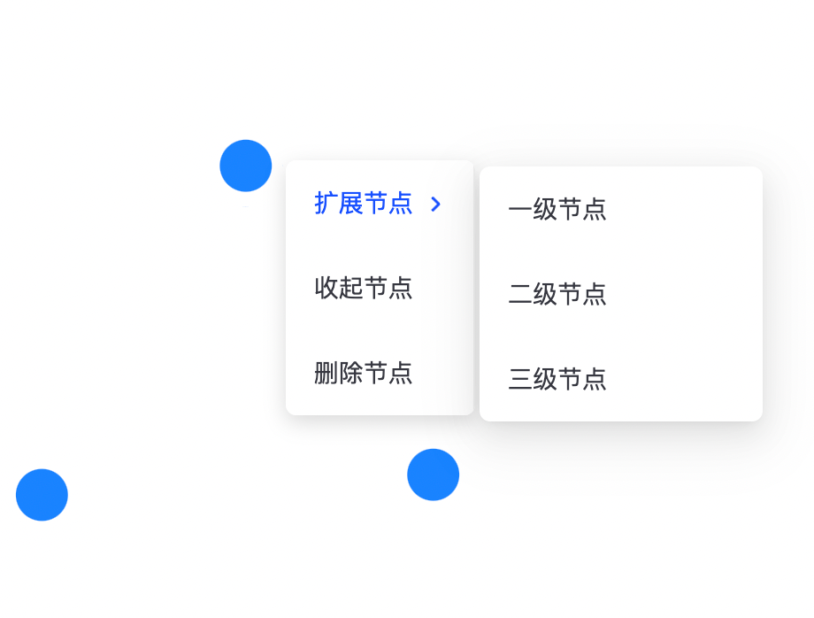


###### b.Collapse/Expand Vertexs

Right-click on a vertex data in the `Canvas` area, a pop-up operation window will appear, click on `Collapse Vertexs` to hide the first-degree relationship Vertexs of the selected Vertexs; right-click on the collapsed Vertex data again to perform Expand Vertexs operation to show the hidden first-degree relationship Vertexs.


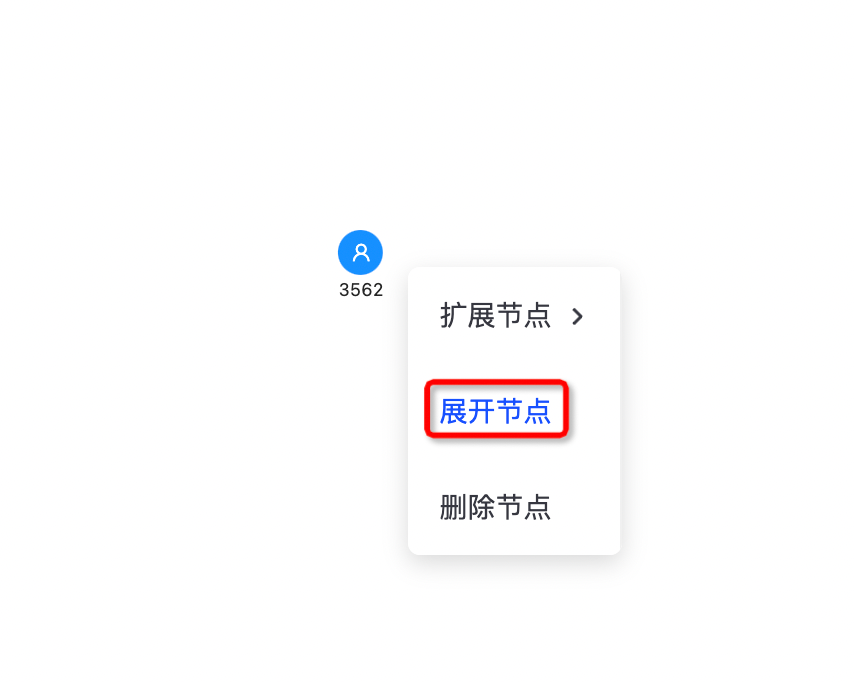

###### c.Fix Vertexs

Right-click on a vertex data in the `Canvas` area, a pop-up operation window will appear, click on `Fix vertexs` to fix the selected vertexs in place. The fixed vertexs cannot be moved (including layout adjustment); right-click on the fixed vertex data again to perform `Unfix vertexs` operation to restore the normal operation of the selected.


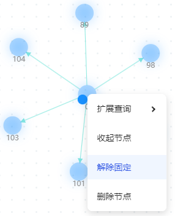

###### d.Delete Vertex

Right-click on a vertex in the `Canvas` area to open the operation window. Click on `Delete Vertex` to remove the selected vertex from the canvas.


###### e.Clear Canvas

Click on the `Clear Canvas` button in the `Toolbar` area to clear all data on the canvas.

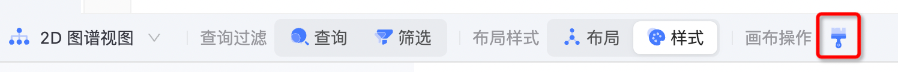

###### f.Vertex/Edge Retrieval

Select a vertex or edge in the `Vertex/Edge Retrieval` window and enter a keyword to perform a fuzzy search for attribute data on the canvas. After the search, you can locate the data position.

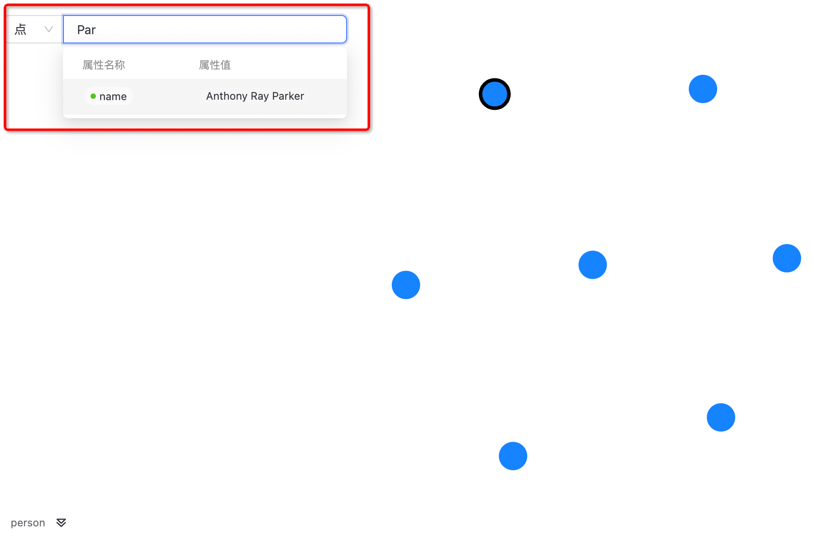

###### g.Canvas Legend

In the legend area of the `Canvas` area, the vertex types in the canvas will be displayed. Click on a vertex type to select the corresponding vertex data. Click on the "More" button to display the statistics, which can be displayed in a list or chart format to show the number of vertexs or edges.


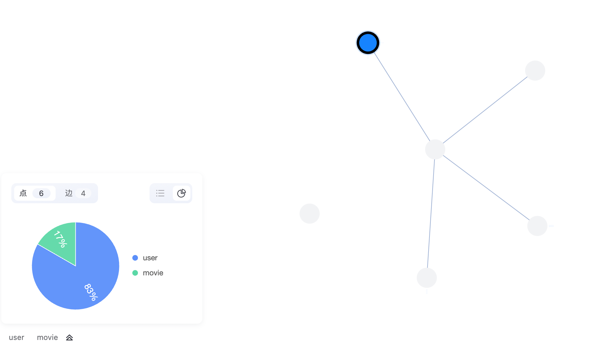

##### 2.4.4.4.Attribute Filter

Click on the `Filter` button in the `Toolbar` area, and click on `Attribute Filter` in the `Sidebar` to perform filter and filtering. Users can select the vertex or edge types to be filtered, and set the corresponding attribute values. After retrieving the filtered group conditions, the corresponding vertex or edge data will be highlighted on the canvas.
- Please select the vertex/edge type: Select the vertex type or edge type to be searched.
- Attribute condition: Set the attribute conditions to be searched. Multiple groups can be set to take the union of the filtering results.
- Add filter group: Multiple filter conditions can be set to take the union of the filtering results.
- Reset: Clear the filter conditions.


##### 2.4.4.5.Statistical Filter

Click on the Filter button in the Toolbar area, and click on Statistical Filter in the Sidebar to perform statistical filtering of canvas data. Users can select the vertex or edge types to be counted, and set the corresponding attribute values. The system will automatically group and count based on the selected vertex/edge types and attributes. The results can be displayed in chart and list formats. Clicking on the values in the chart or list area will highlight the corresponding data on the canvas.


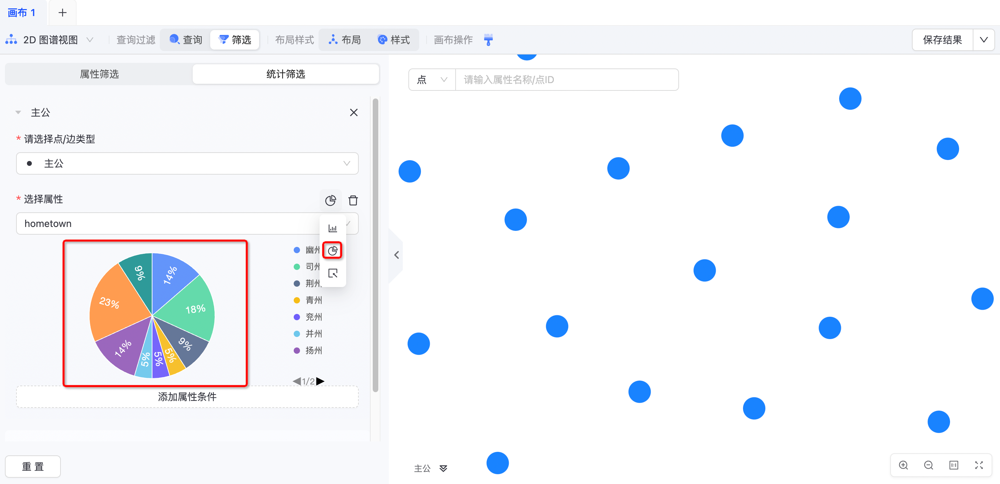

##### 2.4.4.7.Layout Style

Click on the `Layout` button in the `Toolbar` area, and select the corresponding layout method to rearrange the data on the canvas. It supports force-directed layout, concentric circle layout, circular layout, radial layout, Dagre layout, and grid layout. Each layout method has different layout parameters. After adjusting the parameters, the data on the canvas will be rearranged.


For detailed layout parameters, please refer to[AntV-G6](https://g6.antv.antgroup.com/api/graph-layout/guide).

##### 2.4.4.6.Appearance Style

Click on the `Appearance` button in the `Toolbar` area, and click on `Vertex Style` or `Edge Style` in the `Sidebar` to configure the appearance style.
- Vertex Style
    - Apply to vertex type: Set the display style for the corresponding vertex type. Multiple vertex types can be configured simultaneously.
    - Size: The display size for the corresponding vertex type.
    - Color: The display color for the corresponding vertex type.
    - Icon: The icon style for the corresponding vertex type.
    - Display Text: The text content displayed for the corresponding vertex type, defaulting to id.
    - Advanced Configuration: Mark the corresponding vertex data based on the set conditions.
- Edge Style
    - Apply to Edge Type: Set the display style for the corresponding edge type, supports configuring the appearance of multiple edge types simultaneously.
    - Color: The display color for the corresponding edge type.
    - Width: The display width for the corresponding edge type.
    - Display Text: The text content displayed for the corresponding edge type, not displayed by default.
    - Advanced Configuration: Display the corresponding edge data based on the set conditions.


### 2.5.Console

The `Console` provides a visualized account management and database information viewing function. It provides users with comprehensive account and role management functions, including adding, deleting, modifying, and disabling accounts and roles. In addition, it also provides users with convenient database information viewing function, allowing users to easily view the basic information and configuration information of the graph database. Basic information mainly includes version number, running time, CPP compilation version number, etc., while database configuration information includes port number, system function parameter configuration, etc.

#### 2.5.1.Account Management

##### 2.5.1.1.Account Management

##### a.Add Account

Click the `Add` button in the `Account Management` interface to create a new account. Users need to enter the account name, account description, account password, and related roles.

- Account Name: supports Chinese, letters, numbers, and underscores, but does not support spaces or other special characters.
- Related Roles: When creating a new account, you must select a role. After the account is added successfully, the system will automatically generate a role with the same name as the account name.

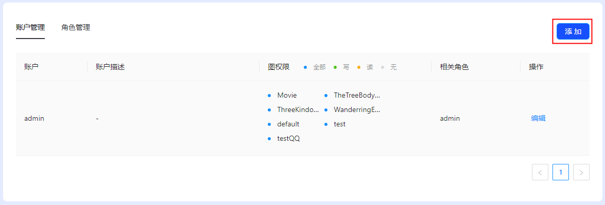
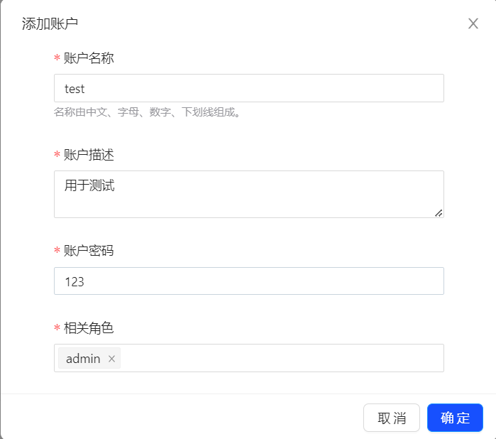

##### b.Edit Account

Click the `Edit` button in the `Account Management` interface to edit the account description, account password, and related roles.


##### c.Disable Account

Click the `Disable` button in the `Account Management` interface to prevent the corresponding account from logging in and accessing. Click the `Enable` button to enable the corresponding account login and access permissions.


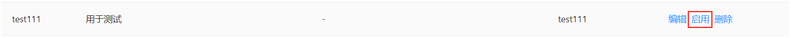

##### d.Delete Account

Click the `Delete` button in the `Account Management` interface to delete the corresponding account.


#### 2.5.1.2.Role Management

##### a.Add Role

Click the `Add` button in the `Role Management` interface to create a new role. Users need to enter the role name, role description, and graph permissions.

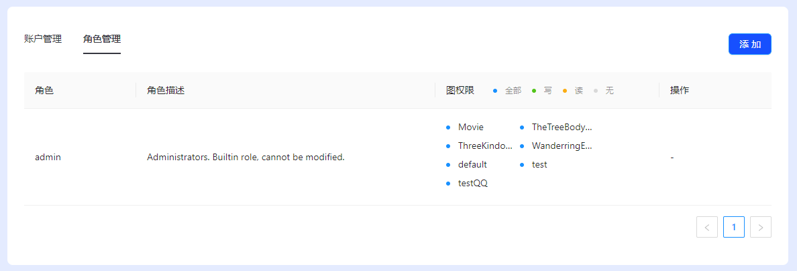

- Role Name: supports Chinese, letters, numbers, and underscores, but does not support spaces or other special characters.
- Graph Permissions: The browser supports four types of graph permission configurations: All, Read/Write, Read-Only, and None.
    - All: corresponds to the read and write permissions of the graph, including editing the graph model permissions (schema).
    - Read/Write: corresponds to the write permission of the graph, but does not include the permission to edit the graph model (schema).
    - Read-Only: corresponds to the read permission of the graph.
    - None: cannot access or operate the corresponding graph.
- Role Conflict: When two roles have different graph permissions for the same graph, and both roles are authorized to the same account, the graph permission of the account for the graph is the union of the graph permissions of the two roles.


##### b.Edit Role

Click the `Edit` button in the `Role Management` interface to edit an existing role. Users can edit the role description and graph permissions.

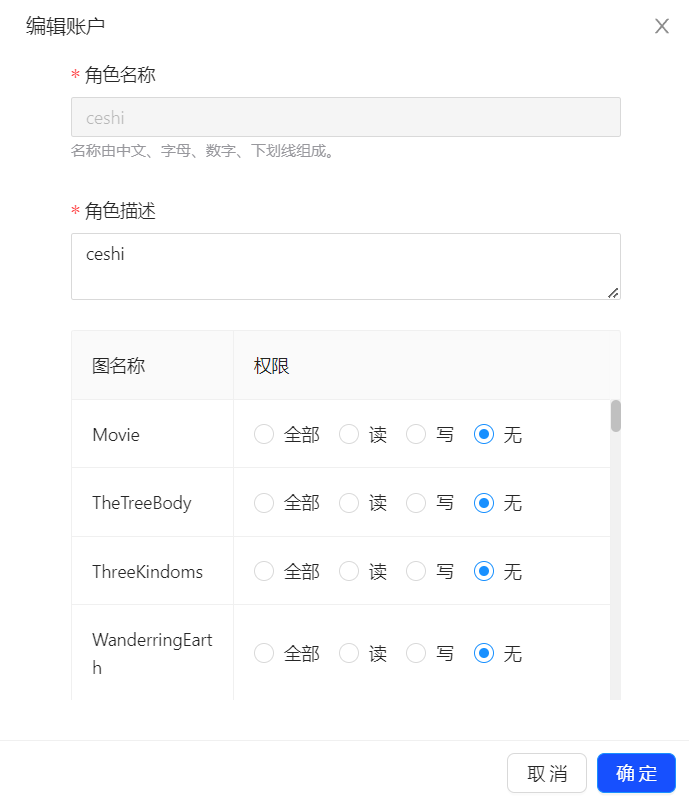

##### c.Disable Role

Click the `Disable` button in the `Role Management` interface to disable the corresponding role. Click the `Enable` button to enable the corresponding role. After the role is disabled, the corresponding graph permissions of the role become invalid.

- Disabled Role: After the role is disabled, the corresponding graph permissions become invalid.
    - When a user has two roles with operating permissions on the same graph, if one of the roles is disabled, the permission of the other role is still valid.


##### d.Delete Role

Click the `Delete` button in the `Role Management` interface to delete the corresponding role.

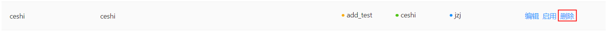

#### 2.5.2.Database Information

##### 2.5.2.1.Basic Information

`Basic Information` obtains the current running status of the system and displays key information.

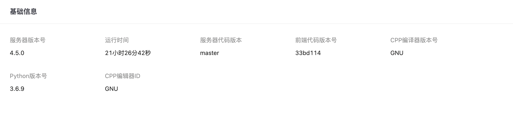

|Parameter    |Meaning    |
|-------|--------|
|TuGraph Version Number|The current version number of TuGraph, x.x.x|
|Running Time|The time from when TuGraph service starts to now|
|Server Code Version|The current commit of the tugraph-db repository|
|Front-end Code Version|The current commit of the tugraph-web repository|
|CPP Compiler Version|The CPP version number when compiling TuGraph|
|Python Version Number|The Python version number when compiling TuGraph|
|CPP Compiler ID|The CPP type when compiling TuGraph|

The current running status of the system can also be obtained through commands.

```cypher
CALL dbms.system.info()
```

##### 2.5.2.2.Database Configuration Information

`Database Configuration Information` obtains the current configuration parameters of the system and displays key information. To adjust the configuration parameters or understand the detailed configuration parameters, please refer to [Database Running-Service Configuration](../5.installation&running/7.tugraph-running.md).

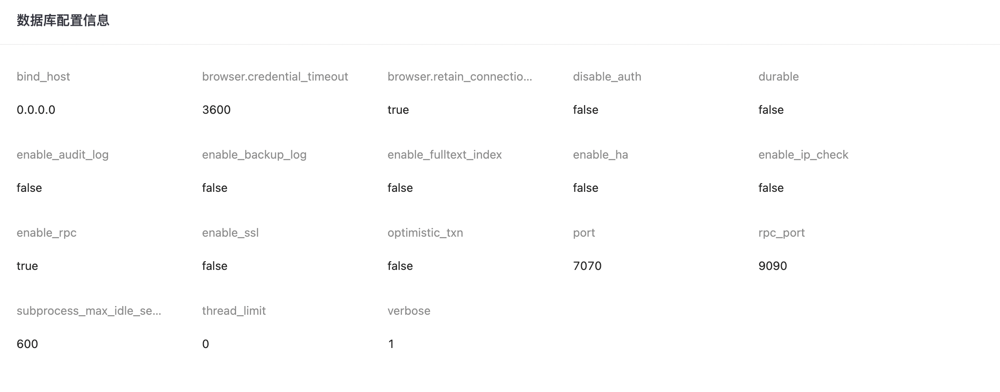

| Parameter                   | Meaning                                                                                                                                         |
|-----------------------------|-------------------------------------------------------------------------------------------------------------------------------------------------|
| bind_host                   | The host set when the system starts, usually 0.0.0.0                                                                                            |
| disable_auth                | Whether to disable the regular update of token authentication. If set to true, the token can be used permanently                                |
| durable                     | Whether to enable persistent storage of the underlying layer. If set to false, the data is updated asynchronously to the disk                   |
| enable_audit_log            | Whether to enable audit log                                                                                                                     |
| enable_backup_log           | Whether to enable real-time incremental backup                                                                                                  |
| enable_fulltext_index       | Whether to enable full-text indexing                                                                                                            |
| enable_ip_check             | Whether to enable IP whitelist                                                                                                                  |
| enable_rpc                  | Whether to enable the RPC port                                                                                                                  |
| enable_ssl                  | Whether to enable SSL encrypted transmission                                                                                                    |
| optimistic_txn              | Whether to enable optimistic multi-threaded write transactions                                                                                  |
| port                        | The REST access port of the current system                                                                                                      |
| rpc_port                    | The port used by the RPC and HA services                                                                                                        |
| subprocess_max_idle_seconds | The maximum idle time of the subprocess, a thread pool parameter                                                                                |
| thread_limit                | The maximum number of threads used by the server at the same time                                                                               |
| verbose                     | The level of detail of the log output information. It can be set to 0, 1, or 2, with larger values indicating more detailed output information. |
