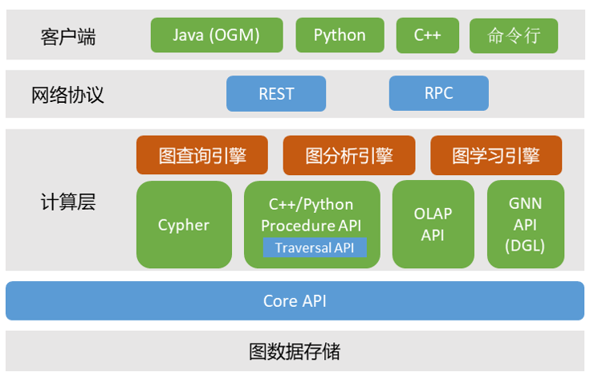

# 多层级接口

> 此文档主要介绍 TuGraph 的多层级接口的设计理念。

## 1.简介

多层级接口是 TuGraph 针对多丰富的使用场景，在易用性和高性中作出的平衡。比如描述式图查询语言 Cypher 能够抹去图数据库实现的细节，基于图模型的抽象来进行表达。Cypher 过于高层的表述，无法高效转化成底层的执行，因此提供了 Procedure API 的过程式语言，来发挥图数据库的最佳性能。

接口可以大致分为客户端接口和服务端接口，大部分操作都在服务端完成，客户端只做数据的封装和解析。客户端和服务端通过网络连接，TuGraph 支持更加灵活的短连接 REST 协议，以及更加高效的长链接 RPC 协议，可根据不同的业务场景来选择。

服务端接口均处在计算层，和图数据存储间用一层 Core API 在逻辑上隔开。

## 2.客户端接口

客户端接口指在客户端执行的接口，通常用于集成到软件应用中。TuGraph 的客户端的接口比较简单，包括登录登出、数据导入导出、存储过程加载调用、Cypher操作等。其中 Cypher 中集成了大部分的功能，包括数据操作、图模型操作、运维管理、账户管理等。

由于 Cypher 的参数和返回值都是字符串，JAVA OGM 是对 Cypher 的结构化封装，即查询结果能够被封装为一个有类型的对象，方便使用。

## 3.服务端接口

服务端接口包括描述式图查询语言 Cypher、过程式图查询语言 Procedure API、图分析编程框架 OLAP API 和图神经网络编程框架 GNN PI，为图事务引擎、图分析引擎、图神经网络引擎提供服务，下面先展开介绍各个接口的特点。

> __描述式图查询语言__ 是对查询逻辑的抽象描述，而与执行逻辑无关，对图数据库应用者比较友好，类比关系型数据库的 SQL 语言。TuGraph 的 Cypher 语言主要依照 Neo4j 开源的 OpenCypher 查询标准，同时对运维管理等辅助功能进行了扩展，在功能上囊括了 TuGraph 的大部分操作。描述式图查询语言会成为图数据库的主要数据操作方式，但由于描述到执行之间需要生成执行计划（Execution Plan），生成最优执行计划在学术界和工业界均有很长的路要走。

> __过程式图查询语言__ 是为了解决描述式图查询语言与最优性能间的鸿沟。TuGraph的 Procedure API 是在 Core API 上做了一层简单的封装，C++ Procedure API的灵活性和高效性能够充分发挥存储的极致性能，也是 Cypher 优化的上限性能。Python Procedure API 是 C++ Procedure API 上的一层跨语言封装，翻译过程中值的拷贝会带来一定的性能损失，优势则主要是 python 语言本身的易用性。raversal API 是并行执行的 Procedure 接口，描述上更接近于集合的操作，比如扩展点集合所有出度邻居，获得一个新的点集。

> __图分析编程框架__ 属于 ‘图计算系统’ 的范畴，会将图数据从支持增删改查的存储中导出快照，以更紧凑的数据存储格式来支持只读的复杂图分析，这里叫做OLAP API。OLAP API 封装了高并发执行的数据结构，包括 Vector、Bitmap等，以及基于 CSR 格式的图快照数据结构，然后提供一套并发的快速点边操作框架。在图分析任务完成后，数据可以通过接口写回图数据库。

> __图神经网络编程框架__ 主要提供了图神经网络应用编程所需要的接口，能够对接PyTorch 等机器学习框架。TuGraph 的图神经网络编程框架主要集成了 DGL，在 Python 的语言环境中完成从图存储到图神经网络应用的完整流程。

除了 Cypher 是解释执行外，其余服务端接口都是编译执行，即需要将对应代码传到服务端后，进行编译（可能会有时间开销），再在服务端执行。所以通常需要先加载，然后再已加载的应用列表中找到程序，传输入参数后执行。
