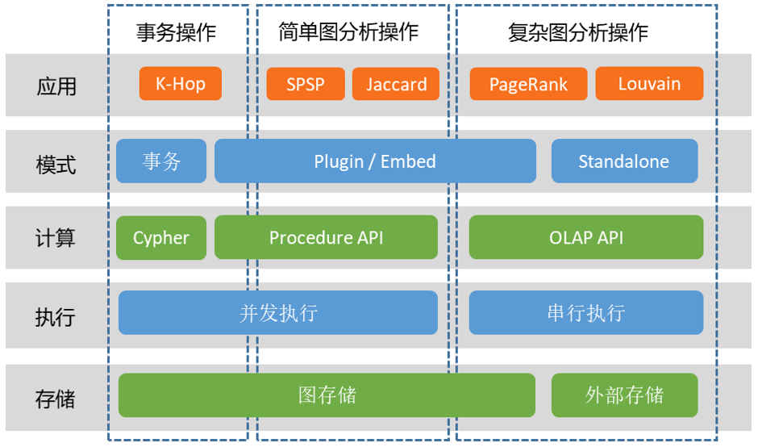

# HTAP

> 此文档主要介绍 TuGraph 的HTAP的设计理念。

## 1.简介

HTAP 的实现在架构上有多种不同的方式：一是用两个不同的副本来分别处理 OLTP 和 OLAP 的任务，核心是数据的一致性同步和额外的资源开销；二是在任何时候都使用同一份数据存储，该实现的数据结构存在内存膨胀，在工业化落地还需要进一步工作。在 TuGraph 的设计中，简单的 OLAP 操作和 OLTP 操作共用一份数据，而复杂的 OLAP 操作则单独导出快照处理。

## 2.设计

在 TuGraph 中，OLTP 为图事务引擎，在图 4.4对应事务操作；OLAP 为图分析引擎，对应简单图分析操作（比如 SPSP）和复杂图分析操作（比如 PageRank），前者可以直接在图存储上执行，而后者需要额外导出快照执行。

- 事务操作，即图事务引擎测的操作，为局部图的增删查改操作，典型的应用为 K 跳访问 K-Hop。
- 简单分析操作，是图分析引擎中较为简单的部分，通常也是局部的图分析操作，比如两点间最短路算法 SPSP、Jaccard 算法。
- 复杂分析操作，是图分析引擎中较为复杂的部分，通常涉及全图的多轮数据迭代操作，比如网页排序算法 PageRank、社区发现算法 Louvain。

如架构图所示，我们在图中增加了外部存储，使得图分析的数据源不局限在图数据库中，可以直接从文本文件读取。

- 图存储，即图数据库中的存储，有精心设计的数据结构，能够完成实时增删查改。
- 外部存储，可以是 RDBMS 或文本文件，以边表的简单方式存储，仅供一次性批量读取，和批量结果写入。在计算层，和整体架构图中的接口对应。
- Cypher，描述式图查询语言，可以并发执行。
- Procedure API，过程式图查询语言，其灵活性能够同时支持事务操作和图分析操作，但效率上不足以完成复杂图分析操作，可以并发执行。
- OLAP API，针对多轮迭代的复杂图分析。应用需要先将存储中的图数据导出成内存中的一个快照，该快照仅用来快速访问，而不需要考虑 ACID 的写支持，因此可以排布地更加紧凑，CSR 排布的读效率要远高于图存储的数据排布。OLAP API 只能串行执行，每个操作都用满 CPU 资源。

OLAP API 的快照可以从外部存储创建，即将边表数据构成件 CSR 的格式；或者从图存储中创建。需要注意的是，OLAP API 要求点的 ID 是连续的自然数，可能需要额外的 ID 映射，该步骤在创建快照时可以在指定一个属性进行映射，或直接取属性值作为 ID。

与计算接口和存储相对应，有四种运行模式。

- 事务模式，每个操作对应一条 Cypher 语句，默认是一个事务。
- Plugin 模式，通过插件的方式，在计算逻辑加载到服务端后调用，也叫存储过程。
- Embed 模式，和 Plugin 模式的使用接口一致，区别是图数据库服务不需要起来，就可以直接用接口调用数据库中的数据，通常用于调试 Procedure API 和OLAP API 的代码，调试信息和操作步骤比 Plugin 模式更加友好。
- Standalone 模式，最大程度剥离与图数据库的关系，仅想用图分析引擎做数据分析时，该模式会比较直接。Standalone 模式会直接使用外部存储的数据。

图神经网络引擎的使用方式和 ‘复杂图分析操作’ 类似，会同时调用部分 OLAP API 和 GNN API，不在这里展开。
