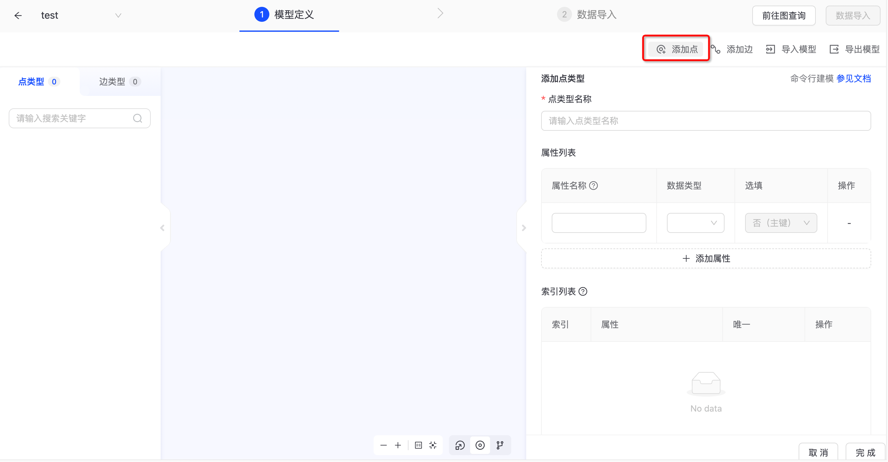
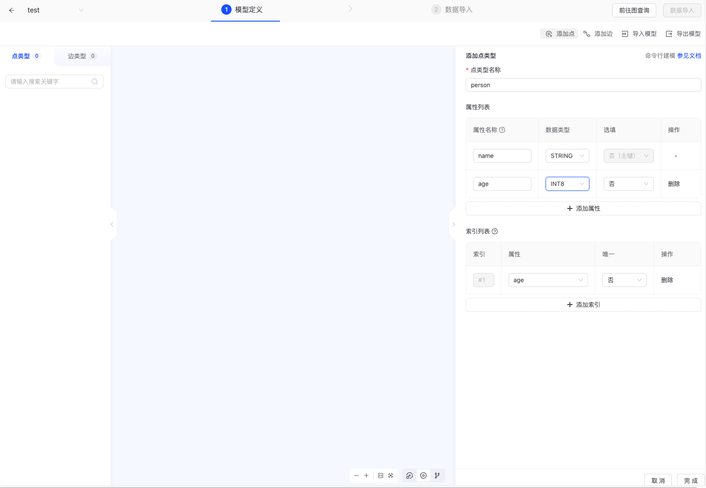
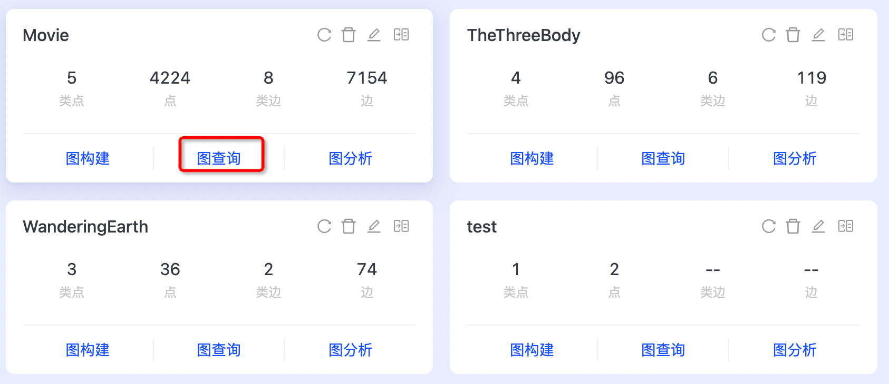
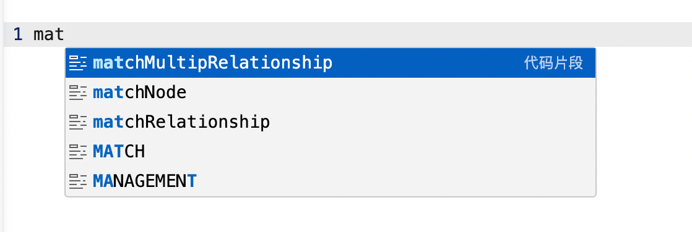
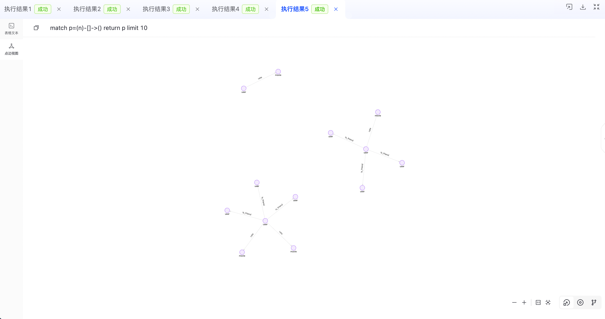
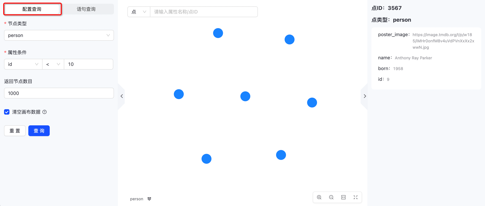
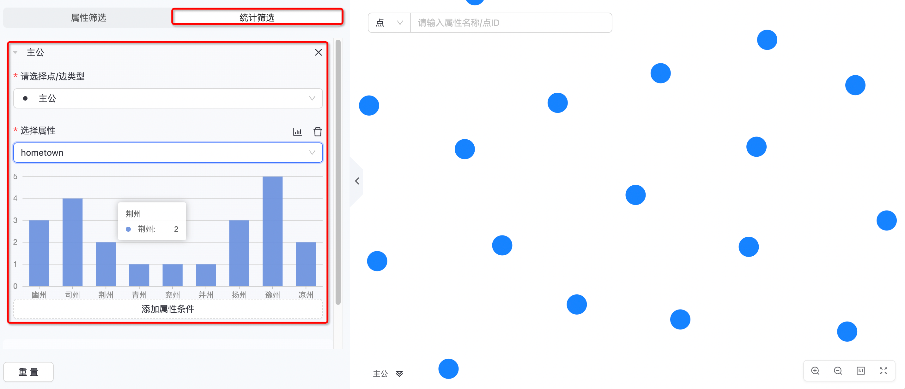
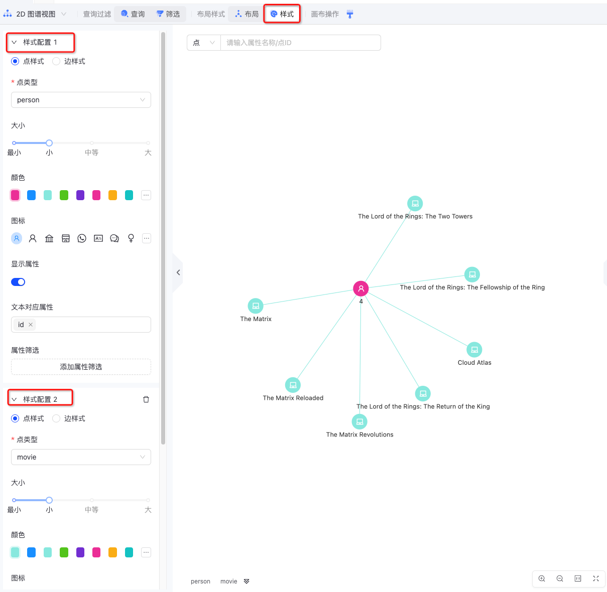

# 可视化操作手册

> 此文档主要介绍 TuGraph Browser 的使用和操作方法。

## 1.简介

TuGraph Browser（以下简称Browser）是一款功能强大的产品可视化开发工具，它以直观的可视化方式呈现图数据，使用户可以轻松地管理、维护和查看数据库运行状态。此工具不仅支持图数据的管理和可视化，还支持对系统账户的管理，为用户提供了全面的操作和管理体验，让用户能够更加高效地管理和利用图数据库。

## 2.操作指南

### 2.1.访问

当用户完成图数据库的安装后，可以通过浏览器访问Browser。用户只需要在浏览器地址栏输入：TuGraph 所在服务器的 IP:Port。默认的端口使用的是 7001。

- 例如：127.0.0.1:7001
- 推荐使用Chrome

#### 2.1.1.启动配置

在启动Browser之前，需要提前启动TuGraph-Server并配置好Browser与TuGraph-Server连接，配置文件在Browser目录下的env.json文件，具体配置如下所示
```shell
# vim /usr/local/share/lgraph/tugraph-db-browser/env.json
{
  "tugraph_db_host": "http://127.0.0.1:9090"
}
```
需要把tugraph_db_host修改为实际TuGraph-Server RPC服务的地址

#### 2.1.2.启动方式
Browser的启动方式分为两种，一种是在docker image中，直接切到Browser所在目录，执行启动命令即可
```shell
cd /usr/local/share/lgraph/tugraph-db-browser
pnpm run dev
```
另一种是在本地环境中使用rpm/deb安装包，此时需要先构建后启动，因此需要在本地提前安装Node环境，具体详见源码目录下的
ci/images/tugraph-runtime-*-Dockerfile。在本地安装TuGraph时，
Browser会安装到本地的指定目录，切到该目录，执行如下命令即可构建并启动
```shell
cd /usr/local/share/lgraph/tugraph-db-browser
pnpm run bootstrap
pnpm run dev
```

### 2.2.登录


- 浏览器成功访问Browser后，首先进入的是登录页面（如上图所示），用户需要填写账号和密码进行登录。
- 默认账号：admin
- 默认密码：73@TuGraph
- 用户首次登录后，会跳转至修改密码页面，密码修改成功后，使用新密码重新登录方可使用。

### 2.3.快速上手

对于首次使用TuGraph的用户，可以通过产品内置的demo数据快速构建一个图项目，快速上手图数据项目。

#### 2.3.1.创建图项目

在`图项目`首页的选项卡中，点击`新建图项目`创建新的图项目。


选择一个产品内置的demo数据，点击`下一步`按钮。


在`填写配置`界面输入图项目信息，demo数据量都相对较小，`最大存储空间`设置为1G即可。输入完图项目信息后，点击`创建`按钮后，系统会自动创建demo数据的图模型、导入图数据。


#### 2.3.2.开始图项目

demo数据的图项目创建完成后，可以在`图项目`的选项卡中找到相应的图项目，可以点击`图查询`查询图数据。


执行默认的查询语句，浏览demo里的图数据。


更多快速上手文档请浏览[快速上手文档](../3.quick-start/1.preparation.md)

### 2.4.图项目

`图项目`提供可视化的图项目管理和图数据研发功能，它为用户提供了一系列便捷的图数据可视化操作，包括图项目的创建、修改、删除等管理操作，以及图数据的查询、点边统计等操作。此外，它也支持图模型的管理，使用户可以更加方便地进行图数据的管理和维护。

#### 2.4.1.图项目管理

在`图项目`界面，可以看到当前图数据库中的图项目。


##### 2.4.1.1.新建图项目

在`图项目`界面，点击`新建图项目`按钮创建一个新的图项目。


新建图项目需要通过`选择模板`和`填写配置`两个页面完成图项目的创建。

- __选择模板__：产品提供空模板和demo模板两类模板。
    - 空模板：全新的图项目，用户需要自己创建图模型和导入图数据，一般用于正式项目开发。
    - demo模板：产品内置的demo数据，图项目创建成功后，系统会自动创建demo图模型并导入demo图数据，一般用于试用和学习。


- __填写配置__：用户需要填写图项目基本信息，并点击`创建`按钮创建图项目。
    - 图名称：新建图项目的名称，同时作为该图项目的唯一主键。支持中文、字母、数字以及下划线，不支持空格以及其他特殊符号。
    - 图描述：新建图项目的描述，可用于详细说明该项目的背景和目标。
    - 高级配置-最大存储空间：设置图项目最大可占用的存储空间，实际并不会提前占用物理存储空间，实际数据量达到最大存储空间阈值后不可再写入数据。


创建成功后，可在`图项目`页面的图项目选项卡中查看。

##### 2.4.1.2.编辑图项目

在`图项目`界面，点击图项目选项卡中的`编辑`按钮（笔形图标），编辑对应图项目的基础信息。


编辑图项目功能可以修改`图名称`和`图描述`。


##### 2.4.1.3.删除图项目

在`图项目`界面，点击图项目选项卡中的`删除`按钮（垃圾桶图标），删除对应的图项目。


_需要注意：图项目删除后无法恢复_。

##### 2.4.1.4.点边统计

在`图项目`界面，点击图项目选项卡中的`点边统计`按钮（折线图标或刷新图标），统计对应图项目的点边数量。


统计结果将展示展示图项目选项卡上，未进行过点边统计的图项目会显示`暂无点边数据`，已经统计过点边数据的图项目再次统计需要点击`刷新`按钮。


#### 2.4.2.图构建

Browser的`图构建`功能主要用于图项目的模型定义和数据导入。在`图项目`页面中，点击图项目选项卡中的`图构建`按钮。


##### 2.4.2.1.模型定义

Browser提供可视化的方式创建和维护图模型。

- 也可用通过`cypher`工具和`lgraph_import`工具创建和维护图模型，详见[Cypher API](../8.query/1.cypher.md)和[数据导入](../6.utility-tools/1.data-import.md)文档。

###### a.浏览图模型

在`模型定义`界面可以查看详细的图模型设置，支持列表和画布方式查看图模型，支持列表展示点类型的属性和索引、边类型的属性和起点/终点类型。


- 支持列表查看点类型和边类型。
    - 支持点类型和边类型的个数展示，在点类型或边类型页签中展示对应的点或边数量。
    - 支持点类型和边类型的名称关键字搜索，在`搜索框`输入关键字可展示对应的点或边。

        
    - 支持点类型和边类型的名称复制，点击`复制`按钮可以复制点或边的名称至粘贴板。

        
    - 支持点类型和边类型的删除，点击`删除`按钮可以删除对应的点或边。

        
- 支持画布方式查看点类型和边类型。
- 在列表或画布中点击相应的点类型或边类型，可以展示模型详情。
        

###### b.添加点

在`模型定义`界面点击`添加点`按钮，在右侧滑动窗口中添加点类型。



用户需要输入点类型名称、属性和索引，点击`完成`按钮完成点类型的创建。
- 点类型名称：点的名称，也是该点的唯一标识。
- 属性：点的属性，需要一个属性作为主键。
    - 数据类型：属性字段的数据类型，支持INT、STRING、DOUBLE、DATE、DATETIME、BLOB、BOOL等类型。
    - 选填：该属性是否可以为空值。
    - 删除：在创建点时可以任意删除属性。
- 索引：点的索引属性，需要先创建属性再设置该属性为索引，索引创建成功后无法修改。
    - 属性：需要配置索引的属性。
    - 唯一：设置该属性字段为唯一值。
    - 主键：对应属性是否为主键，选择`是`后`唯一`选项必须为`是`。
    - 删除：在创建点时可以任意删除索引。



- 编辑点：可以增加点的属性和修改已有属性的数据类型，新增或删除索引。需要对每个新增或修改的属性点击`保存`按钮才可以生效。
_注：主键字段的属性创建后无修改_


###### c.添加边

在`模型定义`界面点击`添加边`按钮，在右侧滑动窗口中添加边类型。


用户需要输入边类型名称、属性、选择起点类型和终点类型，点击`完成`按钮完成边类型的创建。
- 边类型名称：边的名称，也是该边的唯一标识。
- 属性：边的属性，边上可以没有属性。
    - 数据类型：属性字段的数据类型，支持INT、STRING、DOUBLE、DATE、DATETIME、BLOB、BOOL等类型。
    - 选填：该属性是否可以为空值。
    - 删除：在创建边时可以任意删除属性。
- 选择起点类型和终点类型：设置边的起点点类型和终点点类型，支持多个起点类型和终点类型。
    - 起点：选择起点的点类型。
    - 终点：选择终点的点类型。
    - 需要提前创建至少一个点类型才能设置边的起点类型和终点。
    - 如果不选择则表示起点和终点可以为任意点类型，同时画布上不展示对应的边，需要在左侧列表查看边类型。


- 编辑边：可以增加边的属性和修改已有属性的数据类型。需要对每个新增或修改的属性点击`保存`按钮才可以生效。


###### d.导入模型

在`模型定义`界面点击`导入模型`按钮，可以上传模型文件快速创建模型。


在`导入模型`界面点击`上传文件`按钮，上传模型文件成功后，点击确定可以导入图模型。

- 覆盖当前画布中的模型：选中该选项，导入时会先清空已有图模型再导入模型文件中的图模型；不选择，会导入模型文件中新增的点类型和边类型，但不会修改已有的点类型和边类型。


###### e.导出模型

在`模型定义`界面点击`导出模型`按钮，可以将当前图项目中的图模型导出成json文件。


模型文件为json格式，不建议手动修改。


##### 2.4.2.2.数据导入

完成`模型定义`之后，点击`下一步`按钮进入数据导入页面。

###### a.数据准备

在数据导入前需要提前准备数据，当前Browser支持CSV文件的上传，需要保证数据文件后缀为csv。
- 不强制要求包含表头。
- 支持文本限定符，文本限定符为双引号。


###### b.上传文件

在`数据导入`页面上传需要导入的数据文件，将数据导入到图项目中。


- 分隔符：数据文件的列分隔符。
- 文件上传：支持上传多个文件。
    - 支持弹窗中选择多个上传文件。
    - 支持将文件拖拽至页面中上传。
    - 支持同时上传点文件和边文件。

###### c.数据映射

文件上传成功后，需要在`数据导入`页面设置`数据对应表`，将数据文件中的数据列和目标点/边、对应属性建立映射关系。

- 数据对应表：展示已经上传的数据问题。
    - 文件名称：上传的数据文件名称。
    - 文件大小：上传的数据文件大小。
    - 读取结果：数据文件上传结果，success为读取成功。
    - 删除：在页面中删除，不会删除本地文件。
- 数据文件映射：每个已上传的数据文件都需要配置映射关系。
    - 标签：选择该文件对应的点或边类型，只能选择一类点或一类边。
    - 从第N行，开始：从第N行开始读取数据，系统默认从第0行开始读取数据，如需跳过表头可输入1。
    - 属性映射：下拉选择数据列对应的属性字段。
    - 数据预览：系统会预读数据文件的前5行。


文件上传成功后，可以点击`继续导入`按钮继续导入其他数据，或者点击`前往图查询`按钮在`图查询`页面查询已导入的数据。


#### 2.4.3.图查询

在`图项目`界面点击图项目选项卡中的`图查询`按钮，可以查询和访问图项目中的图数据，产品提供`语句查询`、`路径查询`、`点查询`等多种模式查询图数据，支持切换图项目和查询结果展示。



##### 2.4.3.1.切换图项目

`图查询`功能只能访问一个图项目数据，用户可以在`切换图项目`下拉框中选择并切换至其他图数据。


##### 2.4.3.2.语句查询

Browser提供可视化方式开发和调试图查询语句，用户可以输入图查询语句、执行并返回结果，支持收藏语句和查看图模型。


###### a.语句查询窗口

用户在`语句查询窗口`输入图查询语句，点击`执行`按钮可以运行对应语句，并在`执行结果页签`展示结果。

- 切换查询语言：提供不同图查询语言模式的切换。_当前只支持Cypher语法_


- 语句查询窗口：提供当前查询语言的语法提示。



- 执行：点击`执行`按钮，发送输入的查询语句至后台运行。


- 收藏：点击`收藏`按钮，将当前语句查询窗口的内容保存成模板，以便下次使用。


- 下载：点击`下载`按钮，将当前语句查询窗口的内容保存成文本文件并下载至本地，以便下次使用。


详细Cypher使用指南请参考文档：[Cypher API](../8.query/1.cypher.md)

###### b.收藏列表

以列表方式展示已经收藏的查询语句，点击列表中的收藏模板可以使用其中的语句。支持关键字搜索、名称修改以及删除。


###### c.查看图模型

Browser提供当前图项目中的图模型查询，方便用户查询有些点类型和边类型，支持列表展示和画布图谱展示方式，支持隐藏查看图模型窗口。


##### 2.4.3.3.路径查询

Browser提供`路径查询`模板，用户可以通过选择路径的方式，查找图项目中的图数据是否存在相应的路径。


- 路径：在路径选择下拉框内选择需要查找的路径。
    - 选择路径：根据图模型的定义，系统会自动匹配出对应的一度关系路径；再次点击路径下拉框会，系统会根据路径终点的点类型自动匹配下一度关系路径。

    - 执行：点击`执行`按钮返回图项目中匹配的路径。
    - 高级配置：设置扫描的路径数目，默认为100条路径。


_注：需要图模型中的边设置起点和终点，如果图项目中的边均未设置起点和终点，下拉选项无结果_

##### 2.4.3.4.点查询

Browser提供`点查询`模板，用户可以通过选择点属性进行查询，查找图项目中的点数据。


- 选择点：选择需要查询的点类型。
    - 属性：系统会自动匹配点类型的schema，设置相应的查询条件，点击执行按钮返回结果。
- 返回节点数目：设置返回点数据的上限。


##### 2.4.3.5.执行结果页签

Browser提供JSON视图、JSON文本、点边列表、点边视图等多种方式展示图查询结果，支持结果下载、插入数据、全屏展示。

###### a.JSON视图

Browser提供以JSON视图方式展示查询结果。


###### b.JSON文本


###### c.点边列表

Browser提供以点和边列表方式展示查询结果。


###### d.点边视图

Browser提供以画布方式展示查询结果。


###### e.插入数据

Browser提供可视化方式在对应图项目中插入点或边数据。点击`插入数据`按钮，在`插入数据`页签选择点类型或边类型，输入属性值，点击确定完成数据插入。


###### f.下载执行结果

Browser提供图查询结果导出成文本文件功能。点击`下载执行结果`按钮，系统会自动将结果保存成文本文件并下载至本地。


###### g.全屏展示

Browser提供全屏方式展示图查询结果，点击`全屏显示`按钮全屏展示结果，点击`退出全屏`按钮退出全屏展示。





#### 2.4.4.图分析

在`图项目`界面点击图项目选项卡中的`图分析`按钮，可以在画布中展示和分析图数据，产品提供`语句查询`和`配置查询`将图项目中的数据查询并加载至画布，支持画布数据的筛选、布局样式调整以及画布操作。


如下图所示，图分析功能主要包括：1、操作栏：图分析主要操作功能，包括视图切换、查询过滤、布局样式以及画布操作；2、左边栏：查询、筛选、外观功能操作区域；3、画布区域：展示图数据的区域，展示点和边数据，支持点扩展查询、收起节点、固定节点、删除节点，提供画布图数据统计等功能；4：右边栏：选中一个点数据或边数据后，会展示对应的属性信息；5、切换图项目：切换不同的图项目进行分析。


##### 2.4.4.1.语句查询

在`语句查询`功能中，用户可以输入查询语句来查询图数据，并加载数据至画布区域进行展示。
- 语法说明：TuGraph的查询语言及语法说明文档。
- 清空画布数据：未选择此按钮，每次执行查询的结果会追加至画布区域；选择此按钮，每次执行查询前会先清空画布。


##### 2.4.4.2.模板查询

在`模板查询`功能中，用户可以选择节点类型和输入属性条件来查询图数据，并加载数据至画布区域进行展示。
- 清空画布数据：未选择此按钮，每次执行查询的结果会追加至画布区域；选择此按钮，每次执行查询前会先清空画布。



##### 2.4.4.3.画布分析

在`画布分析`功能中，用户可以对画布中的节点或边数据进行操作和分析，主要包括：选中节点进行扩展查询、收起/展开节点、固定节点，清空画布，套索，点/边检索，画布图例等。画布上的最基础操作是拖拽点数据，鼠标左键选住一个节点并移动鼠标，可以完成点数据位置的移动。

###### a.扩展查询

在`画布`区域右键点击一个节点数据，弹出操作悬窗，鼠标移至`扩展查询`处弹出二级悬窗，点击对应的扩展度数进行查询。
- 一度查询：双向扩展一度关系。
- 二度查询：双向扩展二度关系。
- 三度查询：双向扩展三度关系。
- 自定义查询：根据选择的条件进行扩展。
    -边的方向：设置扩展关系的方向，双向：包含出边和入边，出边：选中起点向外指向的边，入边：指向选中起点的边。
    -扩散度数：扩展的度数。
    -自定义返回节点数量：配置返回至前端的节点数量，默认为100，防止遇到超级节点导致前端异常的情况。
    -添加筛选组：设置扩展的关系类型和关系的属性条件，可以设置多组关系类型。


###### b.收起/展开节点

在`画布`区域右键点击一个节点数据，弹出操作悬窗，点击`收起节点`会隐藏所选节点的一度关系节点；再次右键已`收起节点`的点数据可以进行`展开节点`操作，展示已隐藏的一度关系节点。


###### c.固定节点

在`画布`区域右键点击一个节点数据，弹出操作悬窗，点击`固定节点`会将所选节点固定在原处，固定后的节点不可移动（包括重新布局）；再次右键已`固定节点`的点数据可以进行`解除固定`操作，恢复所选节点的正常操作。


###### d.删除节点

在`画布`区域右键点击一个节点数据，弹出操作悬窗，点击`删除节点`会将所选节点移出画布。


###### e.清空画布

在`操作栏`区域点击`清空画布`按钮，会清除所有画布中的数据。


###### f.点/边检索

在`点/边检索`窗口选择点或边，并输入关键字，会模糊检索画布中的属性数据，检索后可定位至数据位置。


###### g.画布图例

在`画布`区域的图例位置，会展示画布中的点类型，点击点类型可以选中对应的点数据，点击更多按钮可以展示统计情况，支持列表或图表方式展示点或边的数量。


##### 2.4.4.4.属性筛选

在`操作栏`区域点击`筛选`按钮，在`左边栏`点击`属性筛选`进行筛选过滤。用户可以选择要筛选的点或边类型，以及对应的属性值进行设置，检索到筛选组条件的数据后会在画布上高亮选中对应的点或边数据。
- 请选择点/边类型：选择需要检索的点类型或边类型。
- 属性条件：设置需要检索的属性条件，可以设置多组，取并集筛选结果。
- 添加筛选组：可以多组筛选条件，取并集筛选结果。
- 重置：可以清空筛选条件。


##### 2.4.4.5.统计筛选

在`操作栏`区域点击`筛选`按钮，在`左边栏`点击`统计筛选`进行画布数据统计。用户可以选择要统计的点或边类型，以及对应的属性值进行设置，系统会自动根据用户选择的点/边类型和属性进行分组统计，支持按照图表和列表两种方式展示结果，同时点击图表或列表区域的数值可以高亮选中画布中的数据。




##### 2.4.4.7.布局样式

在`操作栏`区域点击`布局`按钮，选择对应的布局方式会将画布中的数据进行重新排布，支持力导向布局、同心圆布局、圆形布局、辐射布局、Dagre布局以及网格布局，每种布局方式均有不同布局参数，调整参数后画布中的数据会进行重新排布。


详细布局参数可参考[AntV-G6](https://g6.antv.antgroup.com/api/graph-layout/guide)。

##### 2.4.4.6.外观样式

在`操作栏`区域点击`外观`按钮，在`左边栏`点击`点样式`或`边样式`进行外观样式配置。
- 点样式
    - 应用点类型：设置对应点类型的展示样式，支持同时配置多个点类型外观。
    - 大小：对应点类型的展示大小。
    - 颜色：对应点类型的展示颜色。
    - 图标：对应点类型的图标样式。
    - 显示文本：对应点类型显示的文本内容，默认为id。
    - 高级配置：根据设置的条件标记对应的点数据。
- 边样式
    - 应用边类型：设置对应边类型的展示样式，支持同时配置多个边类型外观。
    - 颜色：对应点类型的展示颜色。
    - 边宽：对应边类型的展示宽度。
    - 显示文本：对应边类型显示的文本内容，默认不显示。
    - 高级配置：根据设置的条件按颜色展示对应的边数据。



### 2.5.控制台

`控制台`提供可视化的的账户管理和数据库信息查看功能，它为用户提供了全面的账户和角色管理功能，包括账户的增删改查以及禁用，角色的增删改查以及禁用。此外，它也为用户提供了便捷的数据库信息查看功能，让用户可以轻松地查看图数据库的基础信息和配置信息。其中，基础信息主要包括版本号、运行时间、CPP编译版本号等，而数据库配置信息则包括端口号、系统功能参数配置等。

#### 2.5.1.账户管理

##### 2.5.1.1.账户管理

###### a.添加账户

在`账户管理`界面点击`添加`按钮创建新的账户，用户需要输入账户名称、账户描述、账户密码以及相关角色。


- 账户名称：支持中文、字母、数字以及下划线，不支持空格以及其他特殊符号。
- 相关角色：新建账户时必须要选择一个角色，在账户添加成功后，系统会自动生成一个与账户名称一样的角色。


###### b.编辑账户

在`账户管理`界面点击`添加`按钮创建新的账户，用户可以编辑账户描述、账户密码以及相关角色。


###### c.禁用账户

在`账户管理`界面点击`禁用`按钮禁止对应的账户登录和访问，点击`启用`按钮开启对应的账户登录和访问权限。


###### d.删除账户

在`账户管理`界面点击`删除`按钮删除对应的账户。


##### 2.5.1.2.角色管理

###### a.添加角色

在`角色管理`界面点击`添加`按钮创建新的角色，用户需要输入角色名称、角色描述以及图权限。


- 角色名称：支持中文、字母、数字以及下划线，不支持空格以及其他特殊符号。
- 图权限：browser支持全部、读、写和无共四类图权限配置。
    - 全部：对应图的读和写权限，包含编辑图模型权限（schema）。
    - 读写：对应图的写权限，不包含编辑图模型权限（schema）。
    - 只读：对应图的读权限。
    - 无：无法访问和操作对应图。
- 角色冲突：当两个角色对同一个图有不同图权限，同时对一个账户授权了这两个角色，该账户对该图的图权限为两个角色的并集。


###### b.编辑角色

在`角色管理`界面点击`编辑`按钮编辑已有角色，用户可以编辑角色描述以及图权限。


###### c.禁用角色

在`角色管理`界面点击`禁用`按钮禁止对应的角色，点击`启用`按钮开启对应的角色。禁用角色后，对应角色图访问权限失效。

- 禁用角色：禁用之后，对应角色图访问权限失效。
    - 当一个用户拥有两个角色对同一个图有操作权限时，当禁用其中一个角色时，另一个角色权限同样有效。


###### d.删除角色

在`角色管理`界面点击`删除`按钮删除对应的角色。


#### 2.5.2.数据库信息

##### 2.5.2.1.基础信息

`基础信息`获取当前系统运行的状态，并展示关键信息。


|参数    |含义    |
|-------|--------|
|TuGraph版本号|当前TuGraph的版本号，x.x.x|
|运行时间|TuGraph服务启动到现在的时间|
|服务器代码版本|tugraph-db仓库的当前commit|
|前端代码版本|tugraph-web仓库的当前commit|
|CPP编译器版本号|编译TuGraph时的CPP版本号|
|Python版本号|编译TuGraph时的Python版本号|
|CPP编译器ID|编译TuGraph时的CPP类型|

也可以通过命令获取当前系统运行状态。

```
CALL dbms.system.info()
```

##### 2.5.2.2.数据库配置信息

`数据库配置信息`获取当前系统运行的配置参数，并展示关键信息。调整配置参数或了解详细配置参数请参考[数据库运行-服务配置](../5.installation&running/7.tugraph-running.md)。


| 参数                          | 含义                                  |
|-----------------------------|-------------------------------------|
| bind_host                   | 系统启动时设置的host，一般为0.0.0.0             |
| disable_auth                | 是否关闭token认证的定期更新，如为true则token可以永久使用 |
| durable                     | 是否开启存储底层持久化，如为false，数据异步更新到磁盘       |
| enable_audit_log            | 是否开启审计日志                            |
| enable_backup_log           | 是否开启实时增量备份                          |
| enable_fulltext_index       | 是否开启全文索引                            |
| enable_ip_check             | 是否开启IP白名单                           |
| enable_rpc                  | 是否开启RPC端口                           |
| enable_ssl                  | 是否开启ssl加密传输                         |
| optimistic_txn              | 是否开启乐观多线程写入事务                       |
| port                        | 当前系统的REST访问端口                       |
| rpc_port                    | RPC 及 HA 服务所用端口                     |
| subprocess_max_idle_seconds | 自进程最大空闲时间，线程池参数                     |
| thread_limit                | 服务端同时使用的最大线程数                       |
| verbose                     | 日志输出信息的详细程度。可设为 0，1，2，值越大则输出信息越详细。  |
